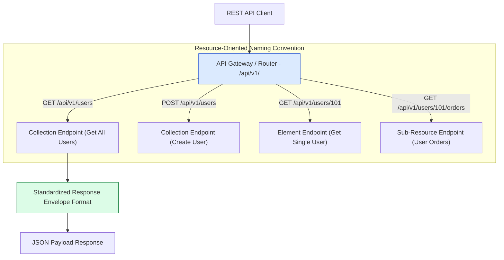
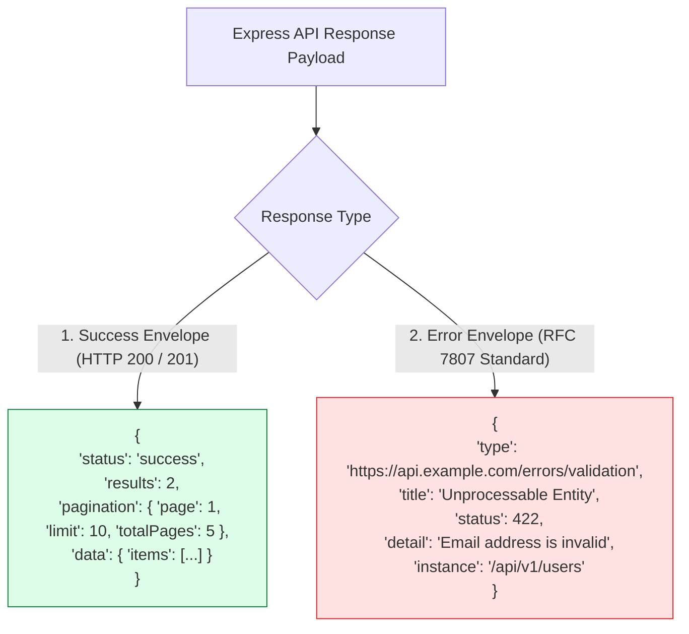
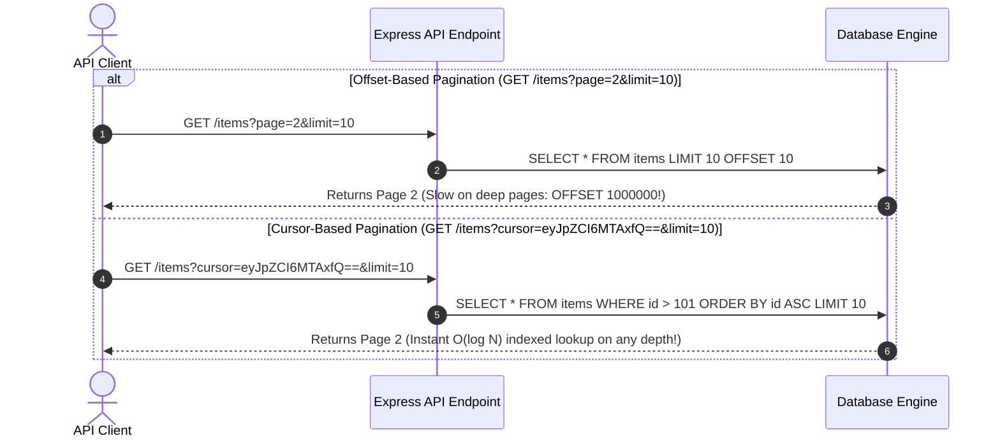

# Module 12: RESTful API Design Patterns, Response Envelopes, and HTTP Status Codes

## Overview

Designing production-grade **RESTful APIs** in Express requires adhering to architectural constraints: **Resource-Oriented URI Naming**, **Uniform Interface Contracts**, **Standardized JSON Response Envelopes**, **API Versioning (`/api/v1/`)**, and strict **HTTP Status Code Semantics**.

Understanding REST resource modelling, RFC 7807 Problem Details error formatting, cursor-based vs offset-based pagination schemas, and stateless CRUD controller patterns is essential.

---

## 1. RESTful API Architecture Topology



---

## 2. Standardized JSON Response Envelope Formats

To ensure consistent API contracts across teams, responses use standardized JSON envelopes for both success and error responses:



### HTTP Status Code Semantics Matrix

| Code | Status Text | Semantic Meaning | Response Body Payload |
| :--- | :--- | :--- | :--- |
| **`200`** | `OK` | Standard successful retrieval or update | JSON payload representation |
| **`201`** | `Created` | Successful creation of new entity | JSON payload of created entity |
| **`204`** | `No Content` | Successful request with no body to return | **Empty Body** (`res.status(204).send()`) |
| **`400`** | `Bad Request` | Malformed JSON payload or missing parameters | Error detail envelope |
| **`401`** | `Unauthorized` | Missing or invalid authentication token | Error detail envelope |
| **`403`** | `Forbidden` | Authenticated but lacks required RBAC role | Error detail envelope |
| **`404`** | `Not Found` | Target endpoint or resource ID does not exist | Error detail envelope |
| **`422`** | `Unprocessable` | Syntactically correct JSON failing schema validation | Array of validation field errors |
| **`429`** | `Too Many Requests` | Rate limit threshold exceeded | Error detail envelope + `Retry-After` header |
| **`500`** | `Internal Error` | Unexpected server exception or crash | Sanitized generic error message |

---

## 3. Offset vs. Cursor Pagination Execution Flow



---

## 4. Practical Implementation Showcase: Production REST Controller

```javascript
const express = require("express");
const app = express();

app.use(express.json());

// In-Memory Product Database Store
let productRepository = [
  { id: 101, title: "Enterprise Workstation", price: 2500, category: "hardware" },
  { id: 102, title: "Wireless Mechanical Keyboard", price: 150, category: "peripherals" },
  { id: 103, title: "4K Monitor 32 Inch", price: 700, category: "peripherals" }
];

// 1. GET ALL (Filter, Sort, and Paginate)
app.get("/api/v1/products", (req, res) => {
  const { category, minPrice, maxPrice, page = 1, limit = 10 } = req.query;

  let filtered = [...productRepository];

  if (category) {
    filtered = filtered.filter((p) => p.category === String(category).toLowerCase());
  }
  if (minPrice) {
    filtered = filtered.filter((p) => p.price >= Number(minPrice));
  }
  if (maxPrice) {
    filtered = filtered.filter((p) => p.price <= Number(maxPrice));
  }

  // Calculate Pagination Slices
  const pageNum = Math.max(1, Number(page));
  const limitNum = Math.max(1, Math.min(100, Number(limit))); // Cap limit at 100
  const startIndex = (pageNum - 1) * limitNum;
  const paginatedItems = filtered.slice(startIndex, startIndex + limitNum);

  // Standardized Success Envelope
  res.status(200).json({
    status: "success",
    results: paginatedItems.length,
    totalRecords: filtered.length,
    pagination: {
      currentPage: pageNum,
      limit: limitNum,
      totalPages: Math.ceil(filtered.length / limitNum)
    },
    data: {
      products: paginatedItems
    }
  });
});

// 2. POST CREATE (201 Created)
app.post("/api/v1/products", (req, res) => {
  const { title, price, category } = req.body;

  if (!title || !price) {
    return res.status(400).json({
      status: "fail",
      error: { message: "Fields 'title' and 'price' are required" }
    });
  }

  const newProduct = {
    id: Date.now(),
    title,
    price: Number(price),
    category: category || "general"
  };

  productRepository.push(newProduct);

  res.status(201).json({
    status: "success",
    data: { product: newProduct }
  });
});

// 3. DELETE BY ID (204 No Content)
app.delete("/api/v1/products/:id", (req, res) => {
  const id = Number(req.params.id);
  const exists = productRepository.some((p) => p.id === id);

  if (!exists) {
    return res.status(404).json({
      status: "fail",
      error: { message: `Product with ID ${id} does not exist` }
    });
  }

  productRepository = productRepository.filter((p) => p.id !== id);

  // 204 No Content requires an EMPTY body payload!
  res.status(204).send();
});

// Start Server
app.listen(3000, () => {
  console.log("RESTful API Server running on port 3000");
});
```

---

## Key Production Takeaways

1. **Use Plural Nouns for URIs**: Define endpoints with plural nouns (`/api/v1/products`, `/api/v1/users`) representing collections, avoiding verb-based path names like `/getAllProducts`.
2. **Return `201 Created` and `204 No Content` Correctly**: Return `201 Created` with the newly formed object for successful `POST` operations, and `204 No Content` (with an empty body) for successful `DELETE` operations.
3. **Always Version APIs via URL Prefixes**: Prefix all API routes with `/api/v1/` to ensure breaking backend changes can be released cleanly under `/api/v2/` without breaking legacy client integrations.
4. **Cap Max Pagination Limit Constraints**: Always validate and cap requested pagination `limit` parameters (e.g. `Math.min(100, Number(req.query.limit))`) to protect databases from memory exhaustion attacks.

