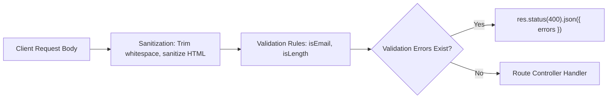

# File 13: Input Request Validation and Sanitization (express-validator)

## Overview
Input **Validation** and **Sanitization** protect applications from malicious or malformed user input, SQL injection, and XSS attacks. Using libraries like **`express-validator`** enforces schema rules on `req.body`, `req.params`, and `req.query`.

---

## 1. Request Validation Pipeline



---

## 2. Express Validation Middleware Implementation

```javascript
const express = require("express");
const { body, validationResult } = require("express-validator");

const app = express();
app.use(express.json());

// Validation Chain Rules Definition
const userRegistrationRules = [
    body("email")
        .trim()
        .isEmail()
        .withMessage("Must be a valid email address")
        .normalizeEmail(),
    body("password")
        .isLength({ min: 8 })
        .withMessage("Password must be at least 8 characters long"),
    body("age")
        .optional()
        .isInt({ min: 18 })
        .withMessage("User must be at least 18 years old")
];

// Error Checking Middleware
const validate = (req, res, next) => {
    const errors = validationResult(req);
    if (!errors.isEmpty()) {
        return res.status(400).json({
            status: "fail",
            errors: errors.array().map(err => ({ field: err.path, message: err.msg }))
        });
    }
    next();
};

// Route using Validation Pipeline
app.post("/api/v1/register", userRegistrationRules, validate, (req, res) => {
    res.status(201).json({ status: "success", message: "User registered safely!" });
});
```

---

## Key Takeaways
1. Validate inputs on **EVERY public endpoint** before passing data to databases or business services.
2. Use **Sanitization** (`trim()`, `normalizeEmail()`) to clean input data.
3. Return **`400 Bad Request`** with detailed field error arrays when validation fails.
