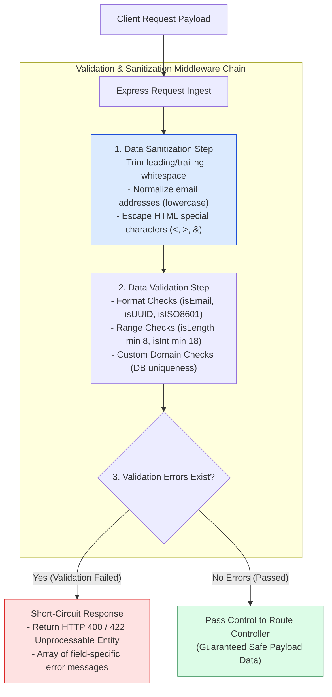
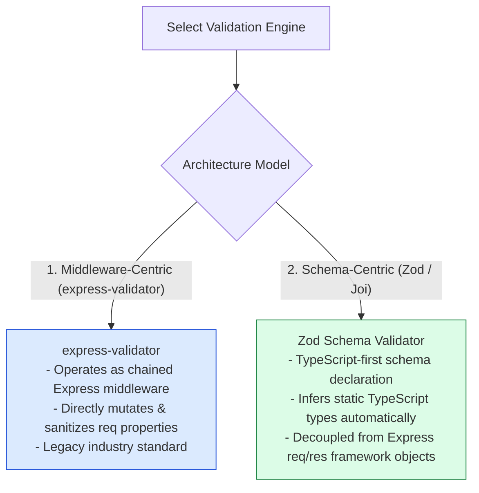
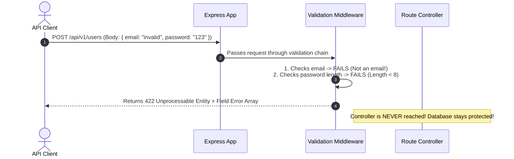

# Module 13: Request Validation, Data Sanitization, and Schema Enforcement

## Overview

Input **Validation** and **Sanitization** serve as the first line of defense against security threats like **SQL Injection**, **Cross-Site Scripting (XSS)**, and corrupted database writes. Using validation frameworks like **`express-validator`** or **Zod / Joi**, Express applications enforce strict schemas on incoming `req.body`, `req.params`, and `req.query`.

Understanding **Validation vs. Sanitization**, **Reusable Schema Validation Middleware**, and **HTTP 400/422 Field Error Formatting** is essential.

---

## 1. Input Validation & Sanitization Pipeline Architecture



---

## 2. Validation Framework Comparison: `express-validator` vs. Zod / Joi



### Validation Strategy Feature Comparison

| Validation Feature | `express-validator` | Zod / Joi Schema Engine |
| :--- | :--- | :--- |
| **Integration Style** | Express Middleware Chain Array | Functional Middleware Wrapper |
| **Type Inference** | Manual Type Annotation | **Automatic TypeScript Infer (`z.infer<T>`)** |
| **Sanitization Support** | Native built-in sanitizers (`trim()`, `escape()`) | Transform functions (`z.string().trim()`) |
| **Schema Reusability** | Medium (Route-specific chains) | **High (Reusable across Frontend & Backend)** |
| **Error Format** | Array of `{ path, msg }` | Detailed `ZodError` issue array |

---

## 3. Validation Sequence & Response Format



---

## 4. Practical Implementation Showcase: Reusable Validation Middleware

```javascript
const express = require("express");
const { body, param, query, validationResult } = require("express-validator");
const app = express();

app.use(express.json());

// 1. Reusable Validation Result Evaluator Middleware
const validateRequest = (req, res, next) => {
  const errors = validationResult(req);
  if (!errors.isEmpty()) {
    return res.status(422).json({
      status: "fail",
      errorType: "VALIDATION_ERROR",
      errors: errors.array().map((err) => ({
        field: err.path,
        message: err.msg,
        receivedValue: err.value
      }))
    });
  }
  next(); // Proceed to controller handler if zero validation errors
};

// 2. User Registration Validation & Sanitization Schema Chain
const registerValidationRules = [
  body("email")
    .trim()
    .notEmpty().withMessage("Email address is required")
    .isEmail().withMessage("Must supply a valid email address")
    .normalizeEmail(), // Sanitizer: converts to lowercase & strips aliases
  
  body("password")
    .trim()
    .isLength({ min: 8 }).withMessage("Password must be at least 8 characters long")
    .matches(/\d/).withMessage("Password must contain at least one numeric digit"),
  
  body("username")
    .trim()
    .isAlphanumeric().withMessage("Username must contain alphanumeric characters only")
    .isLength({ min: 3, max: 20 }).withMessage("Username must be between 3 and 20 characters"),

  body("age")
    .optional()
    .isInt({ min: 18, max: 120 }).withMessage("Age must be an integer between 18 and 120")
];

// 3. User Search Query Validation Rules
const searchQueryRules = [
  query("q").trim().notEmpty().withMessage("Search query param 'q' cannot be empty"),
  query("limit").optional().isInt({ min: 1, max: 100 }).withMessage("Limit must be between 1 and 100")
];

// Protected Routes using Validation Pipelines
app.post("/api/v1/users/register", registerValidationRules, validateRequest, (req, res) => {
  // req.body is guaranteed to be sanitized and valid!
  res.status(201).json({
    status: "success",
    message: "User account created safely",
    user: { email: req.body.email, username: req.body.username }
  });
});

app.get("/api/v1/users/search", searchQueryRules, validateRequest, (req, res) => {
  res.status(200).json({ status: "success", query: req.query.q });
});

// Start Server
app.listen(3000, () => {
  console.log("Request Validation Server running on port 3000");
});
```

---

## Key Production Takeaways

1. **Validate All Incoming Untrusted Input**: Apply validation and sanitization middleware to all public HTTP endpoints (`req.body`, `req.params`, `req.query`) before passing data to service layers or ORM databases.
2. **Combine Validation with Sanitization**: Always pair validators (`isEmail()`) with sanitizers (`trim()`, `normalizeEmail()`, `escape()`) to strip malicious characters and whitespace automatically.
3. **Return HTTP 422 Unprocessable Entity for Schema Errors**: Return HTTP `422 Unprocessable Entity` or HTTP `400 Bad Request` with an array detailing specific field names and human-readable failure messages.
4. **Use Reusable Validation Middleware Functions**: Decouple validation execution logic (`validationResult(req)`) into a reusable middleware function to keep route handler pipelines clean.

