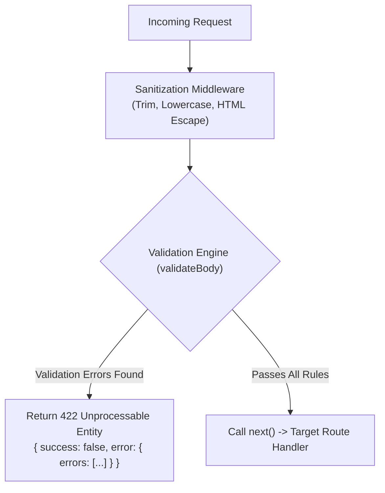

# Module 13: Request Validation & Sanitization Pipelines

## Theoretical Overview & Input Defense-in-Depth

Unsanitized and unvalidated client input is a leading cause of security vulnerabilities (SQL Injection, Cross-Site Scripting XSS, DoS, and Data Corruption).

A robust **Validation & Sanitization Pipeline** operates as an inline middleware barrier:
1. **Sanitization**: Mutates incoming data to safe, standard formats (e.g. trimming leading/trailing whitespace, converting email strings to lowercase, escaping HTML characters).
2. **Validation**: Inspects inputs against declarative schema rules (`required`, `type`, `bounds`, `enum`, `customCheck`). If any rule is violated, it collects **all defects** and short-circuits the pipeline with a `422 Unprocessable Entity` or `400 Bad Request` HTTP status.



### Real-World Analogy: Aadhaar Enrollment Center
Think of Operator Priya at the UIDAI Aadhaar enrollment center:
- **Whack-a-Mole Anti-Pattern**: Rejecting an applicant's form for a missing pin code, forcing them to re-queue, then rejecting it again for a missing phone number.
- **Declarative All-in-One Validation**: Operator Priya checks the entire application form against a master verification checklist. If defects exist, she writes down **every single error** on a single rejection slip (`422 Unprocessable Entity`), allowing the applicant to resolve all issues in a single pass.

---

## 1. Validation Rule Types & Sanitization Matrix

| Validation / Sanitization Phase | Applied Action | Example Transformation / Guard |
| :--- | :--- | :--- |
| **Sanitization (Trim)** | Strips whitespace. | `"  Vikram Sarabhai  "` $\to$ `"Vikram Sarabhai"` |
| **Sanitization (Case Normalization)** | Lowercases emails. | `"VIKRAM@Example.COM"` $\to$ `"vikram@example.com"` |
| **Sanitization (HTML Escape)** | Replaces unsafe characters. | `<script>` $\to$ `&lt;script&gt;` |
| **Type Check (`type`)** | Verifies JS data types. | `typeof value === 'string'`, `Array.isArray()` |
| **Length / Bounds Check** | Verifies length or range. | `value.length >= minLength`, `value >= min` |
| **Enum Check (`enum`)** | Verifies whitelist membership. | `['general', 'senior-citizen'].includes(val)` |
| **Custom Validation** | Executes custom check function. | Email regex or custom string inspector. |

---

## 2. Declarative Schema Validation Engine (`block1`)

The `validateValue()` function checks a field against rule configurations, accumulating every error into an array rather than throwing on the first failure.

```javascript
const express = require('express');
const app = express();

function validateValue(field, value, rules) {
  const errors = [];

  // Required Check
  if (rules.required && (value === undefined || value === null || value === '')) {
    errors.push({ field, message: `${field} is required` });
    return errors;
  }
  if (value === undefined || value === null) return errors;

  // Type Check
  if (rules.type) {
    const actualType = typeof value;
    if (rules.type === 'number' && actualType !== 'number') {
      errors.push({ field, message: `${field} must be a number (got ${actualType})` });
      return errors;
    }
    if (rules.type === 'string' && actualType !== 'string') {
      errors.push({ field, message: `${field} must be a string (got ${actualType})` });
      return errors;
    }
    if (rules.type === 'array' && !Array.isArray(value)) {
      errors.push({ field, message: `${field} must be an array` });
      return errors;
    }
  }

  // Bounds & Enum Checks
  if (typeof value === 'string') {
    if (rules.minLength !== undefined && value.length < rules.minLength) {
      errors.push({ field, message: `${field} must be at least ${rules.minLength} chars` });
    }
    if (rules.customCheck && !rules.customCheck(value)) {
      errors.push({ field, message: rules.customMessage || `${field} is invalid` });
    }
  }

  if (rules.enum && !rules.enum.includes(value)) {
    errors.push({ field, message: `${field} must be one of: ${rules.enum.join(', ')}` });
  }

  return errors;
}

// Middleware Factory generating body validation middleware
function validateBody(schema) {
  return (req, res, next) => {
    const errors = [];
    for (const [field, rules] of Object.entries(schema)) {
      errors.push(...validateValue(field, req.body[field], rules));
    }
    if (errors.length > 0) {
      return res.status(422).json({ success: false, error: { message: 'Validation failed', errors } });
    }
    next();
  };
}
```

---

## 3. Sanitization, Query/Param Validation, & Composition (`block2`)

Combining sanitizers, param validators, and body validators into modular pipeline steps using a `compose()` utility function:

```javascript
// 1. Sanitization Middleware Factory
function sanitizeBody(fieldRules) {
  return (req, res, next) => {
    for (const [field, transforms] of Object.entries(fieldRules)) {
      if (req.body[field] === undefined) continue;
      let value = req.body[field];
      if (typeof value === 'string') {
        if (transforms.includes('trim')) value = value.trim();
        if (transforms.includes('toLowerCase')) value = value.toLowerCase();
        if (transforms.includes('escape')) {
          value = value.split('&').join('&amp;').split('<').join('&lt;').split('>').join('&gt;').split('"').join('&quot;');
        }
      }
      req.body[field] = value;
    }
    next();
  };
}

// 2. URL Param Validation Middleware Factory
function validateParams(schema) {
  return (req, res, next) => {
    const errors = [];
    for (const [param, rules] of Object.entries(schema)) {
      const value = req.params[param];
      if (rules.isNumeric) {
        let allDigits = value.length > 0;
        for (let i = 0; i < value.length; i++) {
          if (value[i] < '0' || value[i] > '9') { allDigits = false; break; }
        }
        if (!allDigits) {
          errors.push({ field: `params.${param}`, message: `${param} must be numeric` });
          continue;
        }
        req.params[param] = parseInt(value, 10);
      }
    }
    if (errors.length > 0) {
      return res.status(400).json({ success: false, error: { message: 'Invalid URL parameters', errors } });
    }
    next();
  };
}

// 3. Middleware Composition Utility
function compose(...middlewares) {
  return (req, res, next) => {
    let index = 0;
    function run() {
      if (index >= middlewares.length) return next();
      middlewares[index++](req, res, (err) => {
        if (err) return next(err);
        if (res.headersSent) return;
        run();
      });
    }
    run();
  };
}

// Register Route with Sanitization & Validation Pipeline
app.post('/enrollments',
  sanitizeBody({ name: ['trim'], email: ['trim', 'toLowerCase'] }),
  validateBody({
    name: { required: true, type: 'string', minLength: 2 },
    category: { required: true, enum: ['general', 'senior-citizen', 'child', 'nri'] }
  }),
  (req, res) => {
    res.status(201).json({ success: true, data: req.body });
  }
);
```

---

## Key Takeaways

1. **Collect All Errors**: Always validate the entire request payload and return all accumulated errors in a single response to optimize user experience.
2. **Sanitize Before Validation**: Apply string mutations (trimming whitespace, normalizing case) *before* evaluating length constraints or regex checks.
3. **HTTP Status Code Standard**: Use `422 Unprocessable Entity` for semantic body validation failures and `400 Bad Request` for malformed URL parameters or query strings.
4. **Composition Patterns**: Use middleware composition (`compose(mw1, mw2, mw3)`) to chain sanitizers, parameter checks, and schema validators cleanly.
