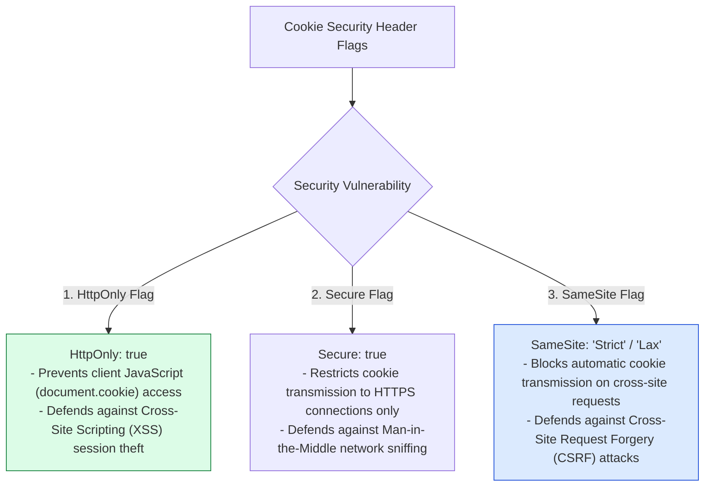
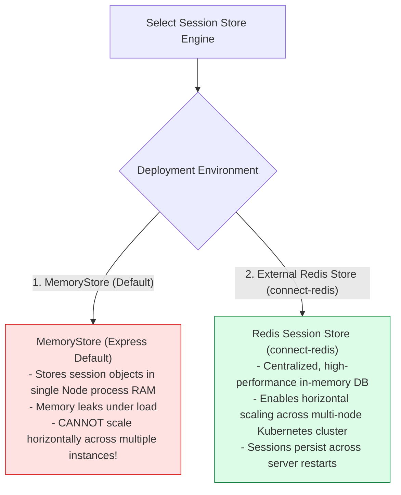

# Module 14: Cookie & Session Management, Security Flags, and Redis Session Stores

## Overview

Stateful web applications rely on **HTTP Cookies** and **Server-Side Sessions** to maintain user authentication state across stateless HTTP requests. The **`cookie-parser`** middleware parses client cookie headers, while **`express-session`** manages server-side session data stored in external memory stores (e.g. Redis or MongoDB).

Mastering **Signed Cookies (`req.signedCookies`)**, **Cookie Security Flags (`HttpOnly`, `Secure`, `SameSite`)**, and **Production Redis Session Store Scaling** is essential.

---

## 1. Cookie & Server-Side Session Architecture

```mermaid
sequenceDiagram
    autonumber
    actor Client as Browser Client
    participant App as Express Application
    participant Redis as Redis Session Store (connect-redis)

    Client->>App: 1. POST /api/v1/auth/login (Credentials)
    App->>App: Authenticates user credentials
    App->>Redis: 2. Save Session Data { userId: 101, role: "ADMIN" } key="sess:s_99182"
    Redis-->>App: Session Saved OK
    
    App-->>Client: 3. 200 OK + Header Set-Cookie: connect.sid=s_99182; HttpOnly; Secure; SameSite=Strict
    
    note over Client: Client stores cookie in HttpOnly browser vault

    Client->>App: 4. GET /api/v1/dashboard (Cookie: connect.sid=s_99182)
    App->>Redis: 5. Fetch Session Data for key "sess:s_99182"
    Redis-->>App: Returns { userId: 101, role: "ADMIN" }
    App-->>Client: 6. 200 OK (Authenticated Dashboard Data)
```

---

## 2. Cookie Security Flags Matrix & CSRF / XSS Defense



### Cookie Security Flag Configuration Matrix

| Cookie Flag | Recommended Value | Security Purpose & Vulnerability Mitigated |
| :--- | :--- | :--- |
| **`httpOnly`** | `true` | Prevents browser scripts from reading cookies (`document.cookie`), mitigating **XSS Cookie Theft**. |
| **`secure`** | `true` (Production) | Enforces TLS/HTTPS transmission, mitigating **Network Sniffing**. |
| **`sameSite`** | `"strict"` / `"lax"` | Controls cross-site cookie transmission, mitigating **CSRF (Cross-Site Request Forgery)**. |
| **`maxAge`** | `86400000` (1 Day ms) | Defines cookie lifespan; prevents session cookies from persisting indefinitely. |
| **`path`** | `"/"` | Restricts cookie scope to specific site URI paths. |

---

## 3. Session Store Scaling: In-Memory vs. External Redis Store



---

## 4. Practical Implementation Showcase: Signed Cookies & Session Setup

```javascript
const express = require("express");
const cookieParser = require("cookie-parser");
const session = require("express-session");
const app = express();

app.use(express.json());

// 1. Configure cookie-parser with secret signing key for tamper-proof cookies
const COOKIE_SECRET = process.env.COOKIE_SECRET || "super_secret_signing_key_2026";
app.use(cookieParser(COOKIE_SECRET));

// 2. Configure Production Session Middleware
app.use(session({
  name: "sid",                           // Custom session cookie name (hides express defaults)
  secret: COOKIE_SECRET,
  resave: false,                         // Prevents unnecessary session store writes
  saveUninitialized: false,              // Prevents storing empty unauthenticated sessions
  cookie: {
    httpOnly: true,                      // Protects from XSS script theft
    secure: process.env.NODE_ENV === "production", // Enforces HTTPS in production
    sameSite: "strict",                  // Protects from CSRF attacks
    maxAge: 1000 * 60 * 60 * 24          // Session TTL: 24 Hours
  }
}));

// 3. Set Signed Cookie Endpoint
app.post("/api/v1/cookies/set-signed", (req, res) => {
  // Signed cookies attach HMAC signature to detect tampering
  res.cookie("user_preference", "dark_mode", {
    signed: true,  // Express appends signature hash to cookie value
    httpOnly: true,
    sameSite: "lax",
    maxAge: 3600000
  });

  res.status(200).json({ message: "Signed preference cookie attached" });
});

// 4. Read Signed Cookie Endpoint
app.get("/api/v1/cookies/read-signed", (req, res) => {
  // req.signedCookies automatically verifies signature hash
  const preference = req.signedCookies.user_preference;

  if (preference === false) {
    return res.status(400).json({ error: "COOKIE_TAMPERED", message: "Cookie signature verification failed!" });
  }

  res.status(200).json({ preference: preference || "default" });
});

// 5. Session Authentication Endpoint
app.post("/api/v1/auth/login", (req, res) => {
  const { username, password } = req.body;

  if (username === "admin" && password === "secret123") {
    // Save user session payload
    req.session.userId = 101;
    req.session.username = "admin";
    req.session.role = "ADMIN";

    return res.status(200).json({ message: "Login successful, session initialized" });
  }

  res.status(401).json({ error: "UNAUTHORIZED", message: "Invalid credentials" });
});

// 6. Destroy Session Logout Endpoint
app.post("/api/v1/auth/logout", (req, res) => {
  req.session.destroy((err) => {
    if (err) {
      return res.status(500).json({ error: "LOGOUT_FAILED" });
    }
    res.clearCookie("sid"); // Clear session cookie from browser
    res.status(200).json({ message: "Logout successful, session destroyed" });
  });
});

// Start Server
app.listen(3000, () => {
  console.log("Cookie and Session Management Server running on port 3000");
});
```

---

## Key Production Takeaways

1. **Never Use Default `MemoryStore` in Production**: The default `express-session` memory store leaks RAM and prevents horizontal application scaling. Always configure external stores like `connect-redis` or `connect-mongo`.
2. **Mandate `httpOnly: true` and `sameSite: 'strict'`**: Always attach `httpOnly: true` to defend against XSS cookie theft and `sameSite: 'strict'` or `'lax'` to mitigate Cross-Site Request Forgery (CSRF).
3. **Use Signed Cookies for Client-Stored Values**: Use signed cookies (`res.cookie(name, val, { signed: true })`) to detect client-side tampering on unencrypted cookie payload values.
4. **Set `resave: false` and `saveUninitialized: false`**: Configuring `resave: false` and `saveUninitialized: false` reduces unnecessary database write operations and avoids creating empty sessions for anonymous requests.

