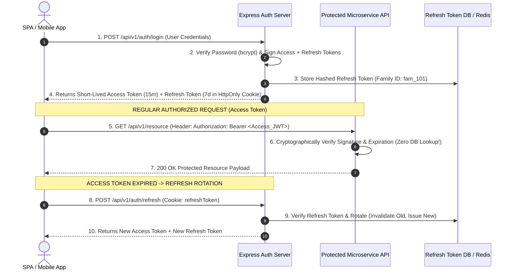
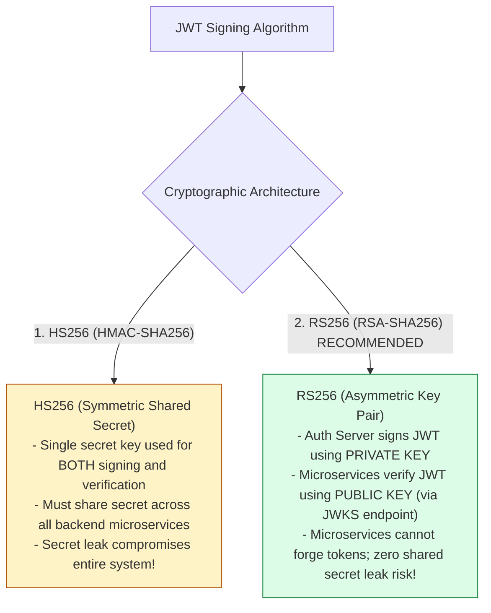
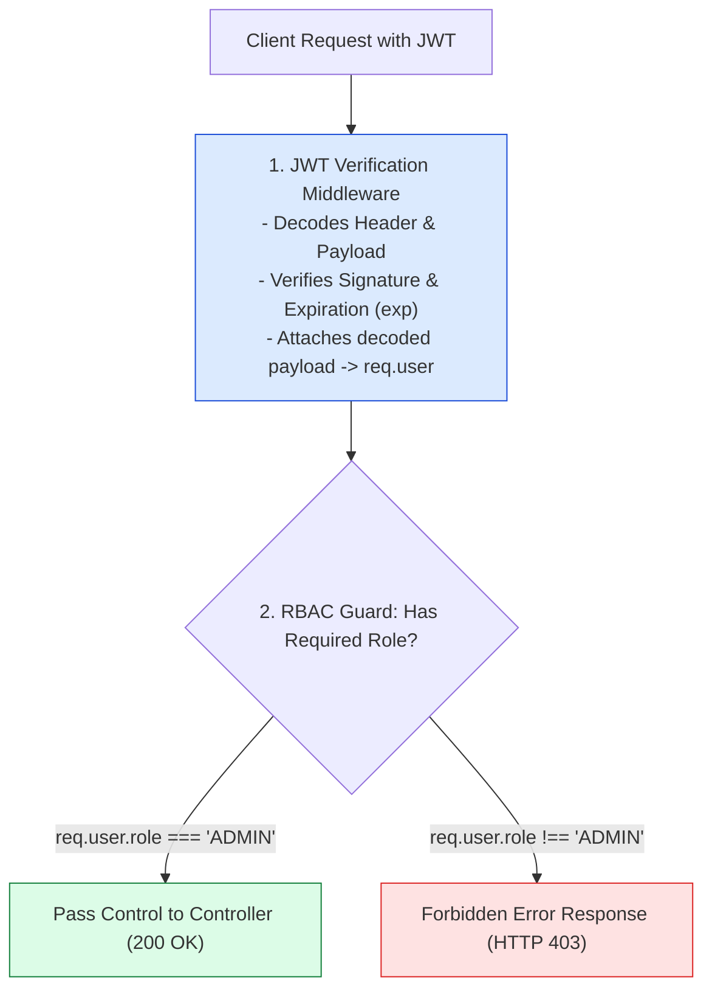

# Module 15: Stateless JWT Authentication, RBAC Authorization, and Token Rotation

## Overview

**JSON Web Token (JWT)** is the open standard (RFC 7519) for compact, URL-safe, stateless authentication. A cryptographically signed JWT contains three base64url-encoded components: **Header**, **Payload (Claims)**, and **Digital Signature**, allowing microservices to verify client identity without database session lookups.

Understanding **Stateless Auth Mechanics**, **Access vs. Refresh Token Rotation**, **Role-Based Access Control (RBAC)**, and **Cryptographic Signing (HS256 vs. RS256)** is essential.

---

## 1. Stateless JWT Authentication & Refresh Token Rotation



---

## 2. JWT Cryptographic Signing: HS256 (Symmetric) vs. RS256 (Asymmetric)



---

## 3. Role-Based Access Control (RBAC) Guard Pipeline



### JWT Token Lifetime & Storage Matrix

| Token Type | Lifespan / TTL | Recommended Storage Location | Security Function |
| :--- | :--- | :--- | :--- |
| **Short-Lived Access Token** | **15 Minutes** | In-Memory Application State / Redux | Carries user identity & roles; used for fast API authentication. |
| **Long-Lived Refresh Token** | **7 Days** | **`HttpOnly`, `Secure`, `SameSite=Strict` Cookie** | Used strictly to request new access tokens; stored securely against XSS. |

---

## 4. Practical Implementation Showcase: JWT & RBAC Middleware

```javascript
const express = require("express");
const jwt = require("jsonwebtoken");
const app = express();

app.use(express.json());

const JWT_SECRET = process.env.JWT_SECRET || "super_secret_jwt_signing_key_2026";

// 1. User Authentication Login Endpoint (Generates JWT)
app.post("/api/v1/auth/login", (req, res) => {
  const { username, password } = req.body;

  // Simulated Database Authentication
  if (username === "priya" && password === "secret123") {
    const payload = {
      userId: 101,
      username: "priya",
      role: "ADMIN" // RBAC Role Claim
    };

    // Sign Access Token expiring in 15 minutes
    const accessToken = jwt.sign(payload, JWT_SECRET, {
      expiresIn: "15m",
      issuer: "auth.enterprise.com",
      audience: "api.enterprise.com"
    });

    return res.status(200).json({
      status: "success",
      tokenType: "Bearer",
      accessToken,
      expiresIn: 900 // Seconds
    });
  }

  res.status(401).json({ error: "UNAUTHORIZED", message: "Invalid username or password" });
});

// 2. JWT Verification Middleware
const authenticateJWT = (req, res, next) => {
  const authHeader = req.headers["authorization"];

  if (!authHeader || !authHeader.startsWith("Bearer ")) {
    return res.status(401).json({
      error: "UNAUTHORIZED",
      message: "Missing or malformed Authorization Bearer header"
    });
  }

  const token = authHeader.split(" ")[1];

  try {
    const decoded = jwt.verify(token, JWT_SECRET, {
      issuer: "auth.enterprise.com",
      audience: "api.enterprise.com"
    });

    req.user = decoded; // Attach claims to request
    next();
  } catch (err) {
    if (err.name === "TokenExpiredError") {
      return res.status(401).json({ error: "TOKEN_EXPIRED", message: "Access token expired" });
    }
    return res.status(403).json({ error: "INVALID_TOKEN", message: "Cryptographic signature validation failed" });
  }
};

// 3. Role-Based Access Control (RBAC) Middleware Guard
const authorizeRoles = (...allowedRoles) => {
  return (req, res, next) => {
    if (!req.user || !allowedRoles.includes(req.user.role)) {
      return res.status(403).json({
        error: "FORBIDDEN",
        message: `Role '${req.user?.role}' is not authorized to access this resource`
      });
    }
    next(); // Authorized!
  };
};

// Protected Admin Resource Endpoint
app.get("/api/v1/admin/dashboard", authenticateJWT, authorizeRoles("ADMIN"), (req, res) => {
  res.status(200).json({
    message: `Welcome to Admin Dashboard, ${req.user.username}`,
    user: req.user
  });
});

// Start Server
app.listen(3000, () => {
  console.log("JWT & RBAC Server running on port 3000");
});
```

---

## Key Production Takeaways

1. **Keep Access Tokens Short-Lived**: Issue short-lived access tokens (15 minutes) paired with rotated refresh tokens stored in `HttpOnly` cookies to minimize exposure window if a token is intercepted.
2. **Use RS256 Asymmetric Keys in Microservices**: Use RS256 private/public key pairs in microservice meshes. The Auth Service holds the Private Key to sign tokens, while resource microservices fetch Public Keys via JWKS endpoints (`/.well-known/jwks.json`) to verify tokens offline.
3. **Never Store Sensitive PII in JWT Payloads**: JWT payloads are base64url-encoded strings that anyone can decode. Never store passwords, SSNs, credit cards, or raw secrets inside unencrypted JWT claims.
4. **Implement Token Revocation via Redis Blacklists**: To support instant user logout or emergency security revocations before token expiry, store revoked token IDs (`jti`) in a high-speed Redis blacklist.

