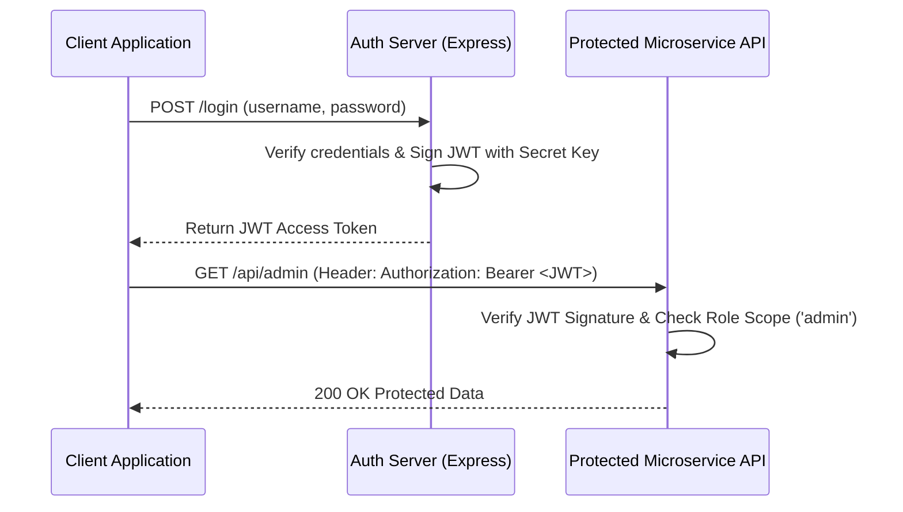

# File 15: JWT Authentication and Role-Based Access Control (RBAC)

## Overview
**JSON Web Token (JWT)** is a compact, URL-safe, stateless authentication standard. A signed JWT contains a **Header**, **Payload**, and **Cryptographic Signature**, enabling stateless authentication across distributed microservices.

---

## 1. JWT Structure & Authentication Flow



### JWT Token Structure

```
[Header: Base64Url] . [Payload: Base64Url] . [Signature: HMACSHA256]
```

---

## 2. JWT Generation & RBAC Guard Implementation

```javascript
const express = require("express");
const jwt = require("jsonwebtoken");

const app = express();
app.use(express.json());

const JWT_SECRET = "super_secret_jwt_key_2026";

// 1. Generate JWT Token on Login
app.post("/login", (req, res) => {
    const { username, password } = req.body;
    
    // Simulate user authentication
    if (username === "priya" && password === "pass123") {
        const payload = { userId: 101, username: "priya", role: "admin" };
        const token = jwt.sign(payload, JWT_SECRET, { expiresIn: "1h" });
        return res.status(200).json({ status: "success", token });
    }
    res.status(401).json({ error: "Invalid credentials" });
});

// 2. Authentication & RBAC Guard Middleware
const verifyJwtAndRole = (requiredRole) => {
    return (req, res, next) => {
        const authHeader = req.headers["authorization"];
        if (!authHeader || !authHeader.startsWith("Bearer ")) {
            return res.status(401).json({ error: "Access token missing" });
        }

        const token = authHeader.split(" ")[1];
        try {
            const decoded = jwt.verify(token, JWT_SECRET);
            req.user = decoded;

            if (requiredRole && decoded.role !== requiredRole) {
                return res.status(403).json({ error: "FORBIDDEN: Insufficient permissions" });
            }

            next(); // Authenticated & Authorized!
        } catch (err) {
            return res.status(401).json({ error: "Invalid or expired token" });
        }
    };
};

// Protected Admin Endpoint
app.get("/admin/dashboard", verifyJwtAndRole("admin"), (req, res) => {
    res.status(200).json({ message: `Welcome Admin ${req.user.username}` });
});
```

---

## Key Takeaways
1. JWTs provide **Stateless Authentication** (no server-side database session lookup required).
2. Transmit JWT tokens via the standard **`Authorization: Bearer <TOKEN>`** header.
3. Validate signature and expiration (`exp`) on every protected request.
4. Implement **Role-Based Access Control (RBAC)** to restrict sensitive admin endpoints.
