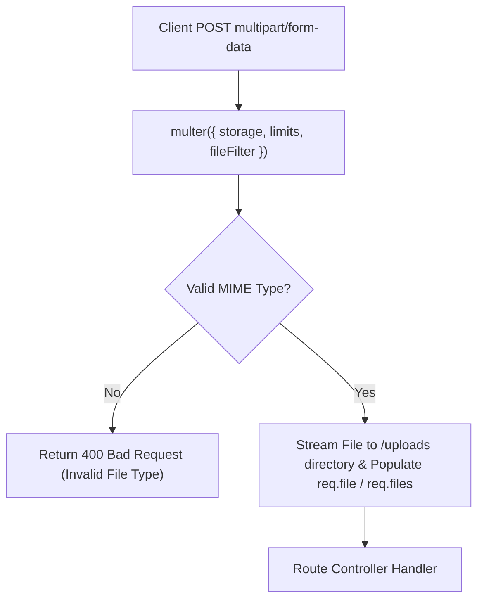

# File 16: Handling File Uploads (multer middleware)

## Overview
Handling `multipart/form-data` file uploads in Express requires using **`multer`** middleware. Multer streams uploaded files to disk storage or memory buffers, enforcing file size limits and MIME type filtering.

---

## 1. File Upload Processing Pipeline



---

## 2. Multer Disk Storage & Filter Implementation

```javascript
const express = require("express");
const multer = require("multer");
const path = require("path");

const app = express();

// 1. Configure Storage Engine & Filename Sanitization
const storage = multer.diskStorage({
    destination: (req, file, cb) => {
        cb(null, path.join(__dirname, "uploads"));
    },
    filename: (req, file, cb) => {
        const uniqueSuffix = `${Date.now()}-${Math.round(Math.random() * 1E9)}`;
        const ext = path.extname(file.originalname);
        cb(null, `${file.fieldname}-${uniqueSuffix}${ext}`);
    }
});

// 2. MIME Type Filter (Image Only)
const fileFilter = (req, file, cb) => {
    if (file.mimetype.startsWith("image/")) {
        cb(null, true);
    } else {
        cb(new Error("Only image files are allowed!"), false);
    }
};

const upload = multer({
    storage,
    fileFilter,
    limits: { fileSize: 2 * 1024 * 1024 } // 2MB Limit
});

// Single File Upload Route
app.post("/upload/avatar", upload.single("avatar"), (req, res) => {
    if (!req.file) {
        return res.status(400).json({ error: "No file uploaded" });
    }
    res.status(200).json({
        status: "success",
        fileInfo: {
            filename: req.file.filename,
            size: req.file.size,
            path: req.file.path
        }
    });
});
```

---

## Key Takeaways
1. Express default body parsers do NOT support `multipart/form-data`; use **`multer`**.
2. Enforce strict **`fileFilter`** checks to prevent executable malware upload vulnerabilities.
3. Always configure **`limits.fileSize`** to prevent Denial-of-Service disk exhaustion attacks.
