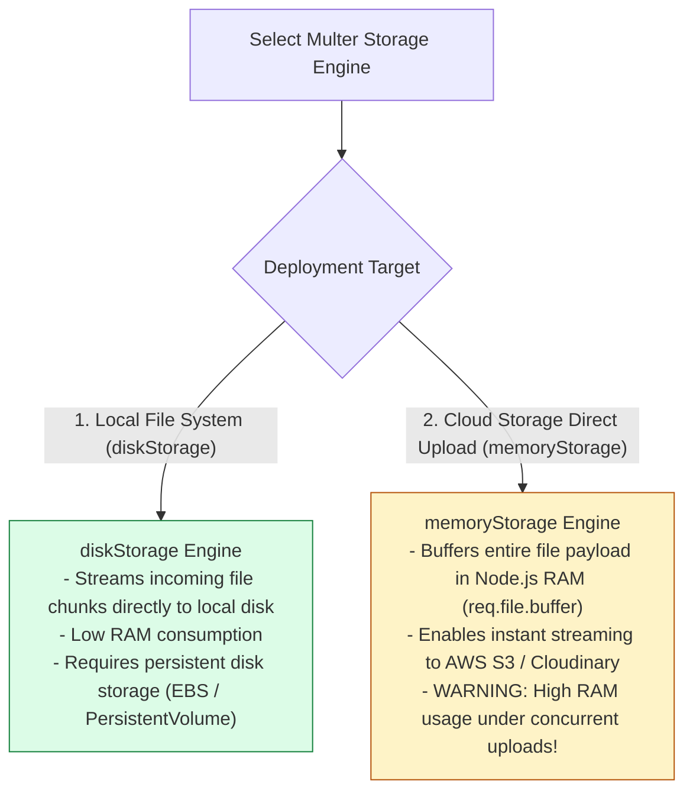
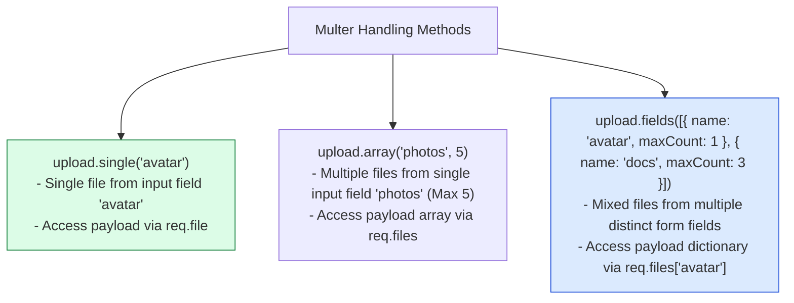

# Module 16: Handling Multipart File Uploads, Storage Engines, and Security Guards

## Overview

Handling **`multipart/form-data`** HTTP requests (such as profile avatar uploads or PDF attachments) requires specialized streaming body parser middleware: **`multer`**. Standard Express body parsers (`express.json()`, `express.urlencoded()`) ignore multipart data streams.

Understanding **Disk Storage (`diskStorage`) vs. Memory Buffer Storage (`memoryStorage`)**, **File Size Limits (`limits.fileSize`)**, **MIME Type Filter Validation (`fileFilter`)**, and **Filename Sanitization** is essential for protecting backend servers against disk exhaustion and arbitrary code execution attacks.

---

## 1. Multipart Upload Ingestion Pipeline

```mermaid
flowchart TD
    Client[Client Browser / Mobile App] -->|POST multipart/form-data| MulterEngine["Multer Middleware Ingestion Engine"]

    subgraph Multer Ingestion & Security Controls
        MulterEngine --> LimitsCheck{1. Enforce limits.fileSize?}
        LimitsCheck -- "Size > Max Limit (e.g. 5MB)" --> ErrorSize["Reject Stream (LIMIT_FILE_SIZE Error)"]
        
        LimitsCheck -- "Size Valid" --> MIMECheck{2. Execute fileFilter (MIME Check)?}
        MIMECheck -- "Disallowed MIME Type" --> ErrorMIME["Reject File (Invalid MIME Type)"]
        
        MIMECheck -- "MIME Approved" --> StorageEngine{3. Select Storage Engine}
    end

    StorageEngine -- "diskStorage" --> DiskStream["Stream File to Local Disk Uploads Directory<br/>- Generates sanitized unique filename<br/>- Populates req.file / req.files"]
    StorageEngine -- "memoryStorage" --> BufferMem["Buffer File in RAM Memory<br/>- Populates req.file.buffer<br/>- Ideal for Direct S3 Uploads"]

    DiskStream --> Controller["Execute Route Controller (200 OK)"]
    BufferMem --> Controller

    style MulterEngine fill:#dbeafe,stroke:#1d4ed8
    style Controller fill:#dcfce7,stroke:#15803d
    style ErrorSize fill:#fee2e2,stroke:#dc2626
```

---

## 2. Multer Storage Engine Comparison: Disk vs. Memory Storage



### Multer Storage Engine Feature Matrix

| Feature | `multer.diskStorage()` | `multer.memoryStorage()` |
| :--- | :--- | :--- |
| **Storage Destination** | Local file system directory (`/uploads`) | Node.js RAM Buffer (`req.file.buffer`) |
| **Memory Footprint** | Extremely Low (Streamed directly to disk) | High (Buffers complete file into process RAM) |
| **Best Use Case** | On-premise monolithic web servers | Serverless / Cloud-native AWS S3 direct uploaders |
| **Persistence** | File remains on local disk | Lost when HTTP response finishes or server restarts |

---

## 3. Upload Method Taxonomy (`single`, `array`, `fields`)



---

## 4. Practical Implementation Showcase: Secure File Uploader

```javascript
const express = require("express");
const multer = require("multer");
const path = require("path");
const crypto = require("crypto");
const app = express();

app.use(express.json());

// 1. Configure Secure Disk Storage Engine
const diskStorage = multer.diskStorage({
  destination: (req, file, cb) => {
    // Always use absolute path resolution
    cb(null, path.join(__dirname, "uploads"));
  },
  filename: (req, file, cb) => {
    // SECURITY: Sanitize filenames using random cryptographically secure hex strings
    const randomHash = crypto.randomBytes(16).toString("hex");
    const sanitizedExt = path.extname(file.originalname).toLowerCase();
    cb(null, `file_${Date.now()}_${randomHash}${sanitizedExt}`);
  }
});

// 2. Strict MIME Type Security Filter
const imageMimeFilter = (req, file, cb) => {
  const allowedMimeTypes = ["image/jpeg", "image/png", "image/webp", "image/gif"];

  if (allowedMimeTypes.includes(file.mimetype)) {
    cb(null, true); // Accept file
  } else {
    cb(new Error("INVALID_FILE_TYPE: Only JPEG, PNG, WEBP, and GIF images are permitted"), false);
  }
};

// 3. Initialize Configured Multer Instance
const uploadAvatar = multer({
  storage: diskStorage,
  fileFilter: imageMimeFilter,
  limits: {
    fileSize: 5 * 1024 * 1024, // Enforce 5MB Maximum File Size Guard
    files: 1                    // Enforce Maximum 1 File per Request
  }
});

// Single Avatar Upload Endpoint
app.post("/api/v1/users/avatar", (req, res, next) => {
  // Execute upload middleware with custom error interception
  uploadAvatar.single("avatar")(req, res, (err) => {
    if (err instanceof multer.MulterError) {
      if (err.code === "LIMIT_FILE_SIZE") {
        return res.status(400).json({ error: "FILE_TOO_LARGE", message: "File exceeds 5MB maximum size limit" });
      }
      return res.status(400).json({ error: "MULTER_ERROR", message: err.message });
    } else if (err) {
      return res.status(400).json({ error: "INVALID_FILE", message: err.message });
    }

    if (!req.file) {
      return res.status(400).json({ error: "NO_FILE_PROVIDED", message: "Form field 'avatar' is required" });
    }

    res.status(201).json({
      status: "success",
      message: "Avatar uploaded successfully",
      fileDetails: {
        filename: req.file.filename,
        originalName: req.file.originalname,
        mimeType: req.file.mimetype,
        sizeInBytes: req.file.size,
        savedPath: req.file.path
      }
    });
  });
});

// Start Server
app.listen(3000, () => {
  console.log("Multipart File Upload Server running on port 3000");
});
```

---

## Key Production Takeaways

1. **Always Set `limits.fileSize`**: Always define explicit file size limits (`fileSize: 5 * 1024 * 1024`) inside `multer` configuration options to prevent malicious clients from filling up server disk space or memory.
2. **Never Trust Original User Filenames**: Never save uploaded files using `file.originalname` directly. Generate randomized, sanitized unique filenames (e.g. `crypto.randomBytes(16)`) to prevent path traversal attacks (`../../etc/passwd`).
3. **Validate MIME Types via `fileFilter`**: Restrict acceptable MIME types using `fileFilter` functions to prevent users from uploading executable scripts (`.php`, `.sh`, `.exe`) disguised as images.
4. **Use `memoryStorage` for AWS S3 Uploads**: Use `multer.memoryStorage()` when piping uploaded files directly to S3 or Cloudinary buckets, avoiding temporary local disk writes.

