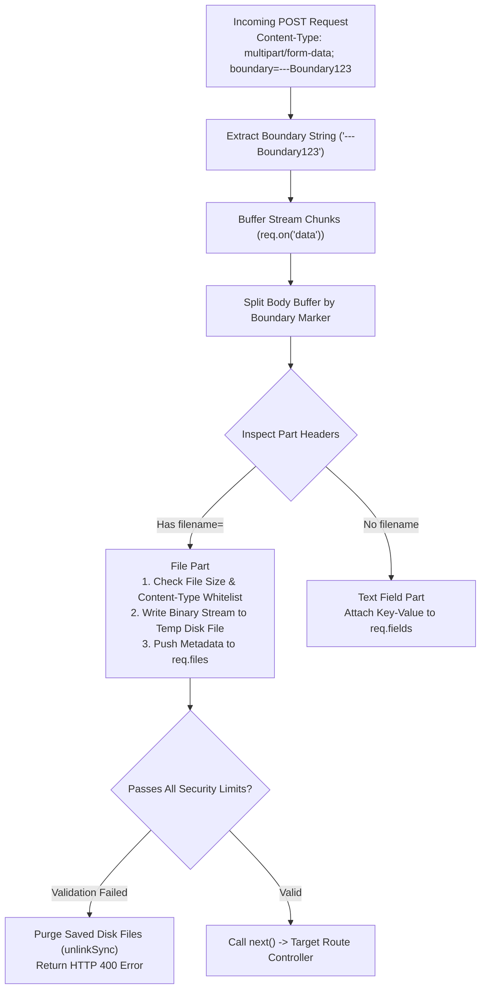

# Module 16: File Uploads & Multipart Form-Data Parsing Mechanics

## Theoretical Overview & Multipart Protocol Architecture

Standard web forms transmit data using `application/x-www-form-urlencoded` payloads. However, when uploading binary files (images, PDFs, documents), browsers format requests using `multipart/form-data`.

The client generates a unique **Boundary String** (e.g., `boundary=----WebKitFormBoundaryXYZ`) to separate distinct payload sections. Each section includes individual HTTP headers (`Content-Disposition`, `Content-Type`) followed by raw binary payload chunks.



### Real-World Analogy: Passport Seva Kendra Document Submission
Think of submitting documents at a Passport Seva Kendra counter:
- **Multipart Package (`multipart/form-data`)**: The physical paper envelope handed over to the counter clerk.
- **Boundary Dividers (`--boundary`)**: Colored tab separators dividing the passport application form (`fields`) from the attached birth certificate and Aadhaar card copies (`files`).
- **Upload Validation & Cleanup (`cleanupFiles`)**: The clerk inspecting your documents. If an unapproved file format (e.g. an invalid executable file instead of a PDF) or oversized document is submitted, the clerk rejects the envelope, purges all scanned pages from the system, and issues an immediate rejection slip (`HTTP 400 Bad Request`).

---

## 1. `multipart/form-data` Wire Format Specification

```http
POST /upload/basic HTTP/1.1
Host: 127.0.0.1:3000
Content-Type: multipart/form-data; boundary=----Boundary123
Content-Length: 350

------Boundary123
Content-Disposition: form-data; name="applicant"

Rajesh Sharma
------Boundary123
Content-Disposition: form-data; name="doc"; filename="aadhaar.txt"
Content-Type: text/plain

Aadhaar scan binary payload data
------Boundary123--
```

---

## 2. Basic Multipart Parser Implementation (`block1`)

Extracting boundary strings, splitting raw binary buffers, and saving uploaded files securely using generated random UUID filenames to prevent file overwrite vulnerabilities:

```javascript
const express = require('express');
const fs = require('fs');
const path = require('path');
const crypto = require('crypto');
const os = require('os');

// 1. Boundary Extractor
function extractBoundary(contentType) {
  if (!contentType || !contentType.includes('multipart/form-data')) return null;
  const marker = 'boundary=';
  const startIdx = contentType.indexOf(marker);
  if (startIdx === -1) return null;
  let value = contentType.substring(startIdx + marker.length);
  for (let i = 0; i < value.length; i++) {
    if (value[i] === ' ' || value[i] === ';') { value = value.substring(0, i); break; }
  }
  return value.length > 0 ? value : null;
}

// 2. Custom Basic Multipart Parser Middleware
function basicMultipartParser(options = {}) {
  const uploadDir = options.uploadDir || os.tmpdir();
  if (!fs.existsSync(uploadDir)) fs.mkdirSync(uploadDir, { recursive: true });

  return (req, res, next) => {
    const boundary = extractBoundary(req.headers['content-type'] || '');
    if (!boundary) return next();

    const chunks = [];
    req.on('data', (chunk) => chunks.push(chunk));
    req.on('end', () => {
      try {
        const parts = parseMultipartBody(Buffer.concat(chunks), boundary);
        req.files = [];
        req.fields = {};

        for (const part of parts) {
          if (part.type === 'file') {
            // Generate unique random name to prevent overwrite attacks
            const ext = path.extname(part.filename);
            const uniqueName = `${crypto.randomBytes(16).toString('hex')}${ext}`;
            const filePath = path.join(uploadDir, uniqueName);
            
            fs.writeFileSync(filePath, part.data);
            req.files.push({
              fieldName: part.fieldName,
              originalName: part.filename,
              savedAs: uniqueName,
              path: filePath,
              contentType: part.contentType,
              size: part.size,
            });
          } else {
            req.fields[part.fieldName] = part.value;
          }
        }
        next();
      } catch (err) { next(err); }
    });
  };
}
```

---

## 3. Enhanced Upload Validation & Cleanup Engine (`block2`)

Enforcing file size limits, file count caps, MIME type whitelists, and automatic disk cleanup on validation failure:

```javascript
function cleanupFiles(paths) {
  for (const fp of paths) {
    try { if (fs.existsSync(fp)) fs.unlinkSync(fp); } catch {}
  }
}

function enhancedMultipartParser(options = {}) {
  const uploadDir = options.uploadDir || os.tmpdir();
  const maxFileSize = options.maxFileSize || 5 * 1024 * 1024; // 5 MB Limit
  const maxFiles = options.maxFiles || 10;
  const allowedTypes = options.allowedTypes || null;
  const allowedExtensions = options.allowedExtensions || null;

  return (req, res, next) => {
    const boundary = extractBoundary(req.headers['content-type'] || '');
    if (!boundary) return next();

    const chunks = [];
    req.on('data', (chunk) => chunks.push(chunk));
    req.on('end', () => {
      try {
        const parts = parseMultipartBody(Buffer.concat(chunks), boundary);
        req.files = [];
        req.fields = {};
        const savedPaths = [];
        let fileCount = 0;

        for (const part of parts) {
          if (part.type === 'file') {
            fileCount++;
            
            // 1. Max File Count Check
            if (fileCount > maxFiles) {
              cleanupFiles(savedPaths);
              const err = new Error(`Too many files. Max: ${maxFiles}`);
              err.status = 400; return next(err);
            }
            
            // 2. Max File Size Check
            if (part.size > maxFileSize) {
              cleanupFiles(savedPaths);
              const err = new Error(`"${part.filename}" exceeds size limit`);
              err.status = 400; return next(err);
            }
            
            // 3. MIME Type Whitelist Check
            if (allowedTypes && !allowedTypes.includes(part.contentType)) {
              cleanupFiles(savedPaths);
              const err = new Error(`Type "${part.contentType}" not allowed`);
              err.status = 400; return next(err);
            }

            const ext = path.extname(part.filename).toLowerCase();
            const uniqueName = `${crypto.randomBytes(16).toString('hex')}${ext}`;
            const filePath = path.join(uploadDir, uniqueName);
            
            fs.writeFileSync(filePath, part.data);
            savedPaths.push(filePath);
            req.files.push({ fieldName: part.fieldName, originalName: part.filename, path: filePath, size: part.size });
          } else {
            req.fields[part.fieldName] = part.value;
          }
        }
        
        req.cleanupFiles = () => cleanupFiles(savedPaths);
        next();
      } catch (err) { next(err); }
    });
  };
}
```

---

## Key Takeaways

1. **Boundary Delimiters**: HTTP `multipart/form-data` uploads use boundary strings (`--boundary`) to separate form fields from binary file streams.
2. **Never Trust Client Metadata**: Never rely solely on client-provided `filename` or `Content-Type` headers. Validate file extensions and inspect binary headers.
3. **Randomized File Storage**: Always generate random UUID filenames (`crypto.randomBytes()`) when saving files to disk to prevent directory traversal or file overwriting attacks.
4. **Mandatory Error Cleanup**: Track saved file paths during parsing so temporary disk files can be immediately unlinked (`unlinkSync`) if a validation rule fails mid-upload.
