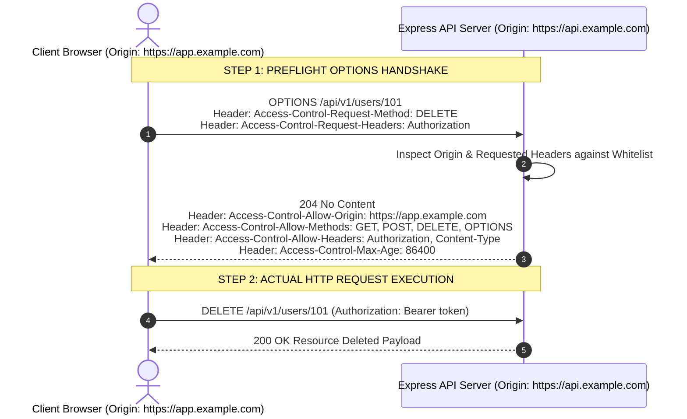
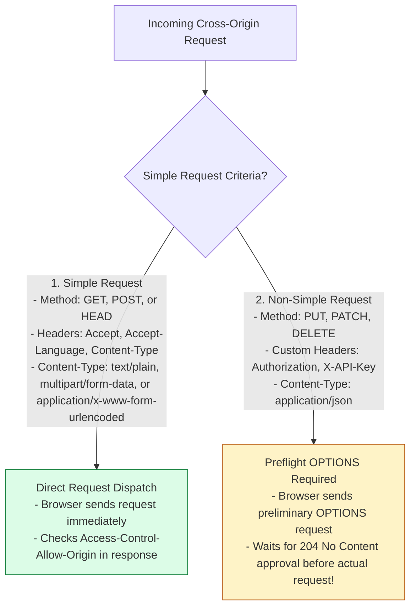
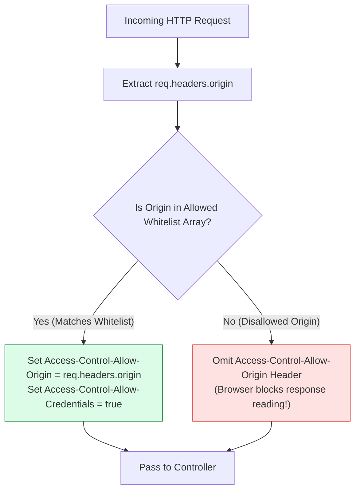

# Module 17: Cross-Origin Resource Sharing (CORS), Preflight Flow, and Security Headers

## Overview

**CORS (Cross-Origin Resource Sharing)** is a critical W3C browser security mechanism that restricts web pages running on one origin (domain, protocol, or port) from requesting resources on a different origin. Express applications configure CORS response headers (`Access-Control-Allow-Origin`, `Access-Control-Allow-Methods`, `Access-Control-Allow-Headers`) and handle **`OPTIONS` Preflight Requests**.

Understanding **Simple vs. Non-Simple Requests**, **OPTIONS Preflight Negotiation**, **Dynamic Origin Whitelisting**, and **Credentials Handling (`Access-Control-Allow-Credentials`)** is essential.

---

## 1. CORS Preflight Handshake Architecture

When a browser makes a non-simple cross-origin request (e.g. using `PUT`, `DELETE`, or custom `Authorization` headers), it automatically dispatches an **`OPTIONS` Preflight Request** before sending the actual HTTP request:



---

## 2. Simple Requests vs. Non-Simple Preflight Requests



### CORS Header Configuration Matrix

| CORS Header | Value / Format | Security Purpose & Function |
| :--- | :--- | :--- |
| **`Access-Control-Allow-Origin`** | `https://app.domain.com` (Never `*` with credentials) | Specifies trusted origin domain permitted to read response. |
| **`Access-Control-Allow-Methods`**| `GET, POST, PUT, DELETE, OPTIONS` | Specifies permitted HTTP verbs for cross-origin calls. |
| **`Access-Control-Allow-Headers`**| `Content-Type, Authorization, X-Requested-With` | Specifies permitted custom request HTTP headers. |
| **`Access-Control-Allow-Credentials`**| `true` | Permits client browsers to send cookies and HTTP auth headers. |
| **`Access-Control-Max-Age`** | `86400` (Seconds) | Caches preflight OPTIONS approval in browser (reduces OPTIONS traffic). |

---

## 3. Dynamic Origin Whitelisting Architecture

Hardcoding a single origin string prevents multi-tenant or multi-frontend setups. A dynamic origin checker validates incoming `Origin` request headers against an array whitelist:



---

## 4. Practical Implementation Showcase: Custom Production CORS Middleware

```javascript
const express = require("express");
const app = express();

app.use(express.json());

// Enterprise Origin Whitelist Array
const ALLOWED_ORIGIN_WHITELIST = [
  "https://app.techplaybook.org",
  "https://admin.techplaybook.org",
  "http://localhost:3000" // Allowed local dev origin
];

// Production Dynamic CORS Middleware Implementation
const productionCorsMiddleware = (req, res, next) => {
  const requestOrigin = req.headers.origin;

  // 1. Validate Origin against Whitelist Array
  if (requestOrigin && ALLOWED_ORIGIN_WHITELIST.includes(requestOrigin)) {
    // Reflect exact origin back (NEVER use '*' when credentials are enabled!)
    res.setHeader("Access-Control-Allow-Origin", requestOrigin);
    res.setHeader("Access-Control-Allow-Methods", "GET, POST, PUT, PATCH, DELETE, OPTIONS");
    res.setHeader("Access-Control-Allow-Headers", "Content-Type, Authorization, X-Requested-With");
    res.setHeader("Access-Control-Allow-Credentials", "true");
    res.setHeader("Access-Control-Max-Age", "86400"); // Cache OPTIONS preflight for 24 Hours
  }

  // 2. Intercept & Resolve OPTIONS Preflight Requests Immediately
  if (req.method === "OPTIONS") {
    // Return 204 No Content with empty body for preflight checks
    return res.status(204).end();
  }

  next(); // Pass control to API controllers
};

// Apply Global CORS Middleware
app.use(productionCorsMiddleware);

// Sample Protected API Resource Endpoint
app.put("/api/v1/user/profile", (req, res) => {
  res.status(200).json({
    status: "success",
    message: "Cross-origin PUT update approved and processed successfully"
  });
});

// Start Server
app.listen(3000, () => {
  console.log("CORS Management Server running on port 3000");
});
```

---

## Key Production Takeaways

1. **CORS is Enforced by Browsers, Not Server Engines**: CORS headers instruct user *web browsers* whether to block or allow JavaScript from reading responses. Non-browser HTTP clients (curl, Postman, server-to-server calls) bypass CORS checks entirely.
2. **Never Pair `Access-Control-Allow-Origin: *` with `Credentials: true`**: Browsers throw a fatal security exception if a server returns wildcard `Access-Control-Allow-Origin: *` while simultaneously specifying `Access-Control-Allow-Credentials: true`.
3. **Cache Preflight Requests with `Access-Control-Max-Age`**: Set `Access-Control-Max-Age: 86400` (24 hours) to allow client browsers to cache `OPTIONS` preflight approvals, eliminating redundant OPTIONS network calls.
4. **Intercept `OPTIONS` Requests Early**: Always return an early `204 No Content` response for `OPTIONS` requests before firing heavy database middleware or route handlers.

