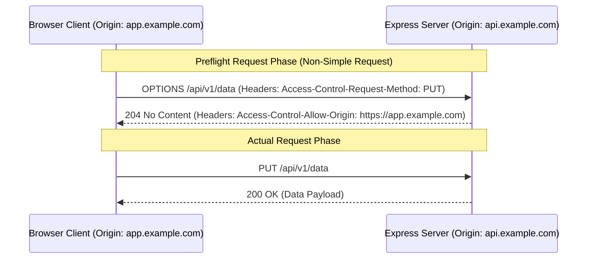

# File 17: CORS (Cross-Origin Resource Sharing) Fundamentals and Implementation

## Overview
**CORS (Cross-Origin Resource Sharing)** is a browser security mechanism that restricts cross-origin HTTP requests. Express applications configure CORS headers (`Access-Control-Allow-Origin`, `Access-Control-Allow-Methods`, `Access-Control-Allow-Headers`) and handle **OPTIONS Preflight Requests**.

---

## 1. CORS Preflight Request Flow



---

## 2. Custom CORS Middleware Implementation

```javascript
const express = require("express");
const app = express();

const ALLOWED_ORIGINS = ["https://app.techplaybook.org", "http://localhost:3000"];

// Custom CORS Middleware
const corsMiddleware = (req, res, next) => {
    const origin = req.headers.origin;

    if (ALLOWED_ORIGINS.includes(origin)) {
        res.setHeader("Access-Control-Allow-Origin", origin);
        res.setHeader("Access-Control-Allow-Methods", "GET, POST, PUT, DELETE, OPTIONS");
        res.setHeader("Access-Control-Allow-Headers", "Content-Type, Authorization");
        res.setHeader("Access-Control-Allow-Credentials", "true");
    }

    // Handle OPTIONS Preflight Requests
    if (req.method === "OPTIONS") {
        return res.status(204).end();
    }

    next();
};

app.use(corsMiddleware);

app.get("/api/v1/data", (req, res) => {
    res.status(200).json({ status: "CORS Enabled API Data" });
});
```

---

## Key Takeaways
1. CORS is enforced by **Browsers**, NOT by backend servers or non-browser clients (like curl or Postman).
2. Non-simple requests (custom headers, `PUT`/`DELETE` methods) trigger an automatic **`OPTIONS` Preflight Request**.
3. Never use `Access-Control-Allow-Origin: *` in production when handling authenticated request cookies (`Access-Control-Allow-Credentials: true`).
