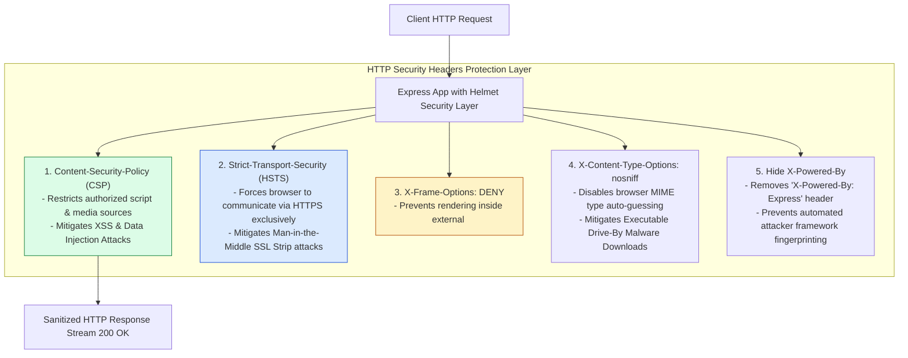
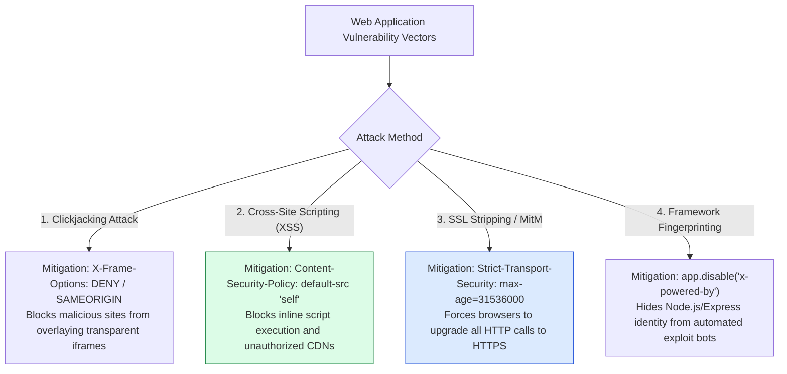
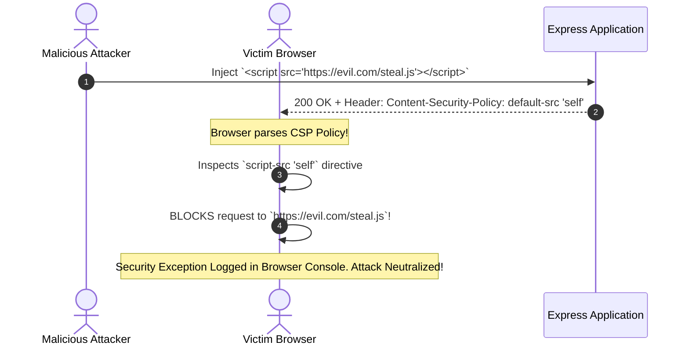

# Module 18: HTTP Security Headers, Application Hardening, and Helmet Configuration

## Overview

Hardening Express.js applications against common web vulnerabilities requires injecting specialized **HTTP Security Headers** into every outgoing response. Utilizing security middleware like **`helmet`** (or custom header injection) mitigates threats like **Clickjacking**, **Cross-Site Scripting (XSS)**, **MIME-Type Sniffing**, and **Framework Fingerprinting**.

Understanding **Content Security Policy (CSP)**, **HSTS (Strict-Transport-Security)**, **X-Frame-Options**, and **Hiding `X-Powered-By`** is essential.

---

## 1. HTTP Security Headers Defense Architecture



---

## 2. Threat Vector vs. HTTP Security Header Mitigation Matrix



### Security Header Specifications Matrix

| Security Header | Recommended Production Value | Target Vulnerability Mitigated |
| :--- | :--- | :--- |
| **`Content-Security-Policy`** | `default-src 'self'; script-src 'self' ...` | Cross-Site Scripting (XSS) & Code Injections |
| **`Strict-Transport-Security`** | `max-age=31536000; includeSubDomains; preload` | SSL Stripping & Man-in-the-Middle (MitM) Attacks |
| **`X-Frame-Options`** | `DENY` or `SAMEORIGIN` | Clickjacking UI Redirection |
| **`X-Content-Type-Options`** | `nosniff` | MIME-Sniffing Executable Execution |
| **`Referrer-Policy`** | `strict-origin-when-cross-origin` | Sensitive URL Fragment & Token Leaks |
| **`X-Permitted-Cross-Domain-Policies`** | `none` | Adobe Flash / PDF Cross-Domain Attacks |
| **`X-Powered-By`** | **REMOVED / DISABLED** | Automated Framework Exploit Fingerprinting |

---

## 3. Content Security Policy (CSP) Directives Execution Pipeline



---

## 4. Practical Implementation Showcase: Application Hardening Middleware

```javascript
const express = require("express");
const app = express();

app.use(express.json());

// 1. Disable Default Framework Fingerprint Header
app.disable("x-powered-by");

// 2. Custom Security Hardening Middleware (Production Native Equivalent of Helmet)
const securityHardeningMiddleware = (req, res, next) => {
  // Explicitly remove X-Powered-By if set by upstream proxies
  res.removeHeader("X-Powered-By");

  // Prevent Clickjacking Attacks inside iframes
  res.setHeader("X-Frame-Options", "DENY");

  // Prevent MIME-Type Auto-Sniffing
  res.setHeader("X-Content-Type-Options", "nosniff");

  // Force HTTPS Connections for 1 Year (HSTS)
  res.setHeader(
    "Strict-Transport-Security",
    "max-age=31536000; includeSubDomains; preload"
  );

  // Restrict Referrer Info Leakage
  res.setHeader("Referrer-Policy", "strict-origin-when-cross-origin");

  // Restrict Cross-Domain Policy Access
  res.setHeader("X-Permitted-Cross-Domain-Policies", "none");

  // Content Security Policy (CSP) - Restricts script/style sources to origin
  res.setHeader(
    "Content-Security-Policy",
    "default-src 'self'; script-src 'self'; style-src 'self' 'unsafe-inline'; img-src 'self' data: https:; frame-ancestors 'none';"
  );

  next();
};

// Mount Global Security Middleware
app.use(securityHardeningMiddleware);

// Hardened Endpoint
app.get("/api/v1/secure-payload", (req, res) => {
  res.status(200).json({
    status: "success",
    message: "Payload served with production HTTP security headers attached"
  });
});

// Start Server
app.listen(3000, () => {
  console.log("Security Hardening Server running on port 3000");
});
```

---

## Key Production Takeaways

1. **Always Disable `X-Powered-By`**: Execute `app.disable('x-powered-by')` on application initialization to prevent automated vulnerability scanners from fingerprinting your Express framework version.
2. **Use `helmet` Middleware in Production**: Install and mount `helmet()` at the top of your middleware chain to automatically set 15+ HTTP security headers according to OWASP best practices.
3. **Configure Strict Content Security Policies (CSP)**: Customize CSP directives (`script-src 'self'`) to block unauthorized external script loading and inline JavaScript execution, neutralizing XSS vectors.
4. **Enforce HSTS (`Strict-Transport-Security`)**: Set `max-age=31536000` (1 year) with `includeSubDomains` and `preload` to ensure client browsers convert all HTTP requests to HTTPS automatically.

