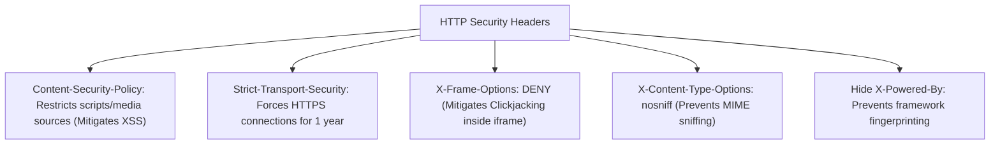

# File 18: Security Headers and Vulnerability Hardening (helmet)

## Overview
Hardening Express applications against web vulnerabilities requires setting HTTP Security Headers (**`helmet`** middleware) including **Content Security Policy (CSP)**, **HSTS**, **X-Frame-Options**, **X-Content-Type-Options**, and hiding the default `X-Powered-By: Express` signature.

---

## 1. Essential HTTP Security Headers



---

## 2. Security Hardening Middleware Implementation

```javascript
const express = require("express");
const app = express();

// Custom Security Headers Middleware (Equivalent to helmet)
const securityHeadersMiddleware = (req, res, next) => {
    // 1. Hide Express Framework Fingerprint
    res.removeHeader("X-Powered-By");

    // 2. Prevent Clickjacking Attacks inside <iframe>
    res.setHeader("X-Frame-Options", "DENY");

    // 3. Prevent MIME Type Sniffing
    res.setHeader("X-Content-Type-Options", "nosniff");

    // 4. Force HTTPS via HSTS (1 Year)
    res.setHeader("Strict-Transport-Security", "max-age=31536000; includeSubDomains");

    // 5. Content Security Policy (CSP)
    res.setHeader("Content-Security-Policy", "default-src 'self'; script-src 'self'");

    next();
};

app.use(securityHeadersMiddleware);

app.get("/api/v1/secure-data", (req, res) => {
    res.status(200).json({ status: "Security Hardened API" });
});
```

---

## Key Takeaways
1. Always hide the **`X-Powered-By`** header (`app.disable('x-powered-by')`) to prevent attacker framework fingerprinting.
2. Set **`X-Frame-Options: DENY`** to defend against Clickjacking.
3. Configure **`Content-Security-Policy` (CSP)** to block unauthorized cross-site script injections.
