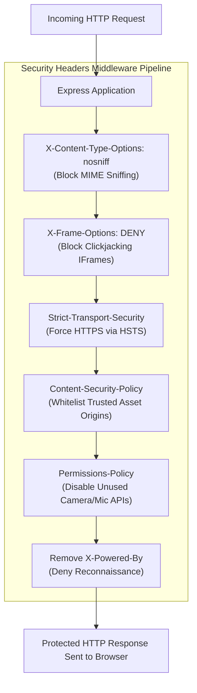

# Module 18: HTTP Security Headers, Content Security Policy (CSP), & Helmet Mechanics

## Theoretical Overview & Defense-in-Depth

HTTP **Security Headers** instruct the client's web browser to activate built-in security defenses. By enforcing strict header policies, web applications defend against Cross-Site Scripting (XSS), Clickjacking, MIME-Type Sniffing, Man-in-the-Middle (MitM) downgrade attacks, and Information Disclosure vulnerabilities.



### Real-World Analogy: Royal Castle Fortifications
Think of defending a royal castle:
- **Drawbridge (`X-Frame-Options: DENY`)**: Prevents enemies from building a hidden fake facade around your castle gate (Clickjacking iframe embedding).
- **Food Taster (`X-Content-Type-Options: nosniff`)**: Verifies that incoming shipments labeled as flour aren't secretly poison (MIME-type sniffing execution).
- **Royal Decrees (`Content-Security-Policy`)**: Lists explicit royal approvals detailing which messengers and artists are permitted inside the courtyard (`script-src 'self'`).
- **Sealed Highway (`Strict-Transport-Security`)**: Mandates that all royal couriers travel strictly via secured, armored highways (HTTPS enforcement).
- **Removing Banners (`Remove X-Powered-By`)**: Stripping your flag markers so foreign spies cannot identify which mortar brand built your walls (Information Disclosure mitigation).

---

## 1. Core Security Headers Reference Matrix

| Security Header | Recommended Configuration Value | Target Vulnerability / Threat Mitigated |
| :--- | :--- | :--- |
| **`X-Content-Type-Options`** | `nosniff` | **MIME Sniffing Attack**: Stops browsers from executing uploaded text/image files as JavaScript. |
| **`X-Frame-Options`** | `DENY` or `SAMEORIGIN` | **Clickjacking**: Prevents external malicious sites from embedding your app inside invisible `<iframes>`. |
| **`Strict-Transport-Security`** | `max-age=31536000; includeSubDomains; preload` | **HTTPS Downgrade / SSL Stripping**: Forces browsers to communicate strictly over encrypted HTTPS for 1 year. |
| **`Content-Security-Policy`** | `default-src 'self'; script-src 'self' https://cdn.com` | **XSS & Injection**: Restricts script execution to explicitly whitelisted domain origins. |
| **`Referrer-Policy`** | `strict-origin-when-cross-origin` | **Information Leakage**: Restricts URL path leakage in `Referer` headers during cross-domain navigation. |
| **`Permissions-Policy`** | `camera=(), microphone=(), geolocation=(self)` | **Hardware Hijacking**: Disables browser hardware access for features your application does not use. |
| **`X-XSS-Protection`** | `0` | Disables legacy, buggy browser XSS auditors which introduced side-channel vulnerabilities. |

---

## 2. Custom Security Headers Middleware (`block1`)

A pure Express middleware implementation configuring essential security headers without third-party dependencies:

```javascript
const express = require('express');
const app = express();

// Disable X-Powered-By at application setting level
app.disable('x-powered-by');

function securityHeaders(options = {}) {
  const {
    frameOptions = 'DENY',
    noSniff = true,
    xssProtection = true,
    hsts = null,
    referrerPolicy = 'strict-origin-when-cross-origin',
    permissionsPolicy = null,
    csp = null,
    removePoweredBy = true
  } = options;

  return (req, res, next) => {
    // 1. Prevent MIME Sniffing
    if (noSniff) res.setHeader('X-Content-Type-Options', 'nosniff');
    
    // 2. Prevent Clickjacking
    if (frameOptions) res.setHeader('X-Frame-Options', frameOptions);
    
    // 3. Disable Legacy XSS Auditor (CSP is primary XSS defense)
    if (xssProtection) res.setHeader('X-XSS-Protection', '0');

    // 4. Force HTTPS (HSTS)
    if (hsts) {
      let val = `max-age=${hsts.maxAge || 31536000}`;
      if (hsts.includeSubDomains) val += '; includeSubDomains';
      if (hsts.preload) val += '; preload';
      res.setHeader('Strict-Transport-Security', val);
    }

    // 5. Content Security Policy (CSP) & Referrer Policy
    if (csp) res.setHeader('Content-Security-Policy', csp);
    if (referrerPolicy) res.setHeader('Referrer-Policy', referrerPolicy);

    // 6. Permissions Policy
    if (permissionsPolicy) {
      const directives = Object.entries(permissionsPolicy)
        .map(([feat, allow]) => `${feat}=(${allow})`).join(', ');
      res.setHeader('Permissions-Policy', directives);
    }

    // 7. Hide Framework Signature
    if (removePoweredBy) res.removeHeader('X-Powered-By');
    
    next();
  };
}
```

---

## 3. CSP Builder & Per-Route Header Overrides (`block2`)

A Fluent Builder for constructing Content Security Policy strings, combined with a per-route header override utility for relaxing rules on specific API or embeddable widget endpoints:

```javascript
// 1. Fluent Content Security Policy (CSP) Builder
class CSPBuilder {
  constructor() { this.directives = {}; }
  add(directive, ...sources) { this.directives[directive] = sources; return this; }
  defaultSrc(...s) { return this.add('default-src', ...s); }
  scriptSrc(...s)  { return this.add('script-src', ...s); }
  styleSrc(...s)   { return this.add('style-src', ...s); }
  imgSrc(...s)     { return this.add('img-src', ...s); }
  connectSrc(...s) { return this.add('connect-src', ...s); }
  frameSrc(...s)   { return this.add('frame-src', ...s); }
  objectSrc(...s)  { return this.add('object-src', ...s); }
  build() {
    return Object.entries(this.directives)
      .map(([d, s]) => `${d} ${s.join(' ')}`).join('; ');
  }
}

// 2. Per-Route Header Override Middleware Utility
function overrideHeaders(headerOverrides) {
  return (req, res, next) => {
    const originalEnd = res.end.bind(res);
    res.end = function (...args) {
      for (const [header, value] of Object.entries(headerOverrides)) {
        if (value === null) res.removeHeader(header);
        else res.setHeader(header, value);
      }
      return originalEnd(...args);
    };
    next();
  };
}

// Construct Global CSP
const cspPolicy = new CSPBuilder()
  .defaultSrc("'self'")
  .scriptSrc("'self'", 'https://cdn.example.com')
  .styleSrc("'self'", "'unsafe-inline'")
  .imgSrc("'self'", 'data:', 'https:')
  .connectSrc("'self'", 'https://api.example.com')
  .frameSrc("'none'")
  .objectSrc("'none'")
  .build();

// Mount Global Security Policy
app.use(securityHeaders({
  frameOptions: 'DENY',
  noSniff: true,
  hsts: { maxAge: 31536000, includeSubDomains: true, preload: true },
  permissionsPolicy: { camera: '', microphone: '', geolocation: 'self' },
  csp: cspPolicy
}));

// Route Overrides: Relax X-Frame-Options for Embeddable Widget Endpoint
app.get('/widget',
  overrideHeaders({
    'X-Frame-Options': null, // Remove DENY to allow embedding
    'Content-Security-Policy': new CSPBuilder().defaultSrc("'self'").scriptSrc("'self'").build()
  }),
  (req, res) => res.json({ widget: true })
);
```

---

## Key Takeaways

1. **CSP is the Ultimate XSS Defense**: Content Security Policy restricts script execution to explicitly whitelisted domains, mitigating XSS even if malicious script tags are injected.
2. **Clickjacking Defense**: Always set `X-Frame-Options: DENY` or `SAMEORIGIN` to prevent clickjacking attacks via hidden `<iframe>` overlays.
3. **Prevent MIME-Type Sniffing**: `X-Content-Type-Options: nosniff` stops browsers from executing uploaded text or image files as executable scripts.
4. **Enforce HTTPS Transmission**: Use `Strict-Transport-Security` (HSTS) to mandate encrypted HTTPS connections and block SSL stripping attacks.
5. **Hide Reconnaissance Markers**: Disable the `X-Powered-By` header (`app.disable('x-powered-by')`) to prevent automated vulnerability scanners from fingerprinting Express.js.
