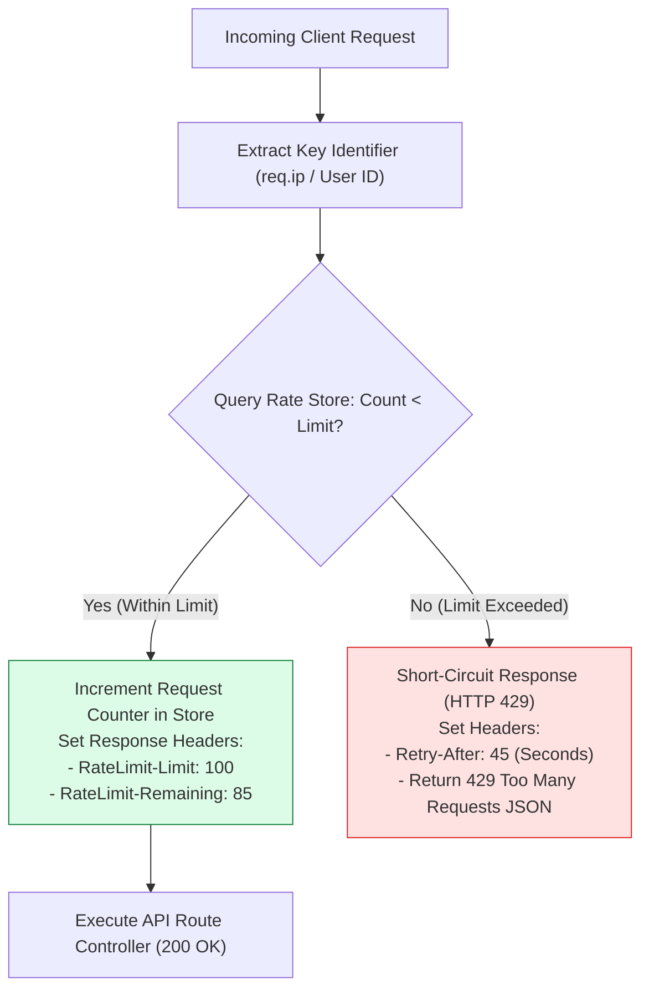
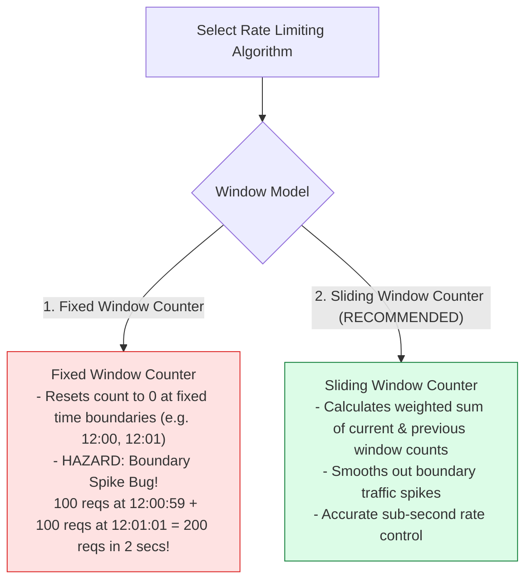
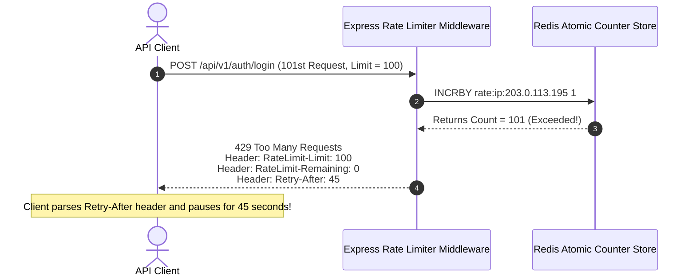

# Module 19: Rate Limiting Algorithms, HTTP 429 Headers, and Distributed Redis Stores

## Overview

**Rate Limiting** is an essential traffic control mechanism that protects Express applications from brute-force authentication attempts, Web Scraping bots, and Denial-of-Service (DoS) resource exhaustion. Using tools like **`express-rate-limit`** or custom algorithms, Express caps the number of requests an IP key can make within a specified time window.

Understanding **Rate Limiting Algorithms (Fixed Window vs. Sliding Window Counter)**, **Standard Rate Limit Response Headers**, and **Distributed Scaling with Redis Stores** is essential.

---

## 1. Rate Limiting Request Interception Pipeline



---

## 2. Rate Limiting Algorithms: Fixed Window vs. Sliding Window Counter



### Rate Limiting Store Engine Matrix

| Store Engine | Environment | Pros | Cons / Production Limitations |
| :--- | :--- | :--- | :--- |
| **`MemoryStore` (Default)** | Single Node Development | Zero external dependencies; fast RAM lookup | **Cannot scale horizontally**; counters reset on server restart; RAM leaks under heavy IP churn |
| **`RedisStore` (`rate-limit-redis`)** | Multi-Node Kubernetes Production | **Centralized atomic counter shared across all cluster nodes**; persistent across restarts | Requires Redis cluster infrastructure dependency |

---

## 3. Standard HTTP Rate Limit Headers & 429 Response



---

## 4. Practical Implementation Showcase: Sliding Window Rate Limiter

```javascript
const express = require("express");
const app = express();

// Enable trust proxy so rate limiter reads real client IP behind load balancers
app.set("trust proxy", true);
app.use(express.json());

// In-Memory Sliding Window Store Map: IP -> { windowStart, count }
const slidingWindowStore = new Map();

// Custom Sliding Window Rate Limiter Middleware Factory
const createRateLimiter = (options) => {
  const { windowMs = 60000, maxLimit = 10, message = "Too many requests" } = options;

  return (req, res, next) => {
    // Extract Client IP Key
    const clientKey = req.ip || req.socket.remoteAddress;
    const now = Date.now();

    if (!slidingWindowStore.has(clientKey)) {
      slidingWindowStore.set(clientKey, { windowStart: now, count: 1 });
    } else {
      const record = slidingWindowStore.get(clientKey);
      const elapsedTime = now - record.windowStart;

      if (elapsedTime > windowMs) {
        // Window expired -> Reset window boundary
        record.windowStart = now;
        record.count = 1;
      } else {
        // Increment request count
        record.count++;
      }

      if (record.count > maxLimit) {
        const retryAfterSeconds = Math.ceil((windowMs - elapsedTime) / 1000);
        
        // Attach Standard Rate Limit Headers
        res.setHeader("Retry-After", retryAfterSeconds);
        res.setHeader("RateLimit-Limit", maxLimit);
        res.setHeader("RateLimit-Remaining", 0);
        res.setHeader("RateLimit-Reset", Math.ceil((record.windowStart + windowMs) / 1000));

        return res.status(429).json({
          status: "fail",
          error: "TOO_MANY_REQUESTS",
          message: `${message}. Please try again in ${retryAfterSeconds} seconds.`,
          retryAfterSeconds
        });
      }
    }

    const currentRecord = slidingWindowStore.get(clientKey);
    res.setHeader("RateLimit-Limit", maxLimit);
    res.setHeader("RateLimit-Remaining", Math.max(0, maxLimit - currentRecord.count));
    
    next();
  };
};

// 1. Strict Auth Rate Limiter (5 requests per 1 minute window)
const authLimiter = createRateLimiter({
  windowMs: 60 * 1000,
  maxLimit: 5,
  message: "Too many failed login attempts"
});

// 2. General API Rate Limiter (100 requests per 15 minute window)
const apiLimiter = createRateLimiter({
  windowMs: 15 * 60 * 1000,
  maxLimit: 100,
  message: "Global API rate limit exceeded"
});

// Mount Rate Limiters
app.post("/api/v1/auth/login", authLimiter, (req, res) => {
  res.status(200).json({ status: "success", message: "Login attempt processed" });
});

app.use("/api/v1/", apiLimiter);

// Start Server
app.listen(3000, () => {
  console.log("Rate Limiting Server running on port 3000");
});
```

---

## Key Production Takeaways

1. **Use Redis Stores in Kubernetes/Cluster Deployments**: Never rely on default in-memory stores (`MemoryStore`) when running multiple app instances behind a load balancer. Use `rate-limit-redis` to share rate counters centrally in Redis.
2. **Apply Aggressive Limits to Sensitive Endpoints**: Apply strict rate limits to authentication routes (`/login`, `/register`, `/forgot-password`) to prevent brute-force credential stuffing and password spraying attacks.
3. **Always Return Standard HTTP `429` & `Retry-After` Headers**: Always send HTTP `429 Too Many Requests` accompanied by `Retry-After` and `RateLimit-*` headers so automated client SDKs can implement backoff strategies cleanly.
4. **Enable `trust proxy` for Accurate IP Resolution**: Configure `app.set('trust proxy', true)` so rate limiters inspect real client IPs from `X-Forwarded-For` headers rather than rate-limiting your load balancer's IP address.

