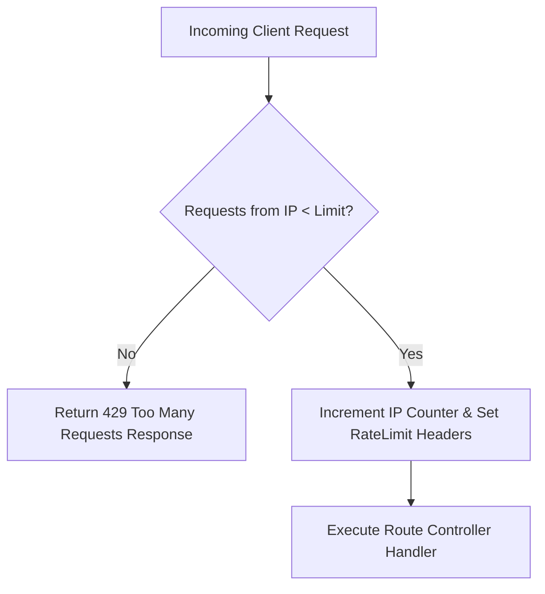

# File 19: Rate Limiting Middleware (express-rate-limit)

## Overview
**Rate Limiting** protects Express applications from brute-force login attacks and API abuse by capping the number of HTTP requests an IP address can make within a specified time window.

---

## 1. Rate Limiting Request Interception Flow



---

## 2. Express Rate Limiter Middleware Implementation

```javascript
const express = require("express");
const app = express();

app.use(express.json());

// In-Memory Rate Limiter Map
const rateLimitMap = new Map();

const customRateLimiter = (options) => {
    const { windowMs, max } = options;

    return (req, res, next) => {
        const ip = req.ip || req.connection.remoteAddress;
        const now = Date.now();

        if (!rateLimitMap.has(ip)) {
            rateLimitMap.set(ip, { count: 1, resetTime: now + windowMs });
        } else {
            const record = rateLimitMap.get(ip);
            if (now > record.resetTime) {
                record.count = 1;
                record.resetTime = now + windowMs;
            } else {
                record.count++;
                if (record.count > max) {
                    res.setHeader("Retry-After", Math.ceil((record.resetTime - now) / 1000));
                    return res.status(429).json({
                        status: "fail",
                        error: "TOO_MANY_REQUESTS",
                        message: `Rate limit exceeded. Try again in ${Math.ceil((record.resetTime - now) / 1000)} seconds.`
                    });
                }
            }
        }

        res.setHeader("X-RateLimit-Limit", max);
        res.setHeader("X-RateLimit-Remaining", max - rateLimitMap.get(ip).count);
        next();
    };
};

// Apply 5 requests per 1 minute window rate limiter
app.use("/api/v1/auth", customRateLimiter({ windowMs: 60000, max: 5 }));

app.post("/api/v1/auth/login", (req, res) => {
    res.status(200).json({ status: "success", message: "Login endpoint accessed" });
});
```

---

## Key Takeaways
1. Apply aggressive rate limits to sensitive endpoints (e.g. `/login`, `/password-reset`).
2. Return HTTP Status **`429 Too Many Requests`** along with standard `X-RateLimit-*` headers.
3. In distributed deployments, back rate limiters with **Redis** to share counter state across server instances.
