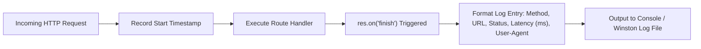

# File 20: Logging Middleware (morgan and winston)

## Overview
HTTP request logging provides visibility into API performance and errors. Utilizing logging middleware (**`morgan`**, **`winston`**, **`pino`**) outputs structured logs (`COMBINED`, `DEV`, JSON format) to stdout and persistent file streams.

---

## 1. Request Logging Lifecycle



---

## 2. Custom HTTP Logger Middleware Implementation

```javascript
const express = require("express");
const app = express();

// Custom Morgan-style Request Logger Middleware
const requestLogger = (req, res, next) => {
    const start = Date.now();
    const { method, url } = req;

    res.on("finish", () => {
        const duration = Date.now() - start;
        const statusCode = res.statusCode;
        const color = statusCode >= 500 ? "\x1b[31m" : statusCode >= 400 ? "\x1b[33m" : "\x1b[32m";
        const reset = "\x1b[0m";

        console.log(`[HTTP LOG] ${method} ${url} ${color}${statusCode}${reset} - ${duration}ms`);
    });

    next();
};

app.use(requestLogger);

app.get("/api/v1/test", (req, res) => {
    res.status(200).json({ message: "Logging Middleware Active" });
});
```

---

## Key Takeaways
1. Measure response duration by recording timestamps before `next()` and listening to **`res.on('finish')`**.
2. Use **JSON formatted structured logs** in production for easy ingestion into Datadog, ELK, or CloudWatch.
3. Log HTTP status codes, method, path, response latency, and IP addresses.
