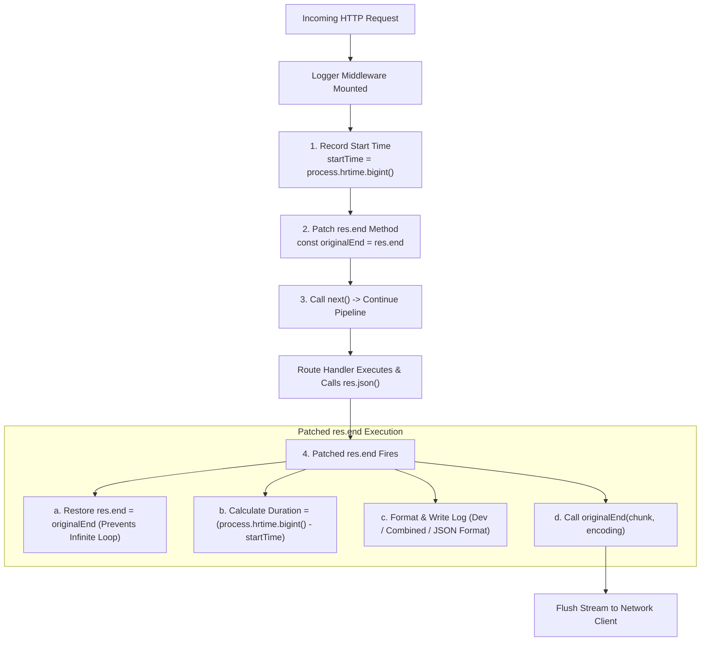

# Module 20: Logging Middleware Mechanics — Response Interception & Structured Logging

## Theoretical Overview & Response Interception Pattern

Logging HTTP requests and responses is crucial for auditing, performance profiling, and operational monitoring. However, when standard Express middleware executes at the start of a request, the HTTP response status code, content length, and total duration have **not yet been calculated**.

To capture response details, logging middleware (such as `morgan`, `pino-http`, or custom loggers) uses the **Response Interception Pattern** by monkey-patching Node's native `res.end()` method.



### Real-World Analogy: RTI Office Log Register
Think of Clerk Ramesh maintaining the log register at the Right to Information (RTI) government office:
- **Intake Logging**: Ramesh records when an applicant enters the building (`method`, `url`, `timestamp`).
- **Response Interception**: Ramesh does not close the entry when the applicant walks in. Instead, he waits at the exit door (`res.end()`). As the applicant leaves, Ramesh stamps the exact resolution status (`200 Approved` vs `404 File Not Found`), logs the processing duration in minutes (`responseTime`), and files the entry into the daily register (`jsonLogStream`).

---

## 1. Popular Log Formats Comparison Matrix

| Format Name | Output Style & Structure | Primary Purpose | Example Output Line |
| :--- | :--- | :--- | :--- |
| **`dev`** | Color-coded concise text with timing. | Local development debugging. | `GET /api/users \x1b[32m200\x1b[0m 4.12ms - 128` |
| **`combined`** | Apache Standard Combined Log Format. | Server log analysis & legacy parsers. | `127.0.0.1 - - [01/Sep/2026:10:00:00 +0000] "GET /api HTTP/1.1" 200 128 "-" "Mozilla/5.0"` |
| **`json`** | Structured JSON key-value pairs. | **Production ELK / Loki / Datadog ingest**. | `{"method":"GET","url":"/api","status":200,"responseTime":"4.12"}` |

---

## 2. Response Interception Logger Implementation (`BLOCK 1`)

High-precision timing calculation using `process.hrtime.bigint()` combined with `res.end()` monkey-patching:

```javascript
const express = require('express');

function createLogger(options = {}) {
  const format = options.format || 'dev';
  const skipFn = options.skip || null;
  const output = options.stream || process.stdout;

  const colors = {
    reset: '\x1b[0m', red: '\x1b[31m', green: '\x1b[32m',
    yellow: '\x1b[33m', cyan: '\x1b[36m',
  };

  function colorForStatus(status) {
    if (status >= 500) return colors.red;
    if (status >= 400) return colors.yellow;
    if (status >= 300) return colors.cyan;
    return colors.green;
  }

  const formatters = {
    dev(info) {
      const c = colorForStatus(info.status);
      return `${info.method} ${info.url} ${c}${info.status}${colors.reset} ${info.responseTime}ms - ${info.contentLength}`;
    },
    json(info) {
      return JSON.stringify({
        method: info.method, url: info.url, status: info.status,
        responseTime: info.responseTime, contentLength: info.contentLength,
        ip: info.ip, timestamp: info.timestamp,
      });
    },
  };

  return function loggerMiddleware(req, res, next) {
    // High-precision nanosecond timer
    const startTime = process.hrtime.bigint();

    const reqInfo = {
      method: req.method,
      url: req.originalUrl || req.url,
      ip: req.ip || req.socket.remoteAddress || '127.0.0.1',
      userAgent: req.get('user-agent') || '-',
    };

    // Monkey-patch res.end to intercept response completion
    const originalEnd = res.end;
    res.end = function patchedEnd(chunk, encoding) {
      // 1. Restore original method immediately to prevent recursion
      res.end = originalEnd;

      // 2. Calculate duration in milliseconds
      const elapsed = process.hrtime.bigint() - startTime;
      const info = {
        ...reqInfo,
        status: res.statusCode,
        responseTime: (Number(elapsed) / 1e6).toFixed(2),
        contentLength: res.get('content-length') || '0',
        timestamp: new Date().toISOString(),
      };

      // 3. Evaluate optional noise skip rule
      if (skipFn && skipFn(req, res)) return res.end(chunk, encoding);

      // 4. Format & write log payload
      const formatter = formatters[format] || formatters.dev;
      output.write(formatter(info) + '\n');

      // 5. Invoke original res.end method
      return res.end(chunk, encoding);
    };

    next();
  };
}
```

---

## 3. Filtering Noise & Multiple Loggers (`BLOCK 2`)

In production, load balancer health checks (e.g., `GET /health`) can fire every 2 seconds, filling log storage with noise. Mounting multiple logger instances with `skip` conditions isolates development logs from production JSON streams:

```javascript
const app = express();

const devLogs = [];
const jsonLogs = [];

const devStream = { write(line) { devLogs.push(line.trim()); } };
const jsonStream = { write(line) { jsonLogs.push(line.trim()); } };

// Rule to skip health check endpoints on dev stream
const skipHealthChecks = (req) => req.url === '/health';

// 1. Dev Console Logger (Skips /health probes)
app.use(createLogger({ format: 'dev', stream: devStream, skip: skipHealthChecks }));

// 2. Production Audit Logger (Captures ALL requests in JSON format)
app.use(createLogger({ format: 'json', stream: jsonStream }));

app.get('/api/departments', (req, res) => res.json([{ id: 1, name: 'Revenue' }]));
app.get('/health', (req, res) => res.sendStatus(200));
```

---

## Key Takeaways

1. **Monkey-Patching `res.end()`**: Logging middleware must wrap `res.end()` to calculate total execution duration and record final HTTP status codes.
2. **Restore Original Method**: Always restore `res.end = originalEnd` inside the patched wrapper before invoking it to prevent stack overflow loops.
3. **Nanosecond Precision**: Use `process.hrtime.bigint()` for microsecond/nanosecond response timing accuracy instead of `Date.now()`.
4. **Structured JSON Logs**: Use JSON formatting in production environments to enable log aggregation in ELK, Grafana Loki, or Datadog.
5. **Noise Reduction via Skip Rules**: Implement skip callbacks to filter out frequent automated health probes (`/health`) from application logs.
