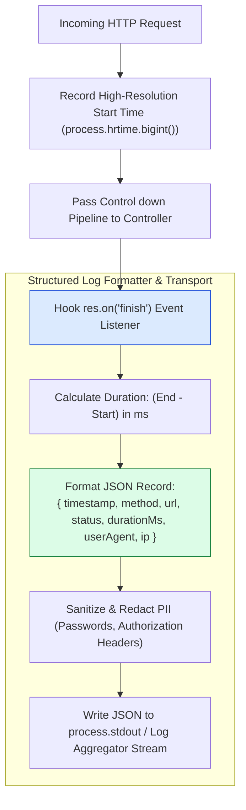
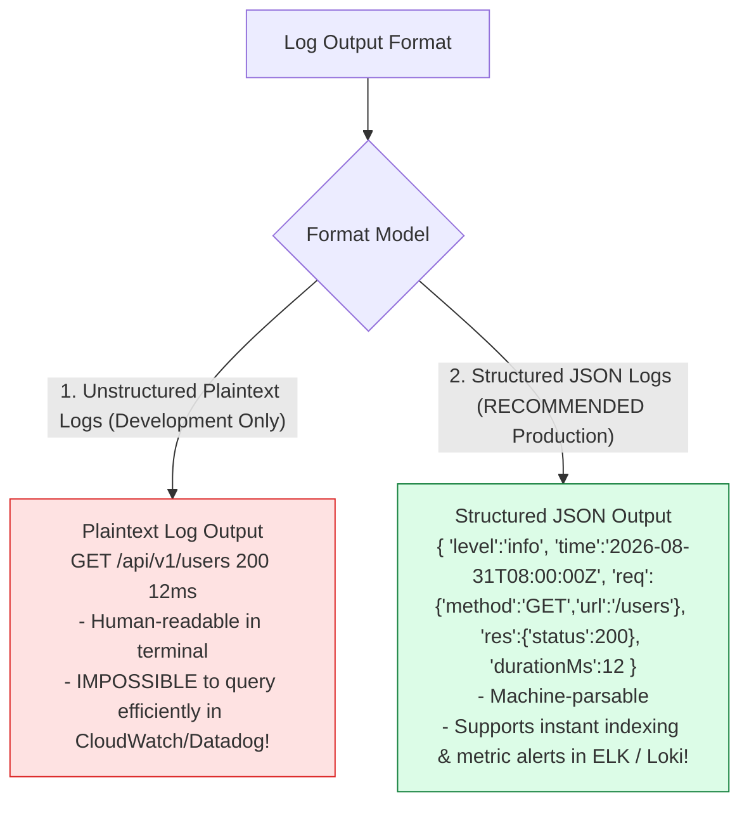
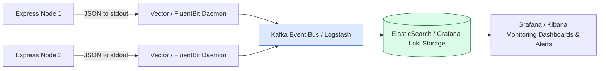

# Module 20: Structured Logging Middleware, Morgan, Winston, and Log Pipelines

## Overview

Application and HTTP request logging provide operational visibility into backend microservice health, latency bottlenecks, and error stack traces. Using middleware like **`morgan`**, **`winston`**, or ultra-fast **`pino`**, Express applications format log entries into **Structured JSON Logs** suitable for log aggregators (ELK Stack, Grafana Loki, Datadog).

Understanding **Request Lifecycle Timing via `res.on('finish')`**, **Structured JSON vs. Text Formatting**, **Log Levels (`info`, `warn`, `error`)**, and **Sensitive Data PII Redaction** is essential.

---

## 1. Request Logging Lifecycle Pipeline



---

## 2. Structured JSON Logs vs. Plaintext Text Logs



### Logging Framework Feature Comparison

| Feature / Metric | `morgan` | `winston` | `pino` (RECOMMENDED) |
| :--- | :--- | :--- | :--- |
| **Primary Scope** | HTTP Request Logging Only | Application & System Logging | High-Performance System & HTTP Logging |
| **Performance Overhead** | Medium | Medium (High object allocation) | **Ultra-Fast (Minimal CPU Overhead)** |
| **Default Output** | Formatted Text Strings | Plaintext / JSON Formatted | **Native Structured JSON Output** |
| **Async Transports** | Console / Stream | File, Elasticsearch, Datadog | Worker Thread Async Streams |
| **PII Redaction** | Custom Formatters Only | Custom Formatters | Native `redact: ['req.headers.authorization']` |

---

## 3. Production Log Aggregation Architecture



---

## 4. Practical Implementation Showcase: Production Structured Logger

```javascript
const express = require("express");
const app = express();

app.use(express.json());

// Production Structured JSON Logger Middleware with PII Redaction
const structuredHttpLogger = (req, res, next) => {
  const startTime = process.hrtime.bigint(); // High-resolution start time
  const { method, originalUrl, ip } = req;
  const userAgent = req.get("User-Agent") || "Unknown";

  // Listen to HTTP Response stream completion event
  res.on("finish", () => {
    const endTime = process.hrtime.bigint();
    const durationMs = Number(endTime - startTime) / 1e6; // Convert nanoseconds to ms

    // Construct Structured Log Record
    const logRecord = {
      level: res.statusCode >= 500 ? "ERROR" : res.statusCode >= 400 ? "WARN" : "INFO",
      timestamp: new Date().toISOString(),
      httpRequest: {
        method,
        url: originalUrl,
        statusCode: res.statusCode,
        durationMs: Number(durationMs.toFixed(2)),
        clientIp: ip,
        userAgent
      },
      // PII REDACTION: Never log raw authorization tokens or passwords!
      authStatus: req.headers.authorization ? "PRESENT_REDACTED" : "ANONYMOUS"
    };

    // Output JSON string to stdout (Streamed to Docker/Kubernetes container logs)
    if (logRecord.level === "ERROR") {
      console.error(JSON.stringify(logRecord));
    } else {
      console.log(JSON.stringify(logRecord));
    }
  });

  next(); // Pass control to downstream handlers
};

// Mount Global Logger
app.use(structuredHttpLogger);

// Sample Endpoints
app.get("/api/v1/health", (req, res) => {
  res.status(200).json({ status: "OK" });
});

app.get("/api/v1/simulate-error", (req, res) => {
  res.status(500).json({ error: "INTERNAL_SERVER_ERROR", message: "Database connection failed" });
});

// Start Server
app.listen(3000, () => {
  console.log("Structured Logging Server running on port 3000");
});
```

---

## Key Production Takeaways

1. **Log in Structured JSON Format in Production**: Always output logs as single-line JSON objects to `process.stdout` in production to allow log shippers (FluentBit, Vector) to parse and ingest log fields into Elasticsearch or Loki effortlessly.
2. **Never Log Sensitive PII or Credentials**: Redact sensitive data (passwords, credit cards, SSNs, JWT `Authorization` headers) from log streams using redaction rules to remain compliant with GDPR and PCI-DSS.
3. **Calculate High-Resolution Durations via `res.on('finish')`**: Use `process.hrtime.bigint()` captured at request entry and calculate elapsed duration inside the `res.on('finish')` event listener to accurately measure API latency.
4. **Use `pino` for High-Throughput Microservices**: Prefer `pino` over heavier loggers like `winston` in high QPS microservices due to Pino's minimal CPU overhead and asynchronous worker thread log processing.

