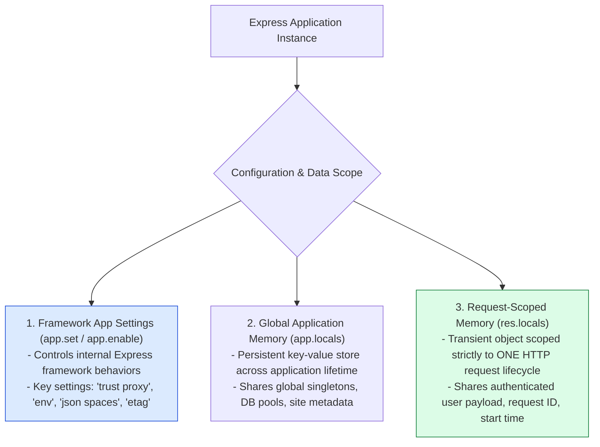
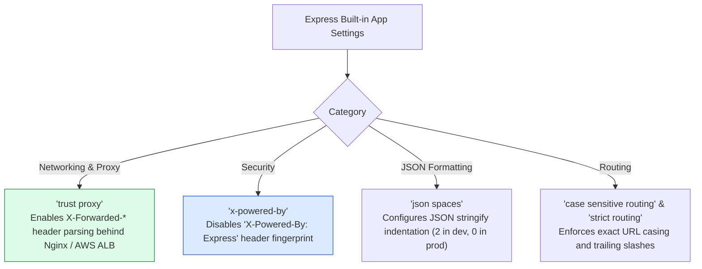
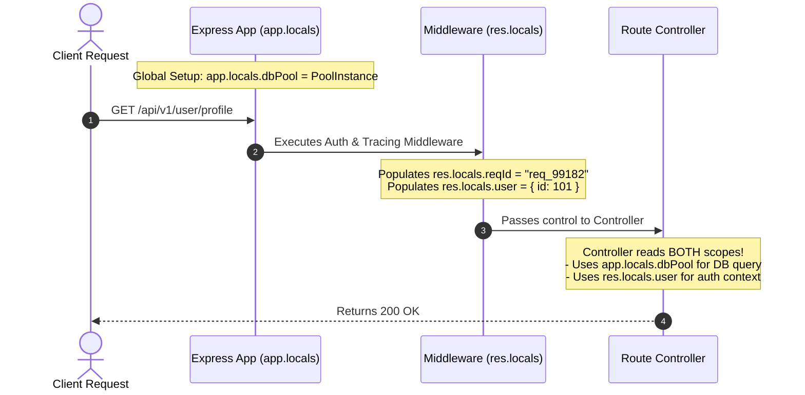

# Module 21: Express Application Settings, Global Configuration, and Scoped State

## Overview

Express application instances expose a centralized configuration engine managed via **`app.set()`**, **`app.get()`**, **`app.enable()`**, and **`app.disable()`**. These settings control internal framework behaviors such as reverse proxy trust (`trust proxy`), view engine resolution (`views`), response payload formatting (`json spaces`), and security header toggles (`x-powered-by`).

Understanding **Global App Settings**, **Application-Wide Memory (`app.locals`)**, and **Request-Scoped Transient State (`res.locals`)** is essential.

---

## 1. Express Configuration & Data Scopes Architecture



---

## 2. Express Built-in Application Settings Matrix



### Express Application Settings Reference Matrix

| Setting Name | Default Value | Setter Method Syntax | Primary Purpose & Production Guidance |
| :--- | :--- | :--- | :--- |
| **`env`** | `process.env.NODE_ENV` \| `"development"` | `app.set('env', 'production')` | Defines current environment mode. Controls view caching & stack traces. |
| **`trust proxy`** | `false` | `app.set('trust proxy', true)` | Enables parsing `X-Forwarded-For` headers to accurately resolve `req.ip` and `req.protocol`. |
| **`x-powered-by`** | `true` | `app.disable('x-powered-by')` | Hides framework identity header (`X-Powered-By: Express`). Always disable in production! |
| **`json spaces`** | `undefined` | `app.set('json spaces', 2)` | Formats `res.json()` responses with multi-line JSON spacing. Enable in dev only. |
| **`etag`** | `"weak"` | `app.set('etag', 'strong')` | Configures ETag HTTP header generation algorithm (`strong`, `weak`, or `false`). |
| **`subdomain offset`** | `2` | `app.set('subdomain offset', 3)` | Defines domain dot offsets for parsing `req.subdomains` array. |

---

## 3. `app.locals` vs. `res.locals` Data Flow



---

## 4. Practical Implementation Showcase: Application Settings Manager

```javascript
const express = require("express");
const app = express();

// 1. Configure Global Framework Application Settings
const isProduction = process.env.NODE_ENV === "production";

app.set("env", isProduction ? "production" : "development");
app.set("trust proxy", true); // Enable reverse proxy IP resolution
app.set("json spaces", isProduction ? 0 : 2); // Multi-line JSON formatting in dev only
app.set("case sensitive routing", false);

// Security Hardening: Disable Framework Fingerprint Header
app.disable("x-powered-by");

// 2. Configure Application-Wide Globals (app.locals)
app.locals.siteName = "Enterprise Node.js API Hub";
app.locals.apiVersion = "v1.0.0";
app.locals.startTime = Date.now();

// 3. Request-Scoped Context Middleware (res.locals)
app.use((req, res, next) => {
  // Scoped strictly to THIS request-response cycle
  res.locals.requestId = `req_${Date.now()}_${Math.random().toString(36).substring(2, 7)}`;
  res.locals.requestStartTime = process.hrtime.bigint();
  next();
});

// Sample Endpoint Consuming Configuration and Scoped Locals
app.get("/api/v1/system/info", (req, res) => {
  res.status(200).json({
    appConfig: {
      environment: app.get("env"),
      trustProxyEnabled: app.get("trust proxy"),
      siteName: app.locals.siteName,
      apiVersion: app.locals.apiVersion,
      uptimeSeconds: Math.floor((Date.now() - app.locals.startTime) / 1000)
    },
    requestContext: {
      requestId: res.locals.requestId,
      clientIp: req.ip,
      protocol: req.protocol
    }
  });
});

// Start Server
app.listen(3000, () => {
  console.log("App Settings Server running on port 3000");
});
```

---

## Key Production Takeaways

1. **Always Disable `x-powered-by`**: Execute `app.disable('x-powered-by')` on server startup to hide Express framework header signatures from automated vulnerability scanners.
2. **Configure `trust proxy` in Reverse Proxy Topology**: Always enable `app.set('trust proxy', true)` when deploying behind Nginx, Cloudflare, or AWS ALB to ensure `req.ip` resolves real client IP addresses.
3. **Use `res.locals` for Request-Scoped Context**: Store transient request variables (tracing IDs, decoded JWT payloads, database transaction handles) in `res.locals` inside middleware.
4. **Use `app.locals` for Application-Wide Singletons**: Store global application metadata, database connection pool references, and external API client instances inside `app.locals`.

