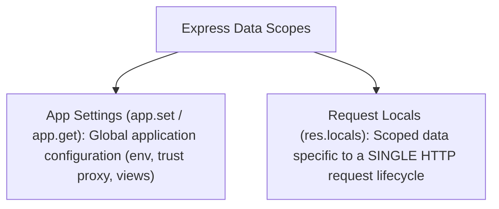

# File 21: Express Application Settings (app.set, app.enable, res.locals)

## Overview
Express application configuration parameters are managed using **`app.set()`**, **`app.get()`**, **`app.enable()`**, and **`app.disable()`**. Data shared across request handlers during a single request lifecycle is stored in **`res.locals`**.

---

## 1. App Settings vs Request Locals Architecture



---

## 2. App Configuration & `res.locals` Implementation

```javascript
const express = require("express");
const app = express();

// 1. Application-Wide Configuration
app.set("env", "production");
app.set("trust proxy", true); // Enable reverse proxy IP parsing
app.disable("x-powered-by");  // Disable framework header

// 2. Middleware populating res.locals
app.use((req, res, next) => {
    res.locals.requestId = `req_${Date.now()}`;
    res.locals.apiVersion = "v1";
    next();
});

app.get("/api/v1/status", (req, res) => {
    res.status(200).json({
        env: app.get("env"),
        requestId: res.locals.requestId,
        apiVersion: res.locals.apiVersion
    });
});
```

---

## Key Takeaways
1. Use **`app.set('trust proxy', true)`** when running behind Nginx or AWS ALB reverse proxies.
2. Store request-scoped user authentication or tracing data in **`res.locals`**.
3. Use **`app.disable('x-powered-by')`** for security hardening.
