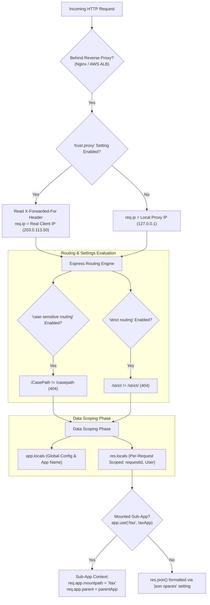

# Module 21: Application Settings, Data Scoping (Locals), & Sub-Application Mounting

## Theoretical Overview & Configuration Management

Express applications behavior is controlled via **Application Settings** configured using `app.set(name, value)`, `app.get(name)`, `app.enable(name)`, and `app.disable(name)`.

In addition to settings switches, Express provides two data storage abstractions:
1. **`app.locals`**: Shared, persistent application-level scope active throughout the server process lifetime.
2. **`res.locals`**: Scoped strictly to a single HTTP request lifecycle, ensuring data isolation across concurrent client requests.



### Real-World Analogy: Commissioner Meena's Nagar Nigam Control Panel
Think of Commissioner Meena managing municipal city operations at the Nagar Nigam office:
- **Application Settings (`app.set()`)**: Control panel dials adjusting municipal infrastructure rules (e.g. enabling strict traffic lane enforcement $\to$ `strict routing`).
- **Global Archives (`app.locals`)**: Municipal department regulations and registry names (`appName: 'NagarNigam'`) visible to all staff officers indefinitely.
- **Citizen Token (`res.locals`)**: A specific token issued to citizen Rajesh for his individual visit (`requestId: 'req-9821'`). When Rajesh leaves the building, his token is shredded (`res.locals` GC cleanup).
- **Sub-Department Offices (`app.use('/tax', taxApp)`)**: The specialized Municipal Tax Collection Office (`taxApp`) operating under its own supervisor while connected to the parent Nagar Nigam head office (`req.app.parent`).

---

## 1. Express Application Settings Reference Matrix

| Setting Name | Default Value | Value Types / Options | Purpose & Framework Impact |
| :--- | :--- | :--- | :--- |
| **`env`** | `process.env.NODE_ENV` | `'development'`, `'production'` | Environment mode indicator. |
| **`etag`** | `'weak'` | `'strong'`, `'weak'`, `false` | Controls ETag header generation algorithm. |
| **`query parser`** | `'simple'` | `'simple'`, `'extended'`, `false` | Sets URL query string parser (`querystring` vs `qs`). |
| **`strict routing`** | `false` | `true` / `false` | When enabled, `/strict` and `/strict/` are treated as distinct URLs. |
| **`case sensitive routing`** | `false` | `true` / `false` | When enabled, `/CasePath` and `/casepath` are treated as distinct URLs. |
| **`json spaces`** | `undefined` | `Number` (e.g. `2`) | Formats `res.json()` responses with indentation spaces for debugging. |
| **`trust proxy`** | `false` | `true`, `'loopback'`, IP subnets | Configures Express to read `X-Forwarded-*` headers behind reverse proxies. |
| **`x-powered-by`** | `true` | `true` / `false` | Sends `X-Powered-By: Express` response header. Disable for security. |

---

## 2. Configuring App Settings (`BLOCK 1`)

Configuring routing, proxy trust, JSON formatting, and security settings before route registration:

```javascript
const express = require('express');
const app = express();

// Set configuration settings BEFORE route definitions
app.set('json spaces', 2);                 // Pretty-print JSON responses with 2-space indentation
app.enable('strict routing');              // Treat /strict and /strict/ as different routes
app.enable('case sensitive routing');      // Treat /CasePath and /casepath as different routes
app.disable('x-powered-by');               // Remove X-Powered-By header
app.disable('etag');                       // Disable automated ETag generation
app.set('trust proxy', 'loopback');        // Trust X-Forwarded-For from local loopback proxy

app.use(express.json());

// 1. Strict Routing Test
app.get('/strict', (req, res) => res.json({ trailingSlash: false }));
app.get('/strict/', (req, res) => res.json({ trailingSlash: true }));

// 2. Case Sensitive Routing Test
app.get('/CasePath', (req, res) => res.json({ matched: true }));

// 3. Trust Proxy Test (Reads real client IP from X-Forwarded-For header)
app.get('/my-ip', (req, res) => res.json({ ip: req.ip }));
```

---

## 3. Data Scoping (`app.locals` vs `res.locals`) & Sub-App Mounting (`BLOCK 2`)

Differentiating global application state from request-isolated middleware data, and mounting modular sub-applications:

```javascript
const app = express();

// 1. Global Persistent App Locals (Shared across entire server instance)
app.locals.appName = 'NagarNigam';
app.locals.version = '2.5.0';

// 2. Request-Scoped Locals Middleware (Isolated per HTTP request)
app.use((req, res, next) => {
  res.locals.requestId = `req-${Date.now()}-${Math.random().toString(36).slice(2, 8)}`;
  next();
});

// Middleware Data Pipeline via res.locals
app.get('/profile',
  (req, res, next) => {
    res.locals.user = { id: 42, name: 'Meena', role: 'commissioner' };
    next();
  },
  (req, res, next) => {
    res.locals.permissions = res.locals.user.role === 'commissioner'
      ? ['read', 'write', 'admin']
      : ['read'];
    next();
  },
  (req, res) => {
    res.json({
      app: { name: req.app.locals.appName, version: req.app.locals.version },
      requestId: res.locals.requestId,
      user: res.locals.user,
      permissions: res.locals.permissions,
    });
  }
);

// 3. Sub-Application Mounting
const taxApp = express(); // Independent Express application instance
taxApp.locals.section = 'tax';

taxApp.get('/dashboard', (req, res) => {
  res.json({
    section: req.app.locals.section,
    mountpath: req.app.mountpath,                            // Output: "/tax"
    parentApp: req.app.parent ? req.app.parent.locals.appName : 'none', // Output: "NagarNigam"
  });
});

// Mount sub-app at /tax URL prefix
app.use('/tax', taxApp);
```

---

## Key Takeaways

1. **Order Matters**: Define routing settings (`strict routing`, `case sensitive routing`) before declaring routes, as Express compiles route matching logic during registration.
2. **Reverse Proxy Configuration**: Always set `app.set('trust proxy', ...)` when deploying behind reverse proxies (Nginx, HAProxy, AWS ALB) to populate `req.ip`, `req.protocol`, and `req.hostname` accurately.
3. **Data Scoping Rules**: Use `app.locals` for application-wide constants and `res.locals` for single-request contextual data (authenticated users, correlation IDs).
4. **Isolated Sub-Applications**: Express sub-apps (`express()`) retain independent setting configurations and local variables while gaining parent reference links (`req.app.parent`).
