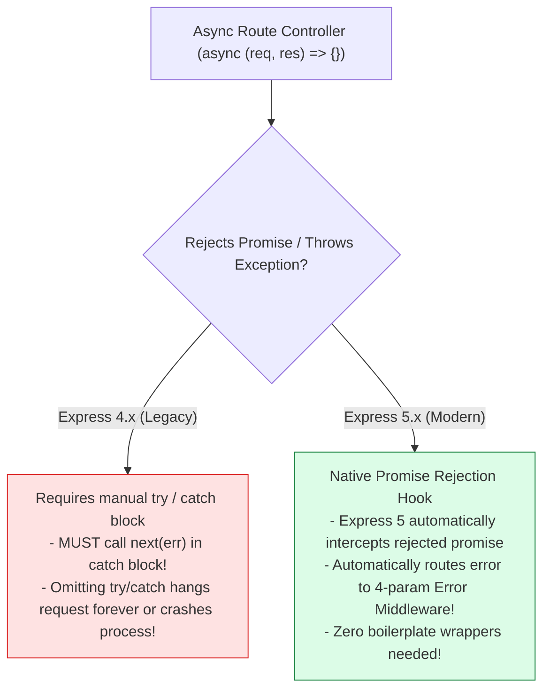
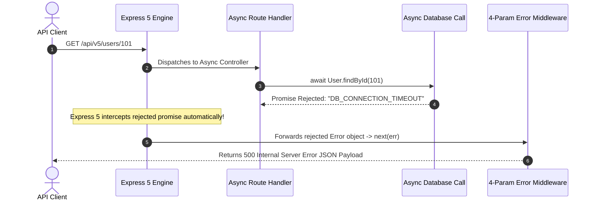
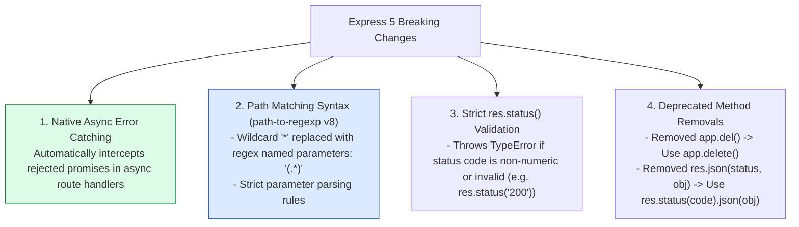

# Module 22: Express v5.x Features, Native Promise Error Handling, and Migration Architectures

## Overview

**Express v5.x** represents a major architectural modernization of the framework. Its primary feature is **Native Automatic Promise Rejection Interception** in `async` route handlers, eliminating the need for `try/catch` wrappers or third-party packages like `express-async-errors`.

Understanding **Express 4 vs. Express 5 Async Error Flow**, **Path Matching Syntax Changes (path-to-regexp v8)**, **Strict `res.status()` HTTP Code Validation**, and **Deprecated Features Removal** is essential for modern Node.js backend development.

---

## 1. Express 4.x vs. Express 5.x Async Error Dispatch Architecture



---

## 2. Express 5 Native Promise Rejection Lifecycle



---

## 3. Express 5 Breaking Changes & Migration Feature Matrix



### Express 4.x vs. Express 5.x Feature Matrix

| Feature / Method | Express 4.x (Legacy) | Express 5.x (Modern Standard) |
| :--- | :--- | :--- |
| **Async Error Handling** | Manual `try/catch` or `express-async-errors` wrapper | **Native Automatic Promise Rejection Interception** |
| **Wildcard Routes** | `app.get('/files/*', handler)` | **`app.get('/files/(.*)', handler)`** (path-to-regexp v8) |
| **`res.status()` Validation** | Permissive (Coerced strings like `'200'`) | **Strict (Throws `TypeError` if status is invalid)** |
| **Method Alias `app.del()`** | Supported (Deprecated) | **REMOVED** (Use `app.delete()` only) |
| **`res.json(status, obj)`** | Supported (Deprecated) | **REMOVED** (Use `res.status(code).json(obj)`) |
| **`req.param(name)`** | Supported (Deprecated) | **REMOVED** (Use `req.params`, `req.query`, `req.body`) |

---

## 4. Practical Implementation Showcase: Express 5 Clean Async Controller

```javascript
const express = require("express");
const app = express();

app.use(express.json());

// Simulated Database Service function returning a Promise
const fetchUserFromDatabase = async (id) => {
  if (id === "999") {
    throw new Error("DATABASE_TIMEOUT: Database server failed to respond within 3000ms");
  }
  return { id: Number(id), name: "Priya Sharma", role: "ENGINEER" };
};

// 1. Express 5 Native Async Route Handler (NO try/catch or catchAsync wrapper!)
app.get("/api/v5/users/:id", async (req, res) => {
  const { id } = req.params;

  // If this promise rejects, Express 5 catches it automatically and passes to error middleware!
  const user = await fetchUserFromDatabase(id);

  res.status(200).json({
    status: "success",
    data: { user }
  });
});

// 2. Express 5 Wildcard Route Syntax (Uses (.*) for path-to-regexp v8 compatibility)
app.get("/api/v5/files/(.*)", (req, res) => {
  const wildcardPath = req.params[0]; // Access captured wildcard group
  res.status(200).json({ status: "success", capturedPath: wildcardPath });
});

// 3. Centralized 4-Parameter Error Handling Middleware
app.use((err, req, res, next) => {
  console.error("🚨 [EXPRESS 5 AUTO-CAUGHT ERROR]:", err.message);

  // Strict Numeric Status Code Validation
  res.status(500).json({
    status: "error",
    error: {
      type: "AUTOMATIC_ASYNC_ERROR",
      message: err.message
    }
  });
});

// Start Server
app.listen(3000, () => {
  console.log("Express v5.x Features Server running on port 3000");
});
```

---

## Key Production Takeaways

1. **Eliminate Legacy Async Error Wrappers**: Upgrade to Express 5 to remove boilerplate `try/catch` blocks and third-party packages (`express-async-errors`), allowing native `async/await` route handlers to throw exceptions safely.
2. **Update Wildcard Route Definitions for `path-to-regexp` v8**: Replace legacy wildcard route paths (`/files/*`) with updated Express 5 syntax (`/files/(.*)`) to ensure compatibility with path-to-regexp v8.
3. **Pass Valid Numeric HTTP Status Codes**: Ensure all `res.status(code)` invocations supply valid integer numbers (e.g. `res.status(200)` instead of `res.status('200')`) to prevent Express 5 `TypeError` exceptions.
4. **Remove Deprecated Method Signatures**: Refactor legacy methods like `req.param('id')` and `res.json(200, data)` to explicit property accessors (`req.params.id`) and status chaining (`res.status(200).json(data)`).

