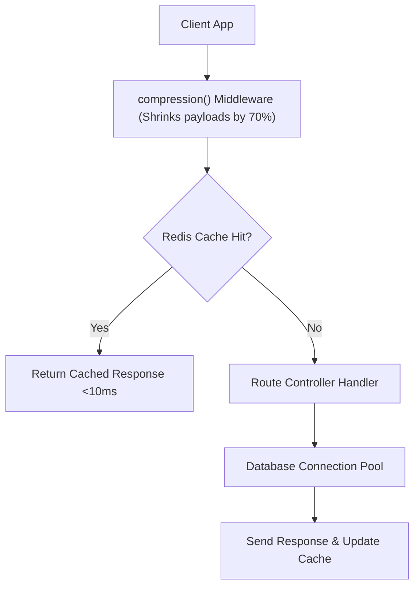

# File 23: Express Performance Patterns (Compression, Connection Pooling, Caching)

## Overview
Optimizing Express performance requires enabling **Gzip/Brotli payload compression (`compression` middleware)**, database connection pooling, in-memory caching, and asynchronous non-blocking event handlers.

---

## 1. High-Performance Express Stack Architecture



---

## 2. Express Performance Optimization Implementation

```javascript
const express = require("express");
const compression = require("compression");

const app = express();

// 1. Enable Gzip Payload Compression Middleware
app.use(compression({
    threshold: 1024, // Only compress responses > 1KB
    level: 6         // Balance CPU usage vs compression ratio
}));

// 2. HTTP Cache Headers for CDN / Edge Caching
app.get("/api/v1/static-catalog", (req, res) => {
    res.setHeader("Cache-Control", "public, max-age=86400"); // Cache for 24 Hours
    res.status(200).json({
        catalog: Array.from({ length: 100 }, (_, i) => ({ id: i, item: `Product ${i}` }))
    });
});
```

---

## Key Takeaways
1. Always enable **`compression()`** middleware to shrink JSON and HTML responses by up to 70-80%.
2. Configure **`Cache-Control`** response headers to offload requests to CDN Edge POPs.
3. Use **Database Connection Pools** to reuse database sockets.
