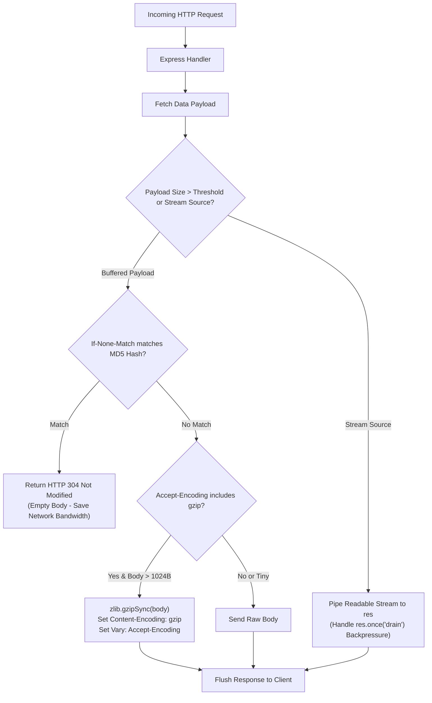

# Module 23: Express Performance Optimization — Compression, ETags, Caching, & Streaming Architecture

## Theoretical Overview & Performance Engineering

Maximizing Express application throughput and minimizing response latency requires optimizing every layer of the HTTP delivery pipeline:
1. **Payload Compression (Gzip / Deflate)**: Reduces wire size for text-based payloads (JSON, HTML, CSS, JS).
2. **Conditional Validation (ETags / 304)**: Avoids re-transmitting unchanged response bodies.
3. **HTTP Cache-Control Directives**: Offloads repeated requests to browser and CDN edge caches.
4. **Streaming & Backpressure Handling**: Streams large datasets continuously without buffering entire payloads in Node process RAM.



### Real-World Analogy: Buddh Circuit F1 Pit Crew Optimization
Think of Pit Crew Chief Vikram optimizing an F1 race car at the Buddh International Circuit:
- **Payload Compression (`createCompressionMiddleware`)**: Vacuum-sealing spare tires so twice as many fit in the haul truck (Gzip compression reducing JSON payload wire size by $70\%+$).
- **ETag Validation (`createETagMiddleware`)**: Checking tire serial numbers before replacing them. If the tire already on the car is identical (`304 Not Modified`), the pit crew leaves it on, saving precious seconds.
- **Cache-Control Policies**: Storage directives labeling tires as long-term (`immutable` telemetry sensors) or single-use (`no-store` sensitive telemetry).
- **Stream Pipelines (`Readable.pipe(res)`)**: Refueling via a high-pressure hose continuous flow rather than carrying heavy fuel buckets back and forth (preventing Node process RAM exhaustion).

---

## 1. HTTP Cache-Control Directives Matrix

| Cache Strategy | Cache-Control Header Value | Target Use Case | Browser / CDN Behavior |
| :--- | :--- | :--- | :--- |
| **Immutable Static Assets** | `public, max-age=31536000, immutable` | Fingerprinted JS/CSS bundles (`app.a8f92.js`). | Cached locally for 1 year. Browsers skip network revalidation on reload. |
| **Revalidating API Data** | `public, max-age=60, must-revalidate` | Dynamic product listings or standings. | Cache for 60 seconds. Requires ETag revalidation after expiry. |
| **Sensitive User Data** | `private, no-store` | User profile, payment details, auth tokens. | **Never store in cache**. Direct origin fetch required on every request. |

---

## 2. Custom Compression & ETag Middleware (`BLOCK 1`)

Implementing Gzip/Deflate compression and MD5 ETag generation middleware from scratch:

```javascript
const express = require('express');
const zlib = require('zlib');
const crypto = require('crypto');

// 1. Response Compression Middleware Factory
function createCompressionMiddleware(options = {}) {
  const threshold = options.threshold || 1024; // 1 KB threshold

  return function compressionMiddleware(req, res, next) {
    const acceptEncoding = req.get('accept-encoding') || '';
    if (!acceptEncoding.includes('gzip') && !acceptEncoding.includes('deflate')) return next();

    const originalEnd = res.end;
    const originalWrite = res.write;
    const chunks = [];

    res.write = function (chunk, encoding) {
      if (chunk) chunks.push(Buffer.isBuffer(chunk) ? chunk : Buffer.from(chunk, encoding));
      return true;
    };

    res.end = function (chunk, encoding) {
      res.write = originalWrite;
      res.end = originalEnd;
      if (chunk) chunks.push(Buffer.isBuffer(chunk) ? chunk : Buffer.from(chunk, encoding));

      const body = Buffer.concat(chunks);
      const contentType = res.get('content-type') || '';

      // Skip small payloads or pre-compressed binary image formats
      if (body.length < threshold || contentType.includes('image/')) {
        if (body.length > 0) res.set('Content-Length', body.length.toString());
        return res.end(body);
      }

      const compressed = acceptEncoding.includes('gzip')
        ? zlib.gzipSync(body)
        : zlib.deflateSync(body);

      res.set('Content-Encoding', acceptEncoding.includes('gzip') ? 'gzip' : 'deflate');
      res.set('Content-Length', compressed.length.toString());
      res.set('Vary', 'Accept-Encoding'); // Crucial for downstream proxy/CDN caching
      return res.end(compressed);
    };

    next();
  };
}

// 2. MD5 ETag Conditional Validation Middleware Factory
function createETagMiddleware() {
  return function (req, res, next) {
    const originalEnd = res.end;
    const originalWrite = res.write;
    const chunks = [];

    res.write = function (chunk, encoding) {
      if (chunk) chunks.push(Buffer.isBuffer(chunk) ? chunk : Buffer.from(chunk, encoding));
      return true;
    };

    res.end = function (chunk, encoding) {
      res.write = originalWrite;
      res.end = originalEnd;
      if (chunk) chunks.push(Buffer.isBuffer(chunk) ? chunk : Buffer.from(chunk, encoding));
      const body = Buffer.concat(chunks);

      if (body.length > 0 && res.statusCode === 200) {
        const etag = `"${crypto.createHash('md5').update(body).digest('hex')}"`;
        res.set('ETag', etag);

        // If client sent matching If-None-Match header, return 304 Not Modified
        if (req.get('if-none-match') === etag) {
          res.removeHeader('content-length');
          res.statusCode = 304;
          return res.end();
        }
      }
      return res.end(body);
    };
    next();
  };
}
```

---

## 3. Streaming Payloads & Backpressure Management (`BLOCK 2`)

Buffering massive JSON arrays in memory causes severe V8 garbage collection pauses and RAM spikes. Streaming chunk-by-chunk while honoring `drain` events guarantees constant $O(1)$ memory usage:

```javascript
const { Readable } = require('stream');
const app = express();

// 1. Manual Row-by-Row JSON Streaming with Backpressure Handling
app.get('/api/stream/large', (req, res) => {
  res.set('Content-Type', 'application/json');
  let index = 0;
  const total = 10000;
  res.write('[\n');

  function sendNext() {
    while (index < total) {
      const item = JSON.stringify({ id: index + 1, value: `telemetry-${index + 1}` });
      const sep = index < total - 1 ? ',\n' : '\n';
      
      // res.write returns false when memory buffer fills up (backpressure)
      const canContinue = res.write(item + sep);
      index++;
      if (!canContinue) {
        res.once('drain', sendNext); // Pause stream until client buffer drains
        return;
      }
    }
    res.end(']\n');
  }
  sendNext();
});

// 2. Piping Node Readable Streams
app.get('/api/stream/lines', (req, res) => {
  res.set('Content-Type', 'text/plain');
  let line = 0;
  const readable = new Readable({
    read() {
      if (line < 100) this.push(`Lap ${++line}: ${Math.random().toFixed(4)}s\n`);
      else this.push(null); // Signal EOF
    },
  });
  readable.pipe(res);
});

// 3. Server Timeout Safety
const server = app.listen(3000);
server.setTimeout(5000); // 5-second socket timeout prevents hung connection leaks
```

---

## Key Takeaways

1. **Compress Text Payloads**: Use Gzip/Deflate middleware to compress text payloads exceeding $1\text{ KB}$, reducing wire transmission sizes by $70-80\%$.
2. **Set `Vary: Accept-Encoding`**: Always include `Vary: Accept-Encoding` headers on compressed responses to prevent CDNs from delivering gzip payloads to uncompressed clients.
3. **ETags Save Bandwidth**: Generate ETags to return `304 Not Modified` on unchanged requests, eliminating response body payloads.
4. **Stream Large Datasets**: Use `res.write()` with `drain` event handling or `readable.pipe(res)` to process large datasets without exhausting V8 heap memory.
5. **Enforce Socket Timeouts**: Configure `server.setTimeout()` to terminate hung socket connections automatically.
