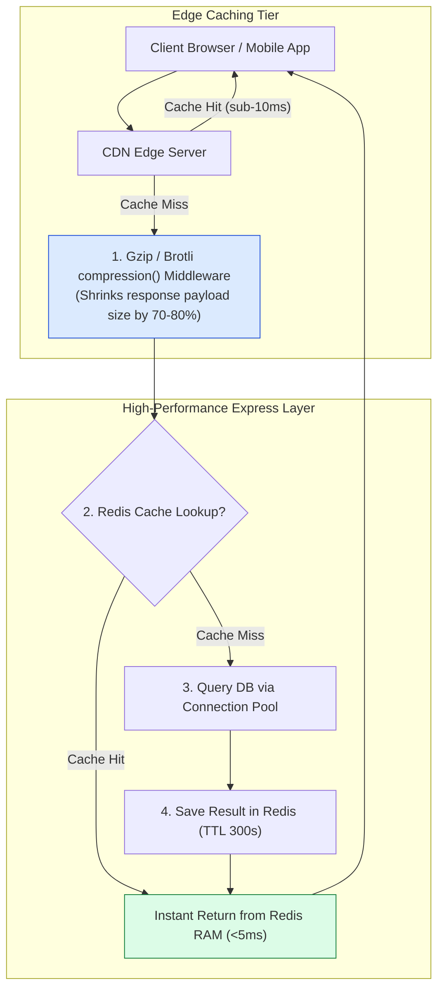
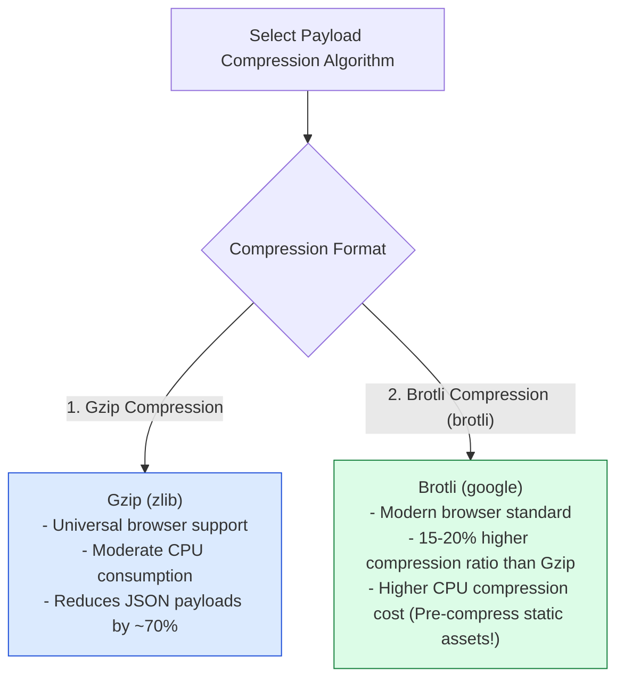
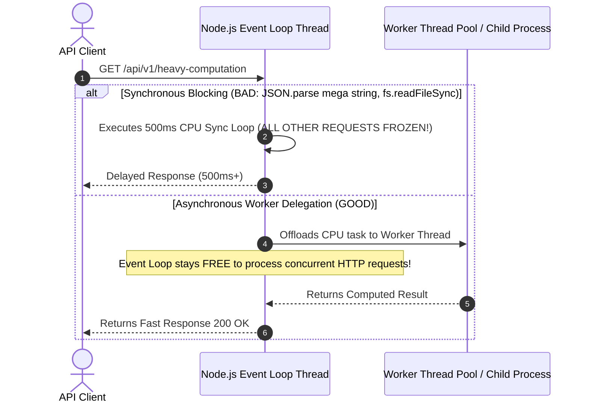

# Module 23: Express Performance Optimization, Payload Compression, and Event Loop Guards

## Overview

Optimizing Express applications for high throughput ($10\text{k}+$ QPS) and sub-50ms p99 latencies requires applying multi-tier performance strategies: **Gzip / Brotli Payload Compression (`compression`)**, **HTTP Cache Control Offloading**, **In-Memory Cache Layers (Redis)**, **Database Connection Pooling**, and preventing **Node.js Event Loop Blocking**.

Understanding **Payload Compression Thresholds**, **Response Caching Architectures**, **Asynchronous Task Offloading**, and **Memory Leak Prevention** is essential.

---

## 1. High-Performance Multi-Tier Express Stack



---

## 2. Gzip vs. Brotli Compression Benchmarks



### Performance Optimization Strategy Matrix

| Optimization Strategy | Latency Impact | Infrastructure Cost | Primary Mechanism |
| :--- | :--- | :--- | :--- |
| **`compression()` Middleware** | Reduces network transfer time | Low CPU overhead | Compresses JSON/HTML text payloads ($>1\text{KB}$) before network transfer. |
| **Redis Response Caching** | Drops DB query time from 80ms to $<5\text{ms}$ | Medium (Redis memory) | Caches fully rendered JSON payloads in Redis RAM. |
| **Database Connection Pooling** | Eliminates TCP/TLS handshake overhead | Zero extra cost | Reuses established database connection sockets (`max: 20`). |
| **CDN Cache-Control Headers** | Offloads $80\%+$ API load to Edge | Reduced server footprint | Sets `Cache-Control: public, max-age=86400, s-maxage=604800`. |

---

## 3. Event Loop Protection Architecture (Avoiding Synchronous Blockers)



---

## 4. Practical Implementation Showcase: High-Performance Express API

```javascript
const express = require("express");
const compression = require("compression");
const app = express();

// 1. Enable High-Performance Gzip/Brotli Payload Compression
app.use(compression({
  threshold: 1024, // Only compress responses larger than 1KB (1024 bytes)
  filter: (req, res) => {
    if (req.headers["x-no-compression"]) {
      return false; // Skip compression if explicitly requested by client header
    }
    return compression.filter(req, res);
  },
  level: 6 // Level 6 provides optimal balance between CPU utilization & compression ratio
}));

app.use(express.json());

// In-Memory Simulated Redis Cache Store
const redisCacheStore = new Map();

// 2. High-Performance Redis Caching Middleware Helper
const cacheMiddleware = (ttlSeconds = 60) => {
  return (req, res, next) => {
    const cacheKey = `cache:${req.originalUrl}`;
    const cachedRecord = redisCacheStore.get(cacheKey);

    if (cachedRecord && Date.now() < cachedRecord.expiresAt) {
      console.log(`⚡ [REDIS CACHE HIT] Serving ${cacheKey} from RAM (<2ms)`);
      res.setHeader("X-Cache", "HIT");
      return res.status(200).json(cachedRecord.payload);
    }

    // Intercept res.json() to capture payload and populate cache
    const originalJson = res.json.bind(res);
    res.json = (body) => {
      res.setHeader("X-Cache", "MISS");
      redisCacheStore.set(cacheKey, {
        payload: body,
        expiresAt: Date.now() + ttlSeconds * 1000
      });
      return originalJson(body);
    };

    next();
  };
};

// 3. CDN Cache-Control Headers & Redis Cached Endpoint
app.get("/api/v1/catalog", cacheMiddleware(300), (req, res) => {
  // Instruct CDN Edge servers to cache for 1 Hour, browser for 5 Minutes
  res.setHeader("Cache-Control", "public, max-age=300, s-maxage=3600, stale-while-revalidate=60");

  // Generate Large Payload (> 10KB) to demonstrate Gzip Compression
  const largeCatalog = Array.from({ length: 200 }, (_, i) => ({
    id: i + 1,
    title: `Enterprise Product Hardware SKU #${1000 + i}`,
    description: "High-performance enterprise infrastructure component with redundant power supplies.",
    price: Math.floor(Math.random() * 5000) + 100
  }));

  res.status(200).json({ status: "success", count: largeCatalog.length, products: largeCatalog });
});

// Start Server
app.listen(3000, () => {
  console.log("Performance Optimization Server running on port 3000");
});
```

---

## Key Production Takeaways

1. **Mount `compression()` Early in the Pipeline**: Place `compression()` middleware at the top of your middleware pipeline so all text and JSON response bodies exceeding 1KB are automatically compressed.
2. **Offload Workloads with CDN `Cache-Control` Headers**: Use `s-maxage` and `stale-while-revalidate` HTTP headers on public endpoints to allow CDN Edge servers (Cloudflare / Fastly) to resolve up to $90\%+$ of GET traffic.
3. **Never Block the Event Loop**: Avoid executing CPU-heavy synchronous operations (`fs.readFileSync()`, synchronous crypto hashing, processing huge JSON arrays) inside request handlers. Offload CPU tasks to Node.js Worker Threads.
4. **Use Database Connection Pools**: Always configure connection pooling on database drivers (Postgres `pg.Pool`, MySQL `createPool`) with appropriate `max` socket bounds to reuse existing TCP connections under high concurrency.

