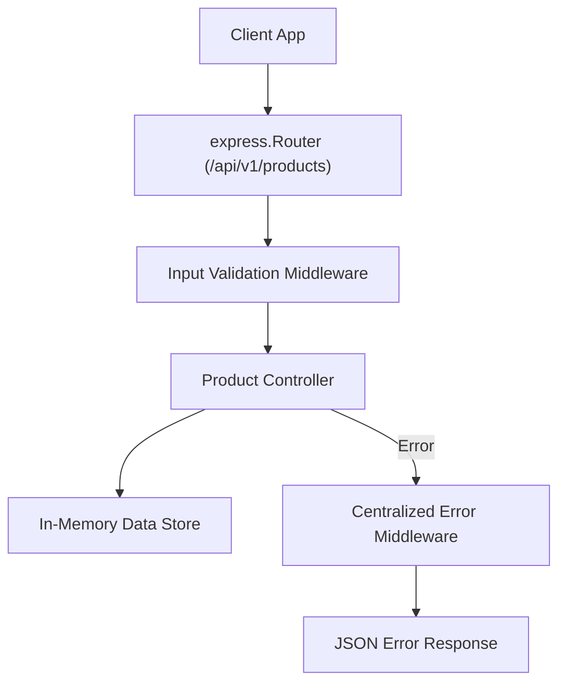

# File 24: Capstone Project — Production REST API Service

## Overview
This capstone project implements a production-grade **REST API Service** in Express, featuring resource routing, validation middleware, JSON error handling, filtering, and pagination.

---

## 1. Production REST API System Architecture



---

## 2. Production REST API Implementation

```javascript
const express = require("express");
const app = express();

app.use(express.json());

// In-Memory Database Store
let products = [
    { id: 101, title: "Wireless Mouse", price: 799, category: "electronics" },
    { id: 102, title: "Mechanical Keyboard", price: 2999, category: "electronics" }
];

const router = express.Router();

// GET /api/v1/products (Filter & Paginate)
router.get("/", (req, res) => {
    const { category, minPrice } = req.query;
    let list = [...products];
    if (category) list = list.filter(p => p.category === category);
    if (minPrice) list = list.filter(p => p.price >= Number(minPrice));

    res.status(200).json({ status: "success", count: list.length, data: { products: list } });
});

// POST /api/v1/products
router.post("/", (req, res, next) => {
    const { title, price, category } = req.body;
    if (!title || !price) {
        return res.status(400).json({ status: "fail", message: "Title and price are required" });
    }
    const newProduct = { id: Date.now(), title, price, category: category || "general" };
    products.push(newProduct);
    res.status(201).json({ status: "success", data: { product: newProduct } });
});

app.use("/api/v1/products", router);
```

---

## Key Takeaways
1. Demonstrates modular **`express.Router`** REST API architecture.
2. Uses standard HTTP status codes (`200`, `201`, `400`, `404`) and envelope response structures.
