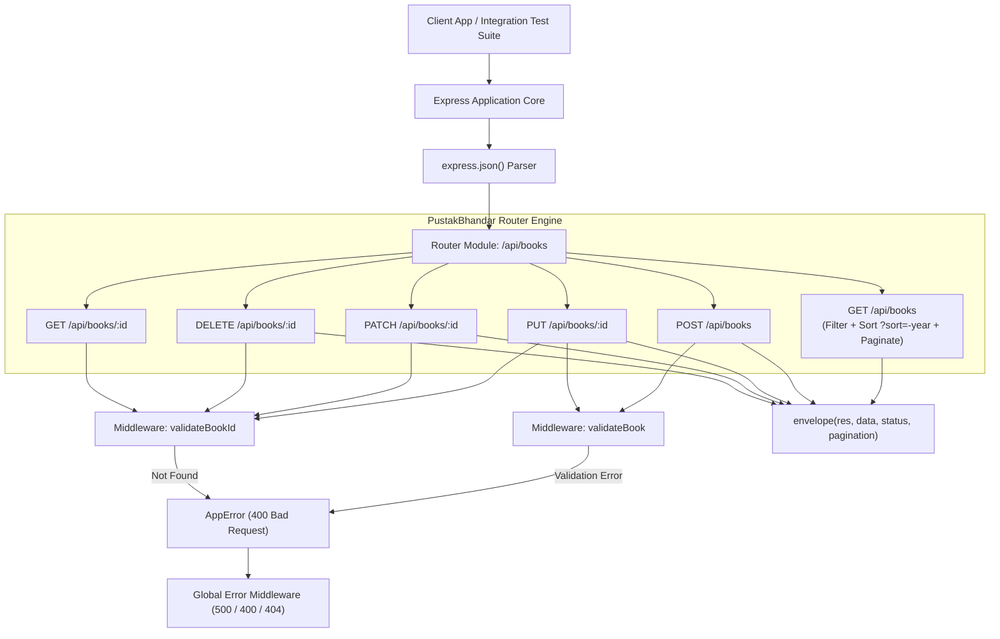

# Module 24: Capstone Project — PustakBhandar REST API Engine

## Theoretical Overview & Project Architecture

The **PustakBhandar REST API** is a production-grade, modular CRUD application demonstrating best-practice RESTful design principles. It incorporates declarative input validation middleware, standardized JSON response envelopes, filtering, sorting, pagination, central error handling, and automated integration testing.



### Real-World Analogy: Sahitya Akademi Digital Library
Think of Sharma ji digitizing the Sahitya Akademi historic library:
- **Master Index (`GET /api/books`)**: Searching books by genre (`?genre=upanyas`) or author (`?author=premchand`), sorted by publication year (`?sort=-year`), delivered in pages of 10 (`pagination`).
- **Catalog Card Validation (`validateBook`)**: Every submitted manuscript must have a non-empty title and valid publication year before entering the catalog.
- **Reference Desk Seal (`envelope`)**: Every book delivered to a reader is wrapped in an official gold envelope (`{ success: true, data: ..., pagination: ... }`).

---

## 1. REST API Endpoint Specifications

| HTTP Method | Route Endpoint | Purpose & Parameters | Response Status |
| :--- | :--- | :--- | :--- |
| **`GET`** | `/api/books` | Returns paginated list. Supports `author`, `genre`, `sort` (`-year`), `page`, `limit`. | `200 OK` |
| **`GET`** | `/api/books/:id` | Fetches single book by UUID. | `200 OK` / `404 Not Found` |
| **`POST`** | `/api/books` | Creates new book record. Requires `title`. | `201 Created` / `400 Bad Request` |
| **`PUT`** | `/api/books/:id` | Full replacement of book details by UUID. | `200 OK` / `400` / `404` |
| **`PATCH`** | `/api/books/:id` | Partial field updates (`title`, `author`, `genre`, `year`, `pages`). | `200 OK` / `400` / `404` |
| **`DELETE`** | `/api/books/:id` | Deletes book record by UUID. | `200 OK` / `404 Not Found` |

---

## 2. Validation & Response Envelope Architecture (Sections 1–3)

Operational error handling, UUID seed data initialization, and middleware validators:

```javascript
const express = require('express');
const crypto = require('crypto');

// 1. Operational Error Class
class AppError extends Error {
  constructor(message, statusCode) {
    super(message);
    this.statusCode = statusCode;
    this.isOperational = true;
  }
}

// 2. Data Store & Seed Function
const books = [];

function seedBooks() {
  const seedData = [
    { title: 'Godan', author: 'Munshi Premchand', genre: 'upanyas', year: 1936, pages: 312 },
    { title: 'Gitanjali', author: 'Rabindranath Tagore', genre: 'kavita', year: 1910, pages: 103 },
    { title: 'Malgudi Days', author: 'R.K. Narayan', genre: 'katha', year: 1943, pages: 256 },
    { title: 'Train to Pakistan', author: 'Khushwant Singh', genre: 'sahitya', year: 1956, pages: 181 },
    { title: 'Tamas', author: 'Bhisham Sahni', genre: 'sahitya', year: 1974, pages: 328 },
    { title: 'The Guide', author: 'R.K. Narayan', genre: 'upanyas', year: 1958, pages: 220 },
  ];
  books.length = 0;
  seedData.forEach(b => books.push({ id: crypto.randomUUID(), ...b, createdAt: new Date().toISOString() }));
}

// 3. Declarative Middleware Guards
function validateBook(req, res, next) {
  const { title, year } = req.body;
  if (!title || typeof title !== 'string' || title.trim().length === 0) {
    return next(new AppError('Title is required and must be a non-empty string', 400));
  }
  if (year !== undefined) {
    const numYear = Number(year);
    if (isNaN(numYear) || numYear < -3000 || numYear > new Date().getFullYear() + 1) {
      return next(new AppError('Year must be a valid number', 400));
    }
    req.body.year = numYear;
  }
  next();
}

function validateBookId(req, res, next) {
  const book = books.find(b => b.id === req.params.id);
  if (!book) return next(new AppError(`Book with id '${req.params.id}' not found`, 404));
  req.book = book; // Attach pre-validated book to request
  next();
}

// 4. Standardized Response Envelope Helper
function envelope(res, data, statusCode = 200, pagination = null) {
  const response = { success: true, data };
  if (pagination) response.pagination = pagination;
  return res.status(statusCode).json(response);
}
```

---

## 3. Router Implementation & Filter/Sort Pipeline (Section 4)

```javascript
function createBookRouter() {
  const router = express.Router();

  // GET /api/books - List with Filtering, Sorting, and Pagination
  router.get('/', (req, res) => {
    let result = [...books];

    // Filter by Author & Genre
    if (req.query.author) {
      const q = req.query.author.toLowerCase();
      result = result.filter(b => b.author.toLowerCase().includes(q));
    }
    if (req.query.genre) {
      result = result.filter(b => b.genre.toLowerCase() === req.query.genre.toLowerCase());
    }

    // Sort (?sort=-year prefix minus convention)
    if (req.query.sort) {
      const field = req.query.sort.replace(/^-/, '');
      const order = req.query.sort.startsWith('-') ? -1 : 1;
      result.sort((a, b) => (a[field] < b[field] ? -1 : a[field] > b[field] ? 1 : 0) * order);
    }

    // Pagination
    const page = Math.max(1, parseInt(req.query.page) || 1);
    const limit = Math.min(100, Math.max(1, parseInt(req.query.limit) || 10));
    const totalItems = result.length;
    const totalPages = Math.ceil(totalItems / limit);
    const start = (page - 1) * limit;

    envelope(res, result.slice(start, start + limit), 200, {
      page, limit, totalItems, totalPages,
      hasNextPage: page < totalPages, hasPrevPage: page > 1,
    });
  });

  router.get('/:id', validateBookId, (req, res) => envelope(res, req.book));

  router.post('/', validateBook, (req, res) => {
    const { title, author, genre, year, pages } = req.body;
    const newBook = {
      id: crypto.randomUUID(),
      title: title.trim(),
      author: author || 'Unknown',
      genre: genre || 'uncategorized',
      year: year || null,
      pages: pages || null,
      createdAt: new Date().toISOString(),
    };
    books.push(newBook);
    envelope(res, newBook, 201);
  });

  router.put('/:id', validateBookId, validateBook, (req, res) => {
    const i = books.findIndex(b => b.id === req.params.id);
    const { title, author, genre, year, pages } = req.body;
    books[i] = {
      ...books[i],
      title: title.trim(),
      author: author || books[i].author,
      genre: genre || books[i].genre,
      year: year !== undefined ? year : books[i].year,
      pages: pages !== undefined ? pages : books[i].pages,
      updatedAt: new Date().toISOString(),
    };
    envelope(res, books[i]);
  });

  router.delete('/:id', validateBookId, (req, res) => {
    const i = books.findIndex(b => b.id === req.params.id);
    const [deleted] = books.splice(i, 1);
    envelope(res, { message: 'Book deleted', book: deleted });
  });

  return router;
}
```

---

## 4. Application Assembly & Test Suite (Sections 5–7)

```javascript
function createApp() {
  const app = express();
  app.use(express.json());
  app.use('/api/books', createBookRouter());
  
  // 404 Fallback Handler
  app.use((req, res) => res.status(404).json({ success: false, error: `Route ${req.method} ${req.path} not found` }));
  
  // Global Operational Error Handler
  app.use((err, req, res, next) => {
    const sc = err.statusCode || 500;
    res.status(sc).json({ success: false, error: err.isOperational ? err.message : 'Internal Server Error' });
  });
  return app;
}
```

---

## Key Takeaways

1. **Modular Architecture**: Splitting routes into `express.Router()` sub-modules keeps complex applications organized and maintainable.
2. **Minus-Prefix Sorting**: Using `?sort=-year` for descending sort is an intuitive, widely adopted REST convention.
3. **Decoupled Validation**: Move validation logic into dedicated middleware functions (`validateBook`, `validateBookId`) to keep controllers thin and focused strictly on data transformation.
4. **Predictable JSON Envelopes**: Consistent `{ success: true, data: ..., pagination: ... }` response envelopes simplify client-side integration.
