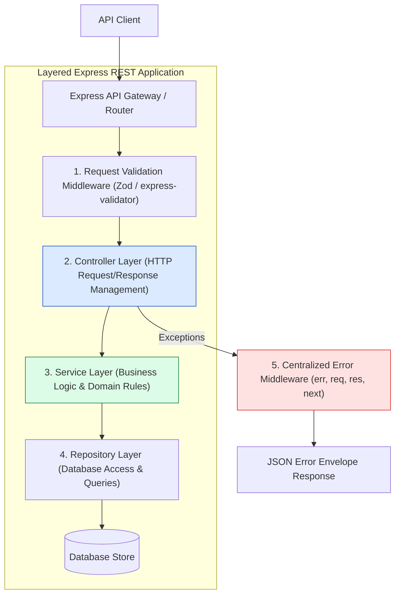
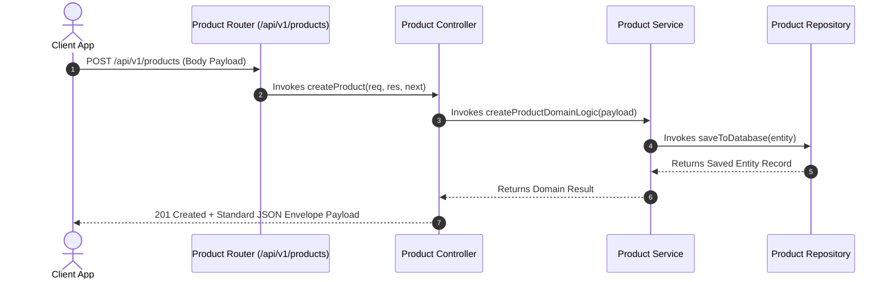
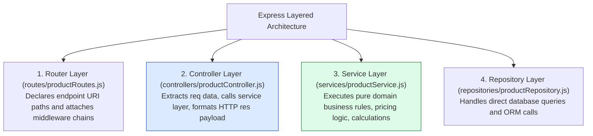

# Module 24: Capstone Project — Production REST API Service Architecture

## Overview

This capstone project implements a production-grade **Enterprise REST API Service** in Express.js, featuring **Controller-Service-Repository Layering**, **Modular Sub-Routers**, **Validation Chains**, **Standardized Envelope Formats**, and **Centralized Error Handling**.

Understanding how to structure enterprise Express backends for maintainability, testability, and clean separation of concerns is essential.

---

## 1. Enterprise Controller-Service-Repository Architecture



---

## 2. Request Data Flow & Processing Lifecycle



---

## 3. Layered Architectural Component Matrix



### Layer Responsibilities & Separation Matrix

| Layer | File / Module | Allowed Responsibilities | Forbidden Responsibilities |
| :--- | :--- | :--- | :--- |
| **Router** | `productRoutes.js` | Path definitions, mounting middleware | Business logic, direct DB queries |
| **Controller** | `productController.js` | Inspecting `req.body`/`params`, setting status codes | Raw SQL/NoSQL queries, complex business rules |
| **Service** | `productService.js` | Domain logic, data transformation, calculations | Direct HTTP `req`/`res` object access |
| **Repository** | `productRepository.js` | Database CRUD queries, connection handling | HTTP status code logic, request parsing |

---

## 4. Practical Implementation Showcase: Complete Capstone REST API

```javascript
const express = require("express");
const app = express();

app.use(express.json());

// -----------------------------------------------------------------------------
// 1. REPOSITORY LAYER (Data Access Abstraction)
// -----------------------------------------------------------------------------
class ProductRepository {
  constructor() {
    this.products = [
      { id: 101, title: "Wireless Mechanical Keyboard", price: 150, category: "peripherals" },
      { id: 102, title: "UltraWide 4K Monitor 34-Inch", price: 850, category: "monitors" }
    ];
  }

  async findAll({ category, minPrice }) {
    let result = [...this.products];
    if (category) result = result.filter((p) => p.category === category.toLowerCase());
    if (minPrice) result = result.filter((p) => p.price >= Number(minPrice));
    return result;
  }

  async findById(id) {
    return this.products.find((p) => p.id === Number(id)) || null;
  }

  async create(data) {
    const newProduct = { id: Date.now(), ...data };
    this.products.push(newProduct);
    return newProduct;
  }
}

const productRepo = new ProductRepository();

// -----------------------------------------------------------------------------
// 2. SERVICE LAYER (Business Logic)
// -----------------------------------------------------------------------------
class ProductService {
  async getCatalog(filters) {
    // Apply domain transformations or discount rules
    return await productRepo.findAll(filters);
  }

  async createProduct(payload) {
    if (!payload.title || !payload.price) {
      const err = new Error("Product 'title' and 'price' are mandatory");
      err.statusCode = 400;
      throw err;
    }
    return await productRepo.create({
      title: payload.title,
      price: Number(payload.price),
      category: payload.category ? payload.category.toLowerCase() : "general"
    });
  }
}

const productService = new ProductService();

// -----------------------------------------------------------------------------
// 3. CONTROLLER LAYER (HTTP Handler)
// -----------------------------------------------------------------------------
class ProductController {
  static async getProducts(req, res, next) {
    try {
      const products = await productService.getCatalog(req.query);
      res.status(200).json({
        status: "success",
        results: products.length,
        data: { products }
      });
    } catch (err) {
      next(err);
    }
  }

  static async createProduct(req, res, next) {
    try {
      const product = await productService.createProduct(req.body);
      res.status(201).json({
        status: "success",
        data: { product }
      });
    } catch (err) {
      next(err);
    }
  }
}

// -----------------------------------------------------------------------------
// 4. ROUTER LAYER
// -----------------------------------------------------------------------------
const productRouter = express.Router();
productRouter.get("/", ProductController.getProducts);
productRouter.post("/", ProductController.createProduct);

app.use("/api/v1/products", productRouter);

// -----------------------------------------------------------------------------
// 5. CENTRALIZED ERROR MIDDLEWARE
// -----------------------------------------------------------------------------
app.use((err, req, res, next) => {
  const statusCode = err.statusCode || 500;
  res.status(statusCode).json({
    status: statusCode >= 500 ? "error" : "fail",
    error: {
      message: err.message || "Internal Server Error"
    }
  });
});

// Start Server
app.listen(3000, () => {
  console.log("Capstone REST API Service running on port 3000");
});
```

---

## Key Production Takeaways

1. **Decouple Controllers from Business Logic**: Keep Express controllers thin by delegating complex domain logic and validation rules to dedicated Service and Repository layer classes.
2. **Never Pass `req`/`res` Objects into Services**: Keep Service classes framework-agnostic by passing primitive arguments (`service.createProduct(payload)`) rather than raw Express `req` or `res` objects.
3. **Use Standard JSON Envelopes**: Wrap JSON responses in a uniform `{ status, data, results }` envelope across all API endpoints to provide consistent contracts for frontend consumers.
4. **Delegate Errors to Centralized Error Middleware**: Forward all caught async errors to `next(err)` so centralized error middleware handles formatting and HTTP status codes consistently.

