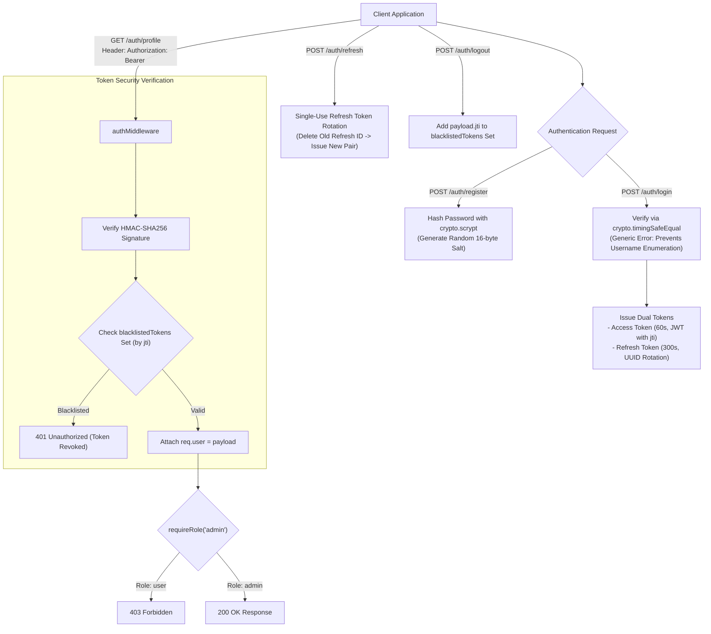

# Module 25: Capstone Project — DigiLocker Dwar Auth Server

## Theoretical Overview & Security Architecture

The **DigiLocker Dwar Authentication Server** is a complete, production-grade security gateway built using Node's native `crypto` module. It demonstrates secure password hashing via `scrypt`, timing-attack-safe comparisons, stateless JWT generation with token blacklisting, single-use refresh token rotation, and Role-Based Access Control (RBAC).



### Real-World Analogy: DigiLocker Security Gate (Dwar)
Think of Kavita's document vault gateway (DigiLocker Dwar):
- **Scrypt Password Vault (`crypto.scrypt`)**: Encrypting passenger master combinations into heavy steel locks that cannot be cracked by fast brute-force key-cloners.
- **Timing-Safe Lock Inspector (`crypto.timingSafeEqual`)**: Inspecting keys in constant time, preventing thieves from listening to lock tumblers to guess passwords.
- **Single-Use Pass Rotation (`refreshTokens.delete()`)**: Swapping out single-use gate vouchers every time a passenger requests entry, invalidating intercepted stolen vouchers instantly.
- **Revocation Blacklist (`blacklistedTokens.add(jti)`)**: Posting a blacklisted serial number badge at the gate during logout so a stolen paper token cannot gain entry even before its expiry timer runs out.

---

## 1. Authentication Server API Endpoints Specification

| HTTP Method | Route Endpoint | Guard / Requirement | Response Status | Purpose & Description |
| :--- | :--- | :--- | :--- | :--- |
| **`POST`** | `/auth/register` | Body: `username`, `password`, `role` | `201 Created` / `400` / `409` | Registers user. Hashes password using `crypto.scrypt`. |
| **`POST`** | `/auth/login` | Body: `username`, `password` | `200 OK` / `401 Unauthorized` | Issues access token ($60\text{s}$) & refresh token ($300\text{s}$). |
| **`GET`** | `/auth/profile` | `Authorization: Bearer <token>` | `200 OK` / `401 Unauthorized` | Returns profile payload of authenticated user. |
| **`POST`** | `/auth/refresh` | Body: `refreshToken` | `200 OK` / `401 Unauthorized` | Single-use refresh token rotation. Invalidates old refresh token. |
| **`POST`** | `/auth/logout` | `Authorization: Bearer <token>` | `200 OK` / `401 Unauthorized` | Blacklists access token `jti` in memory set. |
| **`GET`** | `/auth/admin` | `authMiddleware` + `requireRole('admin')` | `200 OK` / `403 Forbidden` | Restricted admin system status dashboard. |

---

## 2. Password Hashing & JWT Engine (Sections 1–4)

Implementation of `crypto.scrypt` password hashing, timing-safe verification, Base64URL string manipulation, and refresh token storage:

```javascript
const express = require('express');
const crypto = require('crypto');

const JWT_SECRET = crypto.randomBytes(32).toString('hex');
const JWT_EXPIRES_IN = 60; // 60-second short-lived Access Token
const REFRESH_EXPIRES_IN = 300;

const users = [];
const refreshTokens = new Map();
const blacklistedTokens = new Set();

// 1. Password Hashing with scrypt
function hashPassword(password) {
  return new Promise((resolve, reject) => {
    const salt = crypto.randomBytes(16).toString('hex');
    crypto.scrypt(password, salt, 64, (err, key) => {
      if (err) return reject(err);
      resolve({ hash: key.toString('hex'), salt });
    });
  });
}

// 2. Timing-Safe Password Verification
function verifyPassword(password, hash, salt) {
  return new Promise((resolve, reject) => {
    crypto.scrypt(password, salt, 64, (err, key) => {
      if (err) return reject(err);
      // timingSafeEqual defends against side-channel timing attacks
      resolve(crypto.timingSafeEqual(Buffer.from(hash, 'hex'), key));
    });
  });
}

// 3. JWT Signing with Unique jti (JWT ID Claim)
function createJWT(payload, expiresIn = JWT_EXPIRES_IN) {
  const now = Math.floor(Date.now() / 1000);
  const full = { ...payload, iat: now, exp: now + expiresIn, jti: crypto.randomUUID() };
  const header = base64urlEncode({ alg: 'HS256', typ: 'JWT' });
  const body = base64urlEncode(full);
  const sig = crypto.createHmac('sha256', JWT_SECRET).update(`${header}.${body}`)
    .digest('base64').replace(/=/g, '').replace(/\+/g, '-').replace(/\//g, '_');
  return { token: `${header}.${body}.${sig}`, payload: full };
}

// 4. JWT Verification with Blacklist Validation
function verifyJWT(token) {
  try {
    const [h, p, s] = token.split('.');
    if (!h || !p || !s) return { valid: false, error: 'Malformed token' };
    const expected = crypto.createHmac('sha256', JWT_SECRET).update(`${h}.${p}`)
      .digest('base64').replace(/=/g, '').replace(/\+/g, '-').replace(/\//g, '_');
    if (expected !== s) return { valid: false, error: 'Invalid signature' };
    const payload = base64urlDecode(p);
    
    if (payload.exp < Math.floor(Date.now() / 1000)) return { valid: false, error: 'Token expired' };
    if (blacklistedTokens.has(payload.jti)) return { valid: false, error: 'Token has been revoked' };
    
    return { valid: true, payload };
  } catch { return { valid: false, error: 'Token verification failed' }; }
}
```

---

## 3. Auth Routes & Token Rotation Mechanics (Sections 5–6)

```javascript
const app = express();
app.use(express.json());
const r = express.Router();

// Login Endpoint: Generic failure messages prevent username enumeration
r.post('/login', async (req, res) => {
  const { username, password } = req.body;
  if (!username || !password) return res.status(400).json({ success: false, error: 'Credentials required' });
  const user = users.find(u => u.username === username);
  
  if (!user || !(await verifyPassword(password, user.passwordHash, user.salt))) {
    return res.status(401).json({ success: false, error: 'Invalid credentials' });
  }

  const { token } = createJWT({ sub: user.id, username: user.username, role: user.role });
  const refreshToken = createRefreshToken(user.id);
  res.json({ success: true, data: { accessToken: token, refreshToken } });
});

// Single-Use Refresh Token Rotation
r.post('/refresh', (req, res) => {
  const { refreshToken } = req.body;
  if (!refreshToken) return res.status(400).json({ success: false, error: 'Refresh token required' });
  
  const result = verifyRefreshToken(refreshToken);
  if (!result.valid) return res.status(401).json({ success: false, error: result.error });

  // ROTATION: Immediately delete used refresh token!
  refreshTokens.delete(refreshToken);

  const user = users.find(u => u.id === result.userId);
  const { token } = createJWT({ sub: user.id, username: user.username, role: user.role });
  res.json({ success: true, data: { accessToken: token, refreshToken: createRefreshToken(user.id) } });
});

// Logout Endpoint: Blacklist JWT JTI
r.post('/logout', authMiddleware, (req, res) => {
  blacklistedTokens.add(req.user.jti); // Revoke token immediately
  res.json({ success: true, data: { message: 'Logged out successfully' } });
});
```

---

## Key Takeaways

1. **Use Memory-Hard Hashes**: Always hash passwords using GPU-resistant memory-hard functions like `crypto.scrypt` or Argon2.
2. **Prevent Timing Attacks**: Compare password hashes using `crypto.timingSafeEqual()` to eliminate side-channel timing leaks.
3. **Single-Use Refresh Token Rotation**: Invalidate refresh tokens immediately upon consumption and issue a fresh pair to prevent replay attacks.
4. **Immediate Stateless Revocation**: Add a `jti` (JWT ID) claim to access tokens and check a central `blacklistedTokens` set during verification to allow instant logout of stateless JWTs.
5. **Mitigate Username Enumeration**: Always return generic `"Invalid credentials"` messages on login failures to prevent malicious actors from determining valid user accounts.
