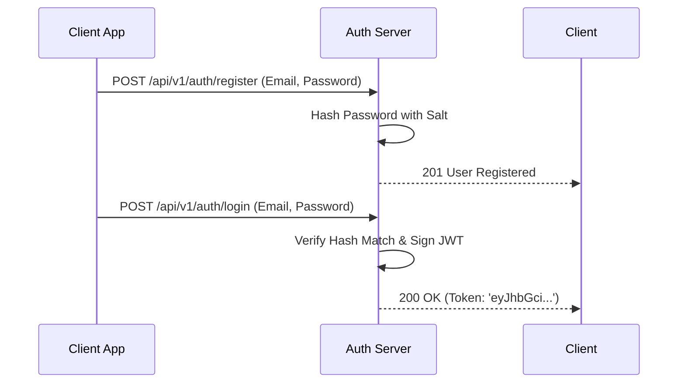

# File 25: Capstone Project — Secure JWT Authentication Server

## Overview
This capstone project implements a **Secure JWT Authentication Server** supporting user registration, salted password hashing, JWT access token generation, authorization guards, and Role-Based Access Control (RBAC).

---

## 1. Authentication Server Security Sequence



---

## 2. JWT Authentication Server Implementation

```javascript
const express = require("express");
const jwt = require("jsonwebtoken");
const crypto = require("crypto");

const app = express();
app.use(express.json());

const JWT_SECRET = "production_jwt_secret_key_2026";
const usersDB = new Map(); // Email -> User Record

// Salted Password Hasher
function hashPassword(password) {
    const salt = crypto.randomBytes(16).toString("hex");
    const hash = crypto.pbkdf2Sync(password, salt, 1000, 64, "sha512").toString("hex");
    return { salt, hash };
}

function verifyPassword(password, salt, hash) {
    const verifyHash = crypto.pbkdf2Sync(password, salt, 1000, 64, "sha512").toString("hex");
    return hash === verifyHash;
}

// User Registration Route
app.post("/api/v1/auth/register", (req, res) => {
    const { email, password, role = "user" } = req.body;
    if (usersDB.has(email)) return res.status(400).json({ error: "Email already registered" });

    const { salt, hash } = hashPassword(password);
    usersDB.set(email, { email, salt, hash, role });
    res.status(201).json({ status: "success", message: "User registered" });
});

// Login Route
app.post("/api/v1/auth/login", (req, res) => {
    const { email, password } = req.body;
    const user = usersDB.get(email);
    if (!user || !verifyPassword(password, user.salt, user.hash)) {
        return res.status(401).json({ error: "Invalid credentials" });
    }

    const token = jwt.sign({ email: user.email, role: user.role }, JWT_SECRET, { expiresIn: "1h" });
    res.status(200).json({ status: "success", token });
});
```

---

## Key Takeaways
1. Never store raw passwords—always apply **Salted Password Hashing** (`pbkdf2` / `bcrypt`).
2. Sign state-less **JWTs** containing user identity and role claims.
