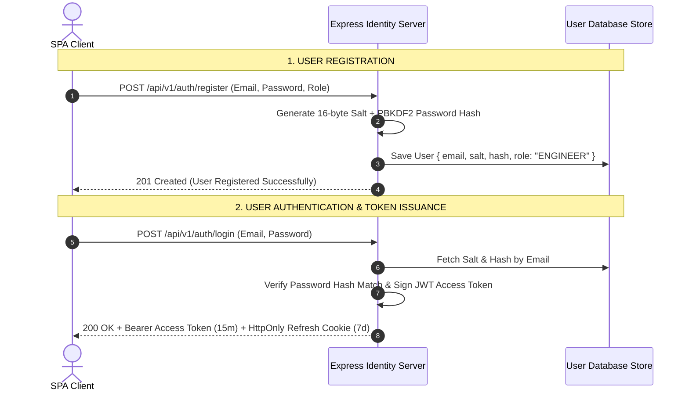
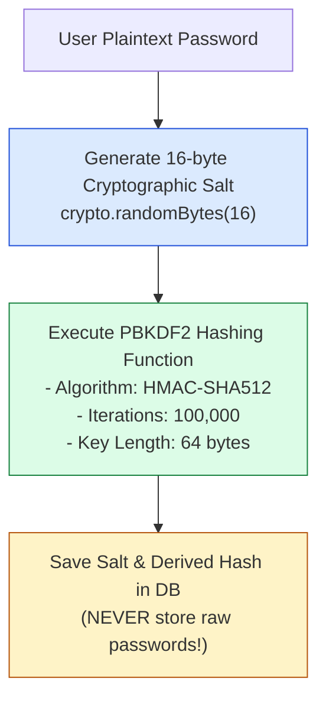
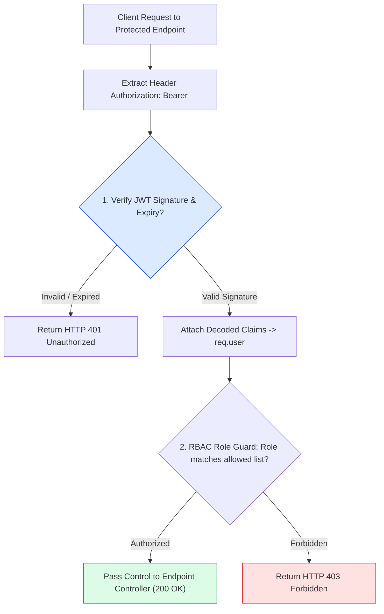

# Module 25: Capstone Project — Production JWT Authentication & RBAC Server

## Overview

This capstone project implements an **Enterprise JWT Authentication & Authorization Server** in Express.js. It covers user registration with **Salted Password Hashing (`pbkdf2Sync`)**, **JWT Access Token Issuance**, **Refresh Token Cookies (`HttpOnly`)**, **Authentication Middleware**, and **Role-Based Access Control (RBAC)** guards.

Understanding how to construct an isolated, secure Identity & Access Management (IAM) service in Express is essential for enterprise security.

---

## 1. Authentication & Token Exchange Architecture



---

## 2. Password Cryptographic Hashing Pipeline



---

## 3. RBAC Protected Resource Request Pipeline



---

## 4. Practical Implementation Showcase: Complete Auth Server

```javascript
const express = require("express");
const jwt = require("jsonwebtoken");
const crypto = require("crypto");
const app = express();

app.use(express.json());

const JWT_SECRET = process.env.JWT_SECRET || "production_auth_server_jwt_secret_key_2026";
const usersRepository = new Map(); // Simulated Database: Email -> User Record

// -----------------------------------------------------------------------------
// 1. CRYPTOGRAPHIC PASSWORD HASHING HELPERS (PBKDF2)
// -----------------------------------------------------------------------------
const hashPassword = (password) => {
  const salt = crypto.randomBytes(16).toString("hex");
  const hash = crypto.pbkdf2Sync(password, salt, 100000, 64, "sha512").toString("hex");
  return { salt, hash };
};

const verifyPassword = (password, salt, storedHash) => {
  const computedHash = crypto.pbkdf2Sync(password, salt, 100000, 64, "sha512").toString("hex");
  return crypto.timingSafeEqual(Buffer.from(storedHash, "hex"), Buffer.from(computedHash, "hex"));
};

// -----------------------------------------------------------------------------
// 2. AUTHENTICATION CONTROLLER ENDPOINTS
// -----------------------------------------------------------------------------
// User Registration Endpoint
app.post("/api/v1/auth/register", (req, res) => {
  const { email, password, role = "USER" } = req.body;

  if (!email || !password) {
    return res.status(400).json({ status: "fail", message: "Email and password are required" });
  }

  if (usersRepository.has(email.toLowerCase())) {
    return res.status(409).json({ status: "fail", message: "User account already exists" });
  }

  const { salt, hash } = hashPassword(password);
  const userRecord = { email: email.toLowerCase(), salt, hash, role: role.toUpperCase() };

  usersRepository.set(email.toLowerCase(), userRecord);

  res.status(201).json({
    status: "success",
    message: "User account created successfully",
    user: { email: userRecord.email, role: userRecord.role }
  });
});

// User Login Endpoint (Generates JWT Access Token)
app.post("/api/v1/auth/login", (req, res) => {
  const { email, password } = req.body;
  const user = usersRepository.get(email?.toLowerCase());

  if (!user || !verifyPassword(password, user.salt, user.hash)) {
    return res.status(401).json({ status: "fail", message: "Invalid email or password" });
  }

  // Sign Access Token expiring in 15 minutes
  const accessToken = jwt.sign(
    { email: user.email, role: user.role },
    JWT_SECRET,
    { expiresIn: "15m", issuer: "auth.enterprise.com" }
  );

  res.status(200).json({
    status: "success",
    tokenType: "Bearer",
    accessToken,
    expiresIn: 900
  });
});

// -----------------------------------------------------------------------------
// 3. AUTHENTICATION & RBAC GUARD MIDDLEWARE
// -----------------------------------------------------------------------------
const authenticateToken = (req, res, next) => {
  const authHeader = req.headers.authorization;
  if (!authHeader || !authHeader.startsWith("Bearer ")) {
    return res.status(401).json({ status: "fail", message: "Access token missing" });
  }

  const token = authHeader.split(" ")[1];
  try {
    const decoded = jwt.verify(token, JWT_SECRET, { issuer: "auth.enterprise.com" });
    req.user = decoded;
    next();
  } catch (err) {
    return res.status(401).json({ status: "fail", message: "Token expired or signature invalid" });
  }
};

const authorizeRoles = (...allowedRoles) => {
  return (req, res, next) => {
    if (!req.user || !allowedRoles.includes(req.user.role)) {
      return res.status(403).json({
        status: "fail",
        message: `Role '${req.user?.role}' is forbidden from accessing this resource`
      });
    }
    next();
  };
};

// -----------------------------------------------------------------------------
// 4. PROTECTED RESOURCE ROUTES
// -----------------------------------------------------------------------------
app.get("/api/v1/user/profile", authenticateToken, (req, res) => {
  res.status(200).json({ status: "success", profile: req.user });
});

app.get("/api/v1/admin/audit-logs", authenticateToken, authorizeRoles("ADMIN"), (req, res) => {
  res.status(200).json({ status: "success", logs: ["System boot OK", "DB backup completed"] });
});

// Start Server
app.listen(3000, () => {
  console.log("Capstone Authentication Server running on port 3000");
});
```

---

## Key Production Takeaways

1. **Always Use Cryptographically Secure Salted Hashing**: Never store plain or un-salted MD5/SHA256 password hashes. Use PBKDF2 (`crypto.pbkdf2Sync` with 100,000 iterations) or bcrypt to defend against rainbow table lookup attacks.
2. **Use Constant-Time String Comparisons**: Use `crypto.timingSafeEqual()` when checking password hashes to mitigate timing side-channel attack vectors.
3. **Decouple Authentication from Authorization Middleware**: Separate JWT token signature verification (`authenticateToken`) from role permissions checking (`authorizeRoles('ADMIN')`) for reusable route protection.
4. **Issue Short-Lived Access Tokens**: Keep access token lifespans short (15 minutes) and pair them with `HttpOnly` refresh cookies to reduce token theft windows.

