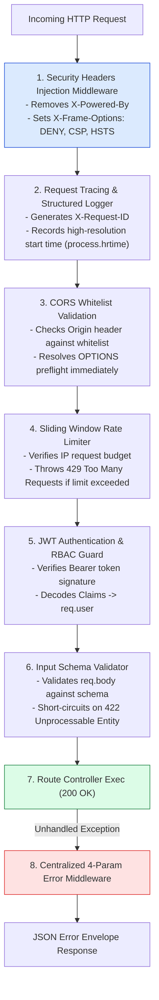
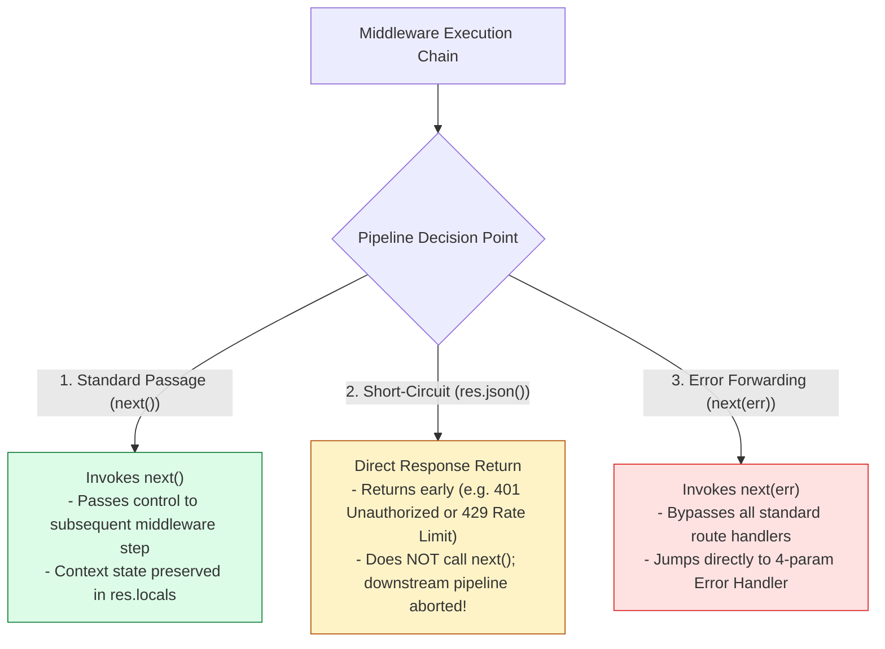
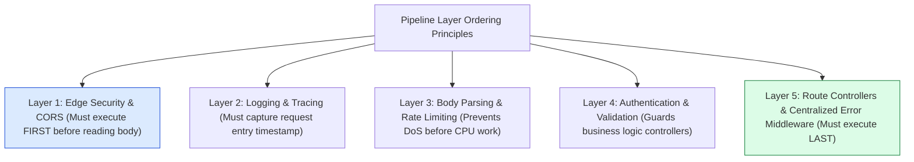

# Module 26: Capstone Project — Custom Enterprise Middleware Pipeline Engine

## Overview

This capstone project constructs an **Enterprise Custom Middleware Pipeline Engine** in Express.js. It details the linear execution sequence of stacked middleware functions: **Security Headers**, **Request Tracing & Logging**, **Rate Limiting**, **CORS Whitelisting**, **JWT Identity Authentication**, **Schema Validation**, and **Centralized Error Propagation**.

Understanding how to compose, mount, and manage complex production middleware chains without race conditions or memory leaks is essential for backend engineering.

---

## 1. Enterprise Middleware Pipeline Sequential Topology



---

## 2. Middleware Chain Execution State & Short-Circuit Mechanics



---

## 3. Pipeline Layer Ordering & Responsibility Matrix



### Pipeline Layer Order & Functional Purpose Matrix

| Step | Middleware Layer | Execution Position | Security / Architectural Purpose |
| :--- | :--- | :--- | :--- |
| **1** | Security Headers & CORS | Global (Top of stack) | Hardens HTTP response headers and handles preflight OPTIONS early. |
| **2** | Tracing & Logging | Global (Top of stack) | Injects unique Request ID (`reqId`) and hooks `res.on('finish')` timing. |
| **3** | Body Parser & Rate Limiter | Global / Grouped | Parses JSON bodies and caps IP request volume to protect CPU resources. |
| **4** | Auth & Input Validation | Route-Specific | Verifies credentials and checks payload schemas before controller execution. |
| **5** | Route Controller | Endpoint Handler | Executes pure business logic and sends `200` / `201` success JSON payload. |
| **6** | Centralized Error Handler | Global (Bottom of stack) | Catches all unhandled exceptions passed via `next(err)`. |

---

## 4. Practical Implementation Showcase: Complete Pipeline Engine

```javascript
const express = require("express");
const app = express();

app.use(express.json());

// =============================================================================
// PIPELINE LAYER 1: SECURITY HEADERS & CORS
// =============================================================================
app.use((req, res, next) => {
  res.removeHeader("X-Powered-By");
  res.setHeader("X-Frame-Options", "DENY");
  res.setHeader("X-Content-Type-Options", "nosniff");
  res.setHeader("Strict-Transport-Security", "max-age=31536000; includeSubDomains");

  // Handle CORS Origin Header
  const origin = req.headers.origin;
  if (origin) {
    res.setHeader("Access-Control-Allow-Origin", origin);
    res.setHeader("Access-Control-Allow-Methods", "GET, POST, PUT, DELETE, OPTIONS");
    res.setHeader("Access-Control-Allow-Headers", "Content-Type, Authorization");
  }

  if (req.method === "OPTIONS") {
    return res.status(204).end(); // Resolve preflight immediately
  }
  next();
});

// =============================================================================
// PIPELINE LAYER 2: REQUEST TRACING & LOGGING
// =============================================================================
app.use((req, res, next) => {
  const reqId = `req_${Date.now()}_${Math.random().toString(36).substring(2, 6)}`;
  res.locals.requestId = reqId;
  res.setHeader("X-Request-ID", reqId);

  const startMs = Date.now();
  res.on("finish", () => {
    const duration = Date.now() - startMs;
    console.log(`[PIPELINE LOG] [${reqId}] ${req.method} ${req.originalUrl} ${res.statusCode} - ${duration}ms`);
  });

  next();
});

// =============================================================================
// PIPELINE LAYER 3: RATE LIMITER
// =============================================================================
const requestCounts = new Map();
app.use((req, res, next) => {
  const ip = req.ip || req.socket.remoteAddress;
  const count = (requestCounts.get(ip) || 0) + 1;
  requestCounts.set(ip, count);

  if (count > 50) {
    return res.status(429).json({
      status: "fail",
      error: "TOO_MANY_REQUESTS",
      message: "Rate limit threshold exceeded"
    });
  }
  next();
});

// =============================================================================
// PIPELINE LAYER 4: ROUTE CONTROLLERS & VALIDATION
// =============================================================================
const validatePayload = (req, res, next) => {
  if (!req.body || !req.body.name) {
    const err = new Error("Field 'name' is required");
    err.statusCode = 400;
    return next(err); // Pass to centralized error handler
  }
  next();
};

app.post("/api/v1/pipeline/data", validatePayload, (req, res) => {
  res.status(200).json({
    status: "success",
    message: "Request processed through 5-stage enterprise middleware pipeline!",
    requestId: res.locals.requestId,
    data: req.body
  });
});

// =============================================================================
// PIPELINE LAYER 5: CENTRALIZED ERROR HANDLER (MUST BE LAST!)
// =============================================================================
app.use((err, req, res, next) => {
  const statusCode = err.statusCode || 500;
  console.error(`🚨 [PIPELINE ERROR] [${res.locals.requestId || "NO_ID"}]:`, err.message);

  res.status(statusCode).json({
    status: "error",
    requestId: res.locals.requestId,
    error: { message: err.message || "Internal Pipeline Error" }
  });
});

// Start Server
app.listen(3000, () => {
  console.log("Custom Middleware Pipeline Server running on port 3000");
});
```

---

## Key Production Takeaways

1. **Order Matters Critically**: Mount security headers, request logging, and CORS middleware at the top of the stack so every request—including short-circuited or errored requests—receives headers and timing logs.
2. **Mount Centralized Error Middleware Last**: Always place your 4-parameter error middleware function `(err, req, res, next)` at the absolute bottom of the middleware chain after all route definitions.
3. **Always Call `next()` or Return a Response**: Every middleware function MUST either call `next()` to pass control forward, send a response (`res.json()`) to short-circuit, or call `next(err)` to trigger error handling. Failing to do so hangs client requests indefinitely.
4. **Use `res.locals` to Pass Request Context Down the Chain**: Attach transient metadata (e.g. `res.locals.requestId`, `res.locals.user`) to `res.locals` so downstream middleware and route handlers can access context cleanly.

