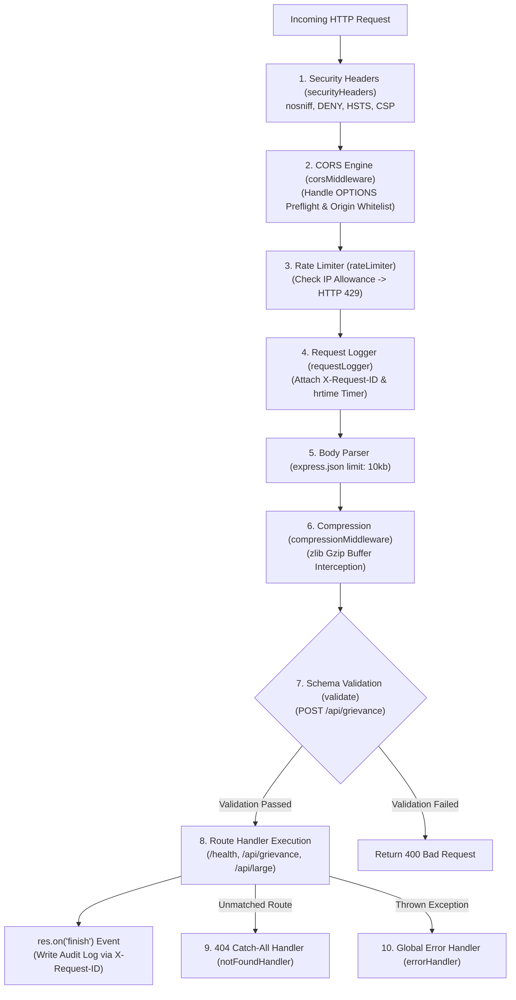

# Module 26: Capstone Project — Production Middleware Pipeline Architecture

## Theoretical Overview & Middleware Pipeline Execution Order

The **Railway Signal Cabin Middleware Pipeline** demonstrates an enterprise-grade Express request processing engine. In Express, **middleware execution order is absolute**—requests flow down a single sequential pipeline where security, CORS, rate limiting, logging, body parsing, and compression must be evaluated in strict priority before route logic executes.



### Real-World Analogy: Mughalsarai Junction Railway Signal Cabin
Think of the master signal cabin at Mughalsarai Junction (Pandit Deen Dayal Upadhyaya Junction):
- **Lever 1 — Boundary Security (`securityHeaders`)**: Lowering the main perimeter gates (`DENY` clickjacking, `nosniff`).
- **Lever 2 — Border Clearance (`corsMiddleware`)**: Checking interstate train permits (`OPTIONS` preflight).
- **Lever 3 — Speed Governor (`rateLimiter`)**: Ensuring no more than 100 trains enter the junction per minute (`429 Too Many Requests`).
- **Lever 4 — Train Tracking Number (`requestLogger`)**: Stamping a unique tracking UUID (`X-Request-ID`) onto every train's manifest.
- **Lever 5 — Weight Inspection (`express.json limit: 10kb`)**: Rejecting overloaded freight wagons (`Payload Too Large`).
- **Lever 6 — Cargo Compression (`compressionMiddleware`)**: Packing cargo efficiently (`Gzip` compression).
- **Lever 7 — Manifest Verification (`validate(schema)`)**: Inspecting freight documentation before granting track access.

---

## 1. Middleware Execution Order & Responsibility Matrix

| Pipeline Sequence | Middleware Layer | Primary Responsibility | Failure Action / Status Code |
| :--- | :--- | :--- | :--- |
| **Step 1** | `securityHeaders()` | Sets `nosniff`, `DENY`, HSTS, and CSP headers. Removes `X-Powered-By`. | Continues `next()`. |
| **Step 2** | `corsMiddleware()` | Validates origins; intercepts `OPTIONS` preflight requests. | Returns `204 No Content` for preflight. |
| **Step 3** | `rateLimiter()` | Tracks IP request frequency over rolling time windows. | Returns `429 Too Many Requests`. |
| **Step 4** | `requestLogger()` | Generates `X-Request-ID` correlation UUIDs & tracks nanosecond timing. | Continues `next()`. |
| **Step 5** | `express.json({ limit: '10kb' })` | Parses JSON body; caps payload sizes. | Returns `413 Payload Too Large`. |
| **Step 6** | `compressionMiddleware()` | Intercepts `res.json()` to Gzip compress payloads $> 1\text{ KB}$. | Continues `next()`. |
| **Step 7** | `validate(schema)` | Validates field types, lengths, and regex patterns. | Returns `400 Bad Request`. |
| **Step 8** | Route Controllers | Executes business logic (`/health`, `/api/grievance`, `/api/large`). | Returns `200 OK` / `201 Created`. |
| **Step 9** | `notFoundHandler` | Catches unmatched HTTP requests. | Returns `404 Not Found`. |
| **Step 10** | `errorHandler` | Four-parameter central error handler catching exceptions. | Returns `500 Internal Server Error`. |

---

## 2. Core Custom Middleware Implementations (Sections 1–6)

```javascript
const express = require('express');
const crypto = require('crypto');
const zlib = require('zlib');
const { Buffer } = require('buffer');

// 1. Security Headers Layer
function securityHeaders() {
  return (req, res, next) => {
    res.setHeader('X-Content-Type-Options', 'nosniff');
    res.setHeader('X-Frame-Options', 'DENY');
    res.setHeader('X-XSS-Protection', '1; mode=block');
    res.setHeader('Referrer-Policy', 'strict-origin-when-cross-origin');
    res.setHeader('Strict-Transport-Security', 'max-age=31536000; includeSubDomains');
    res.setHeader('Content-Security-Policy', "default-src 'self'");
    res.removeHeader('X-Powered-By');
    next();
  };
}

// 2. Correlation ID Request Logger Layer
function requestLogger() {
  return (req, res, next) => {
    const start = process.hrtime.bigint();
    const requestId = req.headers['x-request-id'] || crypto.randomUUID();
    req.requestId = requestId;
    res.setHeader('X-Request-ID', requestId);

    res.on('finish', () => {
      const ms = (Number(process.hrtime.bigint() - start) / 1e6).toFixed(2);
      req.app.locals.requestLogs = req.app.locals.requestLogs || [];
      req.app.locals.requestLogs.push(`[${requestId.slice(0, 8)}] ${req.method} ${req.originalUrl} ${res.statusCode} ${ms}ms`);
    });
    next();
  };
}

// 3. Declarative Schema Validator Layer
function validate(schema) {
  return (req, res, next) => {
    const errors = [];
    for (const [field, rules] of Object.entries(schema)) {
      const v = req.body[field];
      if (rules.required && (v === undefined || v === null || v === '')) {
        errors.push(`${field} is required`); continue;
      }
      if (v === undefined) continue;
      if (rules.type === 'string' && typeof v !== 'string') errors.push(`${field} must be a string`);
      if (rules.minLength && typeof v === 'string' && v.length < rules.minLength) errors.push(`${field} min ${rules.minLength} chars`);
      if (rules.pattern && typeof v === 'string' && !rules.pattern.test(v)) errors.push(`${field} format is invalid`);
    }
    if (errors.length) return res.status(400).json({ success: false, error: 'Validation failed', details: errors });
    next();
  };
}
```

---

## 3. Assembling the Enterprise Pipeline (Sections 8–10)

```javascript
function createApp() {
  const app = express();

  // STACK INVOCATION ORDER MATTERS: Security -> CORS -> Rate Limit -> Logger -> Body -> Compression -> Routes -> 404 -> Error
  app.use(securityHeaders());
  app.use(corsMiddleware({ allowedOrigins: ['http://localhost:3000', 'http://indianrailways.gov.in'], credentials: true }));
  
  const limiter = rateLimiter({ windowMs: 60000, maxRequests: 100 });
  app.use(limiter);
  app.use(requestLogger());
  app.use(express.json({ limit: '10kb' })); // Strict 10 KB body size cap
  app.use(compressionMiddleware());

  // Application Endpoints
  app.get('/health', (req, res) => res.json({ success: true, data: { status: 'healthy' } }));
  
  const grievanceSchema = {
    name: { required: true, type: 'string', minLength: 2 },
    email: { required: true, type: 'string', pattern: /^[^\s@]+@[^\s@]+\.[^\s@]+$/ },
    message: { required: true, type: 'string', minLength: 10 },
  };

  app.post('/api/grievance', validate(grievanceSchema), (req, res) => {
    res.status(201).json({
      success: true,
      data: { id: crypto.randomUUID(), ...req.body, receivedAt: new Date().toISOString() }
    });
  });

  // 404 Catch-All & Centralized Error Handlers
  app.use(notFoundHandler);
  app.use(errorHandler);
  
  app.locals.limiter = limiter;
  return app;
}
```

---

## Key Takeaways

1. **Strict Ordering Rules**: Mount security headers and CORS handlers at the top of the stack, and place 404 catch-alls and 4-parameter error handlers at the bottom.
2. **Correlation Tracking**: Generate and attach `X-Request-ID` headers early in the pipeline to trace individual requests across microservices and log aggregators.
3. **Payload Protection**: Limit incoming JSON request bodies (`express.json({ limit: '10kb' })`) to defend against memory exhaustion and buffer overflow DoS attacks.
4. **Clean Route Controllers**: Encapsulate validation rules into reusable middleware so route controllers focus exclusively on core domain logic.
