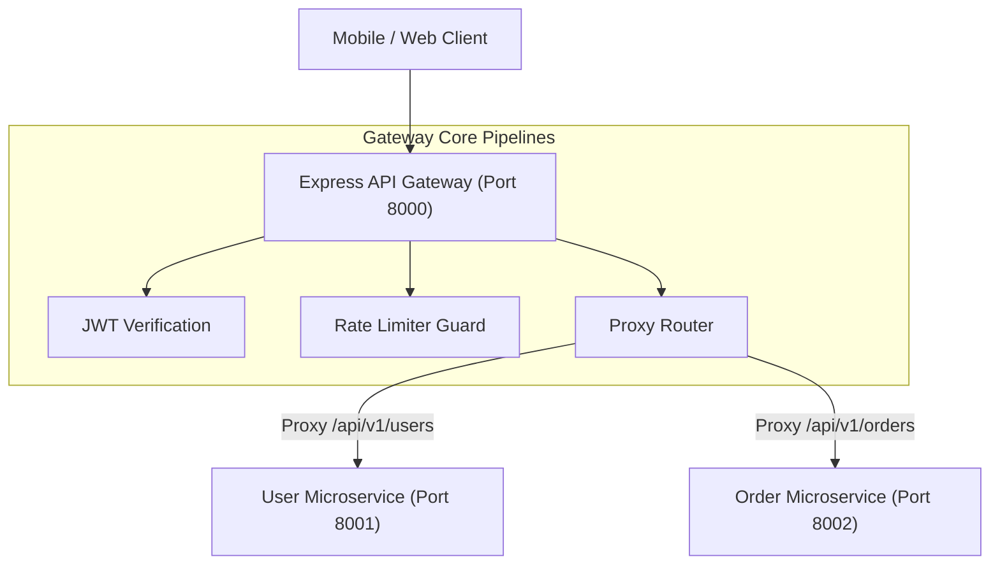

# File 27: Capstone Project — Microservice API Gateway

## Overview
This capstone project implements an **Express Microservice API Gateway**, performing centralized authentication verification, rate-limiting, CORS header injection, and reverse proxy routing to downstream microservices.

---

## 1. Microservice API Gateway Architecture



---

## 2. Express API Gateway Implementation

```javascript
const express = require("express");
const app = express();

app.use(express.json());

// Service Registry Target Mapping
const SERVICES = {
    "/api/v1/users": "http://localhost:8001",
    "/api/v1/orders": "http://localhost:8002"
};

// Gateway Central Auth Middleware
app.use((req, res, next) => {
    if (req.path.startsWith("/api/v1/public")) return next();
    
    const token = req.headers["authorization"];
    if (!token) {
        return res.status(401).json({ error: "GATEWAY_UNAUTHORIZED", message: "Missing token" });
    }
    next();
});

// Proxy Route Handler
app.use((req, res) => {
    const targetService = Object.keys(SERVICES).find(prefix => req.path.startsWith(prefix));
    if (targetService) {
        console.log(`[GATEWAY PROXY] Routing ${req.path} -> ${SERVICES[targetService]}`);
        res.status(200).json({
            gateway: "Express API Gateway",
            routedTo: SERVICES[targetService],
            path: req.path
        });
    } else {
        res.status(404).json({ error: "GATEWAY_404", message: "Microservice route not found" });
    }
});

app.listen(8000, () => console.log("API Gateway running on port 8000"));
```

---

## Key Takeaways
1. Demonstrates building an **API Gateway pattern** using Express.
2. Centralizes cross-cutting concerns (auth, rate limiting, logging) before proxying requests to downstream backend microservices.
