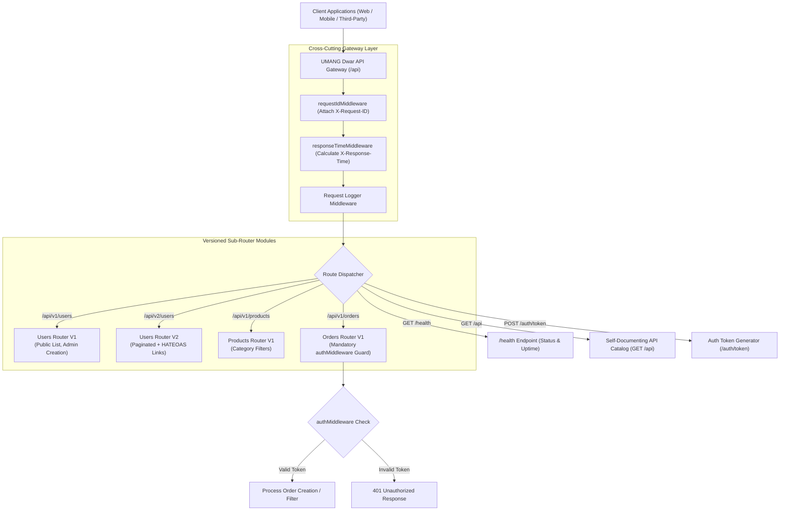

# Module 27: Capstone Project — UMANG Dwar Enterprise API Gateway Architecture

## Theoretical Overview & Gateway Architecture

An **API Gateway** serves as a single, unified entry point for client applications accessing distributed microservices or multi-version APIs. The **UMANG Dwar API Gateway** handles cross-cutting concerns—request correlation tracing (`X-Request-ID`), response timing (`X-Response-Time`), bearer token authentication, role-based authorization, rate limiting, self-documenting route catalogs, and API versioning (`/api/v1` vs `/api/v2`)—at the gateway layer, decoupling these responsibilities from individual sub-router controllers.



### Real-World Analogy: UMANG National Government Portal Gateway
Think of Anuradha ji's architecture for the UMANG national government mobile portal:
- **Unified Entrance (UMANG Dwar Gateway)**: Rather than requiring citizens to travel to 47 different ministry offices, citizens enter through a single security gate (`/api`).
- **Visitor Badge & Stopwatch (`X-Request-ID` & `X-Response-Time`)**: The front gate attaches a unique serial number (`X-Request-ID`) to the visitor's badge and starts a high-precision timer (`X-Response-Time`) to ensure prompt service.
- **Service Counters (`/api/v1` vs `/api/v2`)**: Counter V1 serves basic requests for older mobile apps, while Counter V2 provides upgraded paginated services with direct reference navigation links (`HATEOAS links`).

---

## 1. Gateway API Endpoint Specifications Matrix

| Route Endpoint | API Version | Access Permission | Features & Response Structure |
| :--- | :--- | :--- | :--- |
| **`GET /health`** | Core | Public | Returns status (`healthy`) and server uptime. Includes `X-Request-ID` & `X-Response-Time`. |
| **`GET /api`** | Core | Public | **Self-Documenting Route Catalog** listing all available V1 and V2 endpoints. |
| **`POST /auth/token`** | Core | Public | Generates bearer token for test user (`userId`, `role`). |
| **`GET /api/v1/users`** | `v1` | Public | Returns raw list of users without email addresses. |
| **`POST /api/v1/users`** | `v1` | `authMiddleware` + `requireAdmin` | Creates new user record. |
| **`GET /api/v2/users`** | `v2` | Public | Returns paginated user list (`page`, `limit`, `totalPages`). |
| **`GET /api/v2/users/:id`** | `v2` | Public | Returns user details with **HATEOAS hypermedia links** (`self`, `orders`). |
| **`GET /api/v1/orders`** | `v1` | `authMiddleware` | Users view their own orders; admins view all orders. |
| **`POST /api/v1/orders`** | `v1` | `authMiddleware` | Creates order, calculates totals, updates order store. |

---

## 2. Cross-Cutting Middleware & Sub-Routers (Sections 1–3)

```javascript
const express = require('express');
const crypto = require('crypto');

// 1. Cross-Cutting Request ID Middleware
function requestIdMiddleware(req, res, next) {
  req.requestId = req.headers['x-request-id'] || crypto.randomUUID();
  res.setHeader('X-Request-ID', req.requestId);
  next();
}

// 2. High-Precision Response Time Middleware
function responseTimeMiddleware(req, res, next) {
  const start = process.hrtime.bigint();
  const origWriteHead = res.writeHead.bind(res);
  res.writeHead = function (statusCode, ...args) {
    const elapsed = (Number(process.hrtime.bigint() - start) / 1e6).toFixed(2);
    res.setHeader('X-Response-Time', `${elapsed}ms`);
    return origWriteHead(statusCode, ...args);
  };
  next();
}

// 3. Sub-Router V2 (Paginated + HATEOAS Links)
function createUsersRouterV2() {
  const r = express.Router();
  r.get('/', (req, res) => {
    const page = Math.max(1, parseInt(req.query.page) || 1);
    const limit = Math.min(50, Math.max(1, parseInt(req.query.limit) || 10));
    const start = (page - 1) * limit;
    res.json({
      success: true,
      data: dataStores.users.slice(start, start + limit).map(u => ({ id: u.id, name: u.name, email: u.email, role: u.role })),
      pagination: { page, limit, total: dataStores.users.length, totalPages: Math.ceil(dataStores.users.length / limit) },
      apiVersion: 'v2',
      requestId: req.requestId,
    });
  });

  r.get('/:id', (req, res) => {
    const user = dataStores.users.find(u => u.id === req.params.id);
    if (!user) return res.status(404).json({ success: false, error: 'Not found', requestId: req.requestId });
    res.json({
      success: true,
      data: { ...user },
      links: {
        self: `/api/v2/users/${user.id}`,
        orders: `/api/v2/orders?userId=${user.id}`,
      },
      apiVersion: 'v2',
      requestId: req.requestId,
    });
  });
  return r;
}

// 4. Fully Authenticated Orders Sub-Router
function createOrdersRouter() {
  const r = express.Router();
  r.use(authMiddleware); // Apply authentication guard across all routes in this sub-router

  r.get('/', (req, res) => {
    let orders = [...dataStores.orders];
    if (req.user.role !== 'admin') orders = orders.filter(o => o.userId === req.user.userId);
    res.json({ success: true, data: orders, requestId: req.requestId });
  });

  r.post('/', (req, res) => {
    const { productId, quantity } = req.body;
    if (!productId || !quantity) return res.status(400).json({ success: false, error: 'productId and quantity required', requestId: req.requestId });
    const product = dataStores.products.find(p => p.id === productId);
    if (!product) return res.status(404).json({ success: false, error: 'Product not found', requestId: req.requestId });
    
    const o = {
      id: `o${dataStores.orders.length + 1}`,
      userId: req.user.userId,
      productId,
      quantity,
      status: 'pending',
      total: product.price * quantity
    };
    dataStores.orders.push(o);
    res.status(201).json({ success: true, data: o, requestId: req.requestId });
  });
  return r;
}
```

---

## 3. Gateway Application Assembly & Route Versioning (Section 4)

```javascript
function createApp() {
  const app = express();
  app.locals.startTime = Date.now();
  app.locals.logs = [];

  // Mount Global Gateway Middleware
  app.use(requestIdMiddleware);
  app.use(responseTimeMiddleware);
  app.use(express.json());

  // Health Endpoint
  app.get('/health', (req, res) => {
    res.json({
      success: true,
      data: { status: 'healthy', uptime: `${((Date.now() - app.locals.startTime) / 1000).toFixed(1)}s` },
      requestId: req.requestId
    });
  });

  // Self-Documenting Endpoint Catalog
  app.get('/api', (req, res) => {
    res.json({
      success: true,
      data: {
        name: 'UMANG Dwar API Gateway',
        endpoints: {
          v1: {
            'GET /api/v1/users': 'List users',
            'POST /api/v1/users': 'Create user (admin)',
            'GET /api/v1/products': 'List schemes',
            'GET /api/v1/orders': 'List orders (auth required)'
          },
          v2: {
            'GET /api/v2/users': 'Paginated users list',
            'GET /api/v2/users/:id': 'User details with HATEOAS links'
          }
        }
      },
      requestId: req.requestId
    });
  });

  // Mount Versioned Sub-Routers
  app.use('/api/v1/users', createUsersRouterV1());
  app.use('/api/v1/products', createProductsRouter());
  app.use('/api/v1/orders', createOrdersRouter());
  app.use('/api/v2/users', createUsersRouterV2());

  // 404 Catch-All Handler with Helpful Discovery Hint
  app.use((req, res) => res.status(404).json({
    success: false,
    error: `Route ${req.method} ${req.path} not found`,
    hint: 'Visit GET /api for route discovery catalog',
    requestId: req.requestId
  }));

  return app;
}
```

---

## Key Takeaways

1. **Centralize Cross-Cutting Concerns**: Place authentication, correlation logging (`X-Request-ID`), and execution timing (`X-Response-Time`) at the API Gateway layer to keep individual sub-routers clean and modular.
2. **API Versioning Strategies**: Prefix routes with versions (`/api/v1`, `/api/v2`) to allow legacy client applications to coexist peacefully alongside modern APIs.
3. **Sub-Router Scoping**: Apply security guards (`router.use(authMiddleware)`) at the sub-router level to secure entire resource domains at once.
4. **Self-Documenting Route Catalogs**: Expose an introductory discovery endpoint (`GET /api`) returning a JSON catalog of available routes to improve developer ergonomics.
5. **HATEOAS Navigation**: Include hypermedia resource links (`links: { self, orders }`) in V2 responses to guide API consumers dynamically.
