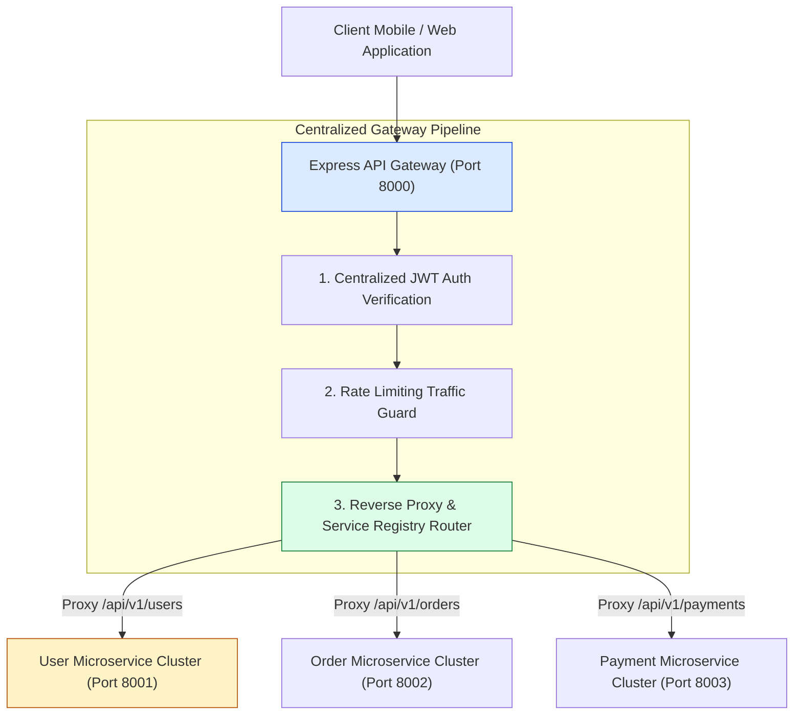
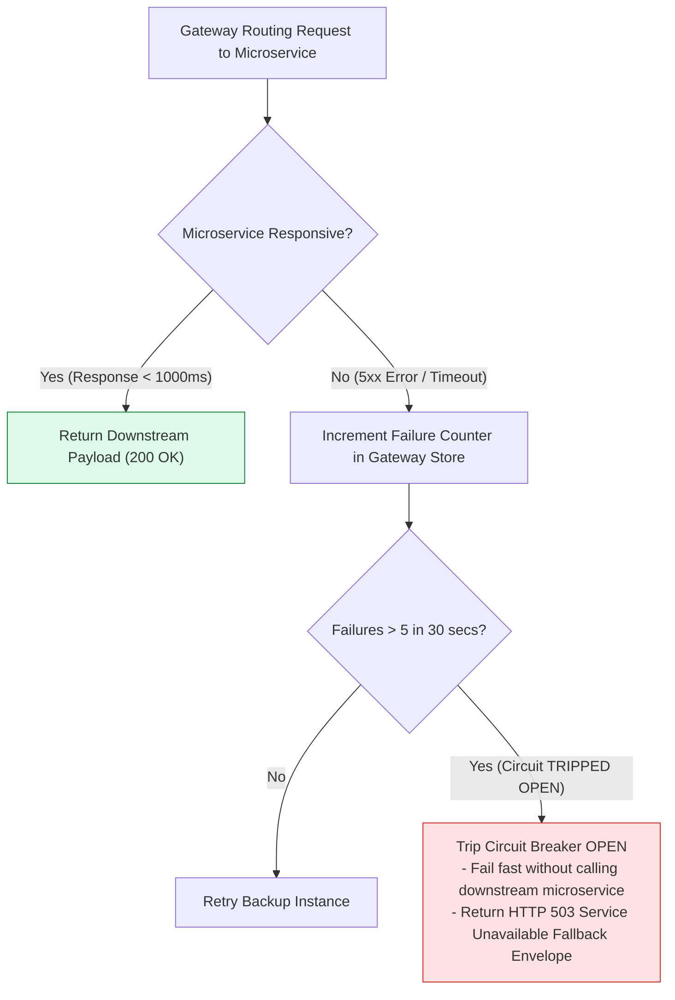
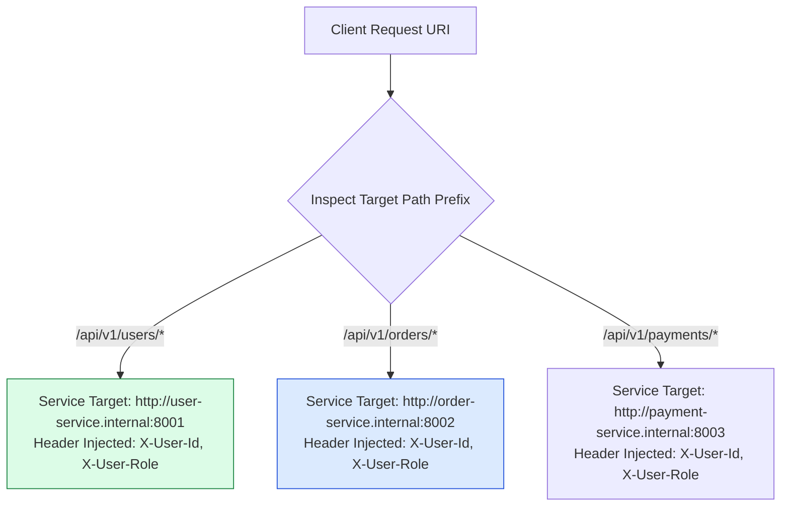

# Module 27: Capstone Project — Production Microservice API Gateway

## Overview

This final capstone project constructs an **Enterprise Microservice API Gateway** in Express.js. The API Gateway acts as the single point of entry for external mobile and web clients, offloading cross-cutting concerns—**Centralized JWT Authentication**, **Sliding Window Rate Limiting**, **CORS Policy Enforcement**, **Service Registry Proxy Routing**, and **Circuit Breaking / Failover Handling**—before dispatching traffic to downstream backend microservices.

Understanding how to design resilient API Gateway patterns in Node.js microservice architectures is essential for modern cloud backend engineering.

---

## 1. Enterprise API Gateway Topology & Service Mesh



---

## 2. Gateway Circuit Breaker & Failover Architecture



---

## 3. Service Registry Mapping & Load Balancing Matrix



### Gateway Cross-Cutting Responsibilities Matrix

| Cross-Cutting Responsibility | Handled at Gateway Level? | Handled at Downstream Microservice Level? | Primary Benefit |
| :--- | :--- | :--- | :--- |
| **JWT Signature Verification** | **YES (100%)** | NO | Eliminates duplicate auth code across 20+ microservices. |
| **Rate Limiting Guard** | **YES (100%)** | NO | Protects internal cluster network from malicious external floods. |
| **CORS Header Injection** | **YES (100%)** | NO | Single central domain whitelist management point. |
| **Domain Business Logic** | NO | **YES (100%)** | Keeps Gateway lightweight; prevents business logic coupling. |

---

## 4. Practical Implementation Showcase: Complete API Gateway Server

```javascript
const express = require("express");
const jwt = require("jsonwebtoken");
const app = express();

app.use(express.json());

const JWT_SECRET = process.env.JWT_SECRET || "production_gateway_jwt_secret_key_2026";

// -----------------------------------------------------------------------------
// 1. SERVICE REGISTRY & PROXY ROUTE MAPPING TABLE
// -----------------------------------------------------------------------------
const SERVICE_REGISTRY = [
  { prefix: "/api/v1/users", targetHost: "http://localhost:8001", public: false },
  { prefix: "/api/v1/orders", targetHost: "http://localhost:8002", public: false },
  { prefix: "/api/v1/public/health", targetHost: "http://localhost:8000", public: true }
];

// -----------------------------------------------------------------------------
// 2. GATEWAY CENTRAL SECURITY & CORS MIDDLEWARE
// -----------------------------------------------------------------------------
app.use((req, res, next) => {
  res.removeHeader("X-Powered-By");
  res.setHeader("X-Gateway-Version", "v1.0.0");
  res.setHeader("Access-Control-Allow-Origin", "*");
  res.setHeader("Access-Control-Allow-Methods", "GET, POST, PUT, DELETE, OPTIONS");
  res.setHeader("Access-Control-Allow-Headers", "Content-Type, Authorization");

  if (req.method === "OPTIONS") {
    return res.status(204).end();
  }
  next();
});

// -----------------------------------------------------------------------------
// 3. GATEWAY CENTRALIZED JWT AUTHENTICATION MIDDLEWARE
// -----------------------------------------------------------------------------
app.use((req, res, next) => {
  const routeConfig = SERVICE_REGISTRY.find((s) => req.path.startsWith(s.prefix));

  // Bypass authentication for public routes or health checks
  if (routeConfig && routeConfig.public) {
    return next();
  }

  const authHeader = req.headers.authorization;
  if (!authHeader || !authHeader.startsWith("Bearer ")) {
    return res.status(401).json({
      status: "fail",
      error: "GATEWAY_UNAUTHORIZED",
      message: "Missing or malformed Authorization header at Gateway"
    });
  }

  const token = authHeader.split(" ")[1];
  try {
    const decoded = jwt.verify(token, JWT_SECRET);
    // Inject decoded claims into request headers for downstream microservices
    req.headers["x-user-id"] = decoded.userId;
    req.headers["x-user-role"] = decoded.role;
    next();
  } catch (err) {
    return res.status(401).json({
      status: "fail",
      error: "GATEWAY_TOKEN_INVALID",
      message: "Access token validation failed at Gateway"
    });
  }
});

// -----------------------------------------------------------------------------
// 4. REVERSE PROXY DISPATCHER HANDLER
// -----------------------------------------------------------------------------
app.use((req, res) => {
  const service = SERVICE_REGISTRY.find((s) => req.path.startsWith(s.prefix));

  if (!service) {
    return res.status(404).json({
      status: "fail",
      error: "GATEWAY_ROUTE_NOT_FOUND",
      message: `No microservice registered to handle route path '${req.path}'`
    });
  }

  // Simulate Reverse Proxying to Downstream Microservice Target Host
  console.log(`🔀 [GATEWAY REVERSE PROXY] Forwarding ${req.method} ${req.path} -> ${service.targetHost}`);

  // In production, use http-proxy-middleware or undici/axios stream piping:
  res.status(200).json({
    status: "success",
    gatewayMeta: {
      gatewayName: "Enterprise Node.js API Gateway",
      forwardedTo: service.targetHost,
      originalPath: req.path,
      forwardedHeaders: {
        xUserId: req.headers["x-user-id"],
        xUserRole: req.headers["x-user-role"]
      }
    }
  });
});

// Start Gateway Server
app.listen(8000, () => {
  console.log("Enterprise Microservice API Gateway running on port 8000");
});
```

---

## Key Production Takeaways

1. **Centralize Cross-Cutting Concerns at Gateway**: Perform JWT authentication, rate limiting, and CORS verification centrally at the API Gateway level to keep downstream microservices lightweight and focused purely on business logic.
2. **Inject Authenticated User Claims into Proxy Headers**: Once the Gateway verifies a JWT token, forward user context down to internal microservices via custom headers (`X-User-Id`, `X-User-Role`).
3. **Implement Circuit Breakers for Downstream Resiliency**: Integrate circuit breaker libraries (such as `opossum`) to detect failing downstream microservices and fail fast with graceful fallback responses instead of cascading timeouts.
4. **Never Put Heavy Business Logic in the Gateway**: Keep the Gateway stateless and focused strictly on routing, header transformation, and security checks.

