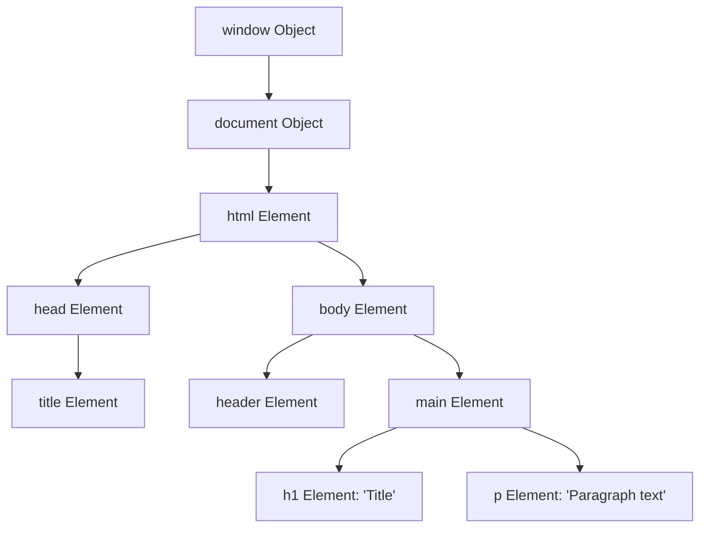
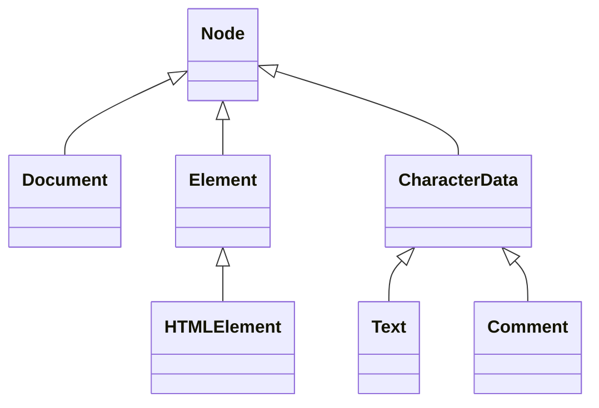

# File 01: DOM Introduction and Architecture

## Overview
The **Document Object Model (DOM)** is an object-oriented, in-memory representation of an HTML or XML document. It provides a structured tree model allowing JavaScript to inspect, manipulate, create, and style webpage content dynamically.

---

## 1. The DOM Tree Architecture



### Core DOM Node Hierarchy



| Node Type Constant | Integer Value | Description |
| :--- | :--- | :--- |
| `Node.ELEMENT_NODE` | `1` | HTML elements (e.g. `<div>`, `<p>`) |
| `Node.TEXT_NODE` | `3` | Raw textual content inside elements |
| `Node.COMMENT_NODE` | `8` | HTML comments `<!-- comment -->` |
| `Node.DOCUMENT_NODE` | `9` | The root `document` object |

---

## 2. DOM Tree Inspection Code

```javascript
// Inspecting the Document & Root Nodes
console.log("Document Title:", document.title);
console.log("Root HTML Node Name:", document.documentElement.nodeName); // "HTML"
console.log("Body Node Type:", document.body.nodeType);                 // 1 (Node.ELEMENT_NODE)

// Checking Node Types Programmatically
function inspectNode(node) {
    switch (node.nodeType) {
        case Node.ELEMENT_NODE:
            console.log(`Element: <${node.tagName.toLowerCase()}>`);
            break;
        case Node.TEXT_NODE:
            console.log(`Text Node: "${node.textContent.trim()}"`);
            break;
        case Node.COMMENT_NODE:
            console.log(`Comment: <!--${node.nodeValue}-->`);
            break;
    }
}

inspectNode(document.body);
```

---

## Key Takeaways
1. The DOM turns static HTML text into a live, tree-structured **object graph**.
2. **`window`** is the global browser container; **`document`** represents the loaded HTML DOM tree root.
3. Every item in the tree is a **`Node`** (`Element`, `Text`, `Comment`).
4. Inspect `node.nodeType` to distinguish between Elements (`1`) and Text nodes (`3`).
