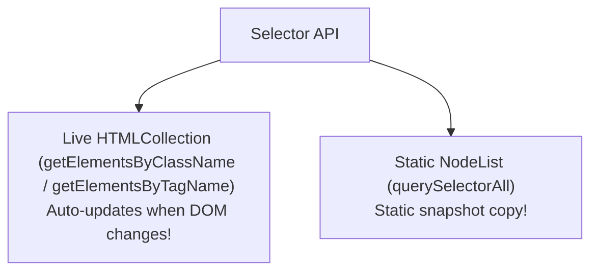

# File 02: Selecting DOM Elements

## Overview
Selecting DOM elements allows JavaScript to access specific HTML nodes for reading or modification. Modern JavaScript provides fast legacy selectors (`getElementById`, `getElementsByClassName`) alongside powerful CSS selector query methods (`querySelector`, `querySelectorAll`).

---

## 1. Static vs Live Collections



### Selector Methods Comparison

| Selector Method | Returns | Return Type | Live vs Static |
| :--- | :--- | :--- | :--- |
| `document.getElementById('id')` | Single Element | `HTMLElement` or `null` | Direct Reference |
| `document.querySelector('.class')` | First matching Element | `HTMLElement` or `null` | Direct Reference |
| `document.querySelectorAll('.class')` | All matching Elements | `NodeList` | **Static Snapshot** |
| `document.getElementsByClassName('cls')` | All matching Elements | `HTMLCollection` | **Live Auto-Updating** |

---

## 2. Selection Code Examples

```javascript
// 1. Modern CSS Query Selectors (Recommended)
const header = document.querySelector("#main-header");
const activeCards = document.querySelectorAll(".card.active");

// NodeList iteration via forEach
activeCards.forEach((card, index) => {
    console.log(`Card ${index + 1}:`, card.textContent);
});

// 2. Scoped Element Querying
const sidebar = document.querySelector(".sidebar");
const navLinks = sidebar.querySelectorAll("a.nav-link"); // Scoped search inside .sidebar!

// 3. Live vs Static Collection Behavior
const liveList = document.getElementsByClassName("item"); // HTMLCollection (Live)
const staticList = document.querySelectorAll(".item");     // NodeList (Static)

// Converting HTMLCollection to Array for map/filter
const itemArray = Array.from(liveList);
```

---

## Key Takeaways
1. Prefer **`querySelector()`** and **`querySelectorAll()`** for flexible CSS selector syntax.
2. `querySelectorAll()` returns a **static `NodeList`** (does not auto-update when elements are removed).
3. `getElementsByClassName()` returns a **live `HTMLCollection`** (automatically reflects DOM changes).
4. Use **`Array.from(collection)`** to transform collections into standard arrays.
