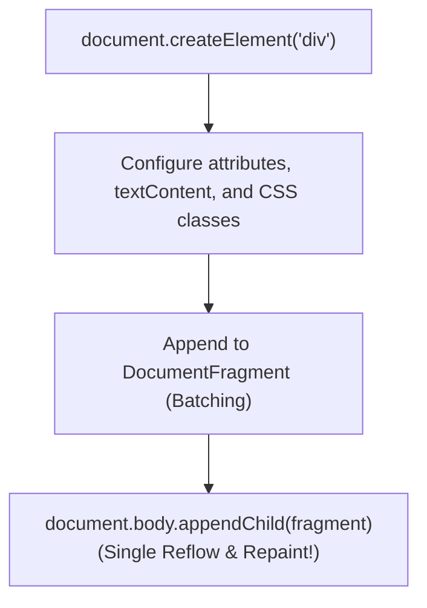

# File 04: Creating and Modifying DOM Elements

## Overview
JavaScript allows dynamically instantiating new HTML nodes, updating text content, inserting nodes into the DOM tree, and removing elements. High-performance modifications leverage **`DocumentFragment`** to minimize browser reflows and repaints.

---

## 1. DOM Element Creation Lifecycle



---

## 2. Dynamic DOM Creation & Batch Insertion

```javascript
// 1. Creating Elements & Safe Text Assignment
const newCard = document.createElement("div");
newCard.className = "card profile-card";

const title = document.createElement("h3");
title.textContent = "Priya Sharma"; // SAFE: Automatically escapes raw text (no XSS risk!)

newCard.appendChild(title);

// 2. High-Performance Batch Insertion via DocumentFragment
function renderUserList(users) {
    const listContainer = document.querySelector("#user-list");
    const fragment = document.createDocumentFragment(); // In-memory offscreen container

    users.forEach(user => {
        const li = document.createElement("li");
        li.className = "user-item";
        li.textContent = `${user.name} (${user.role})`;
        fragment.appendChild(li); // No DOM reflow triggered yet!
    });

    listContainer.appendChild(fragment); // Single DOM reflow!
}

// 3. Removing Elements
const oldElement = document.querySelector("#deprecated-banner");
if (oldElement) {
    oldElement.remove(); // Modern element removal
}
```

---

## Key Takeaways
1. Prefer **`textContent`** over `innerHTML` when rendering user data to prevent **Cross-Site Scripting (XSS)** vulnerabilities.
2. Use **`DocumentFragment`** to batch-insert multiple elements into the DOM with a single reflow.
3. Use **`element.remove()`** to cleanly detach an element from the DOM tree.
