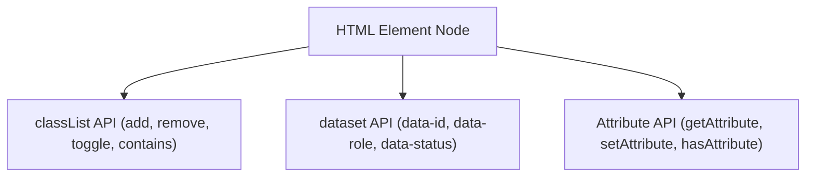

# File 05: Attributes, Data Sets, and CSS Classes

## Overview
Manipulating element attributes (`getAttribute`, `setAttribute`), custom data attributes (`dataset`), and CSS classes (`classList`) allows JavaScript to control element behavior, accessibility attributes (`aria-*`), and visual presentation state.

---

## 1. ClassList & Dataset API Architecture



---

## 2. Attributes & ClassList Implementation

```javascript
const btn = document.querySelector("#submit-btn");

// 1. Working with classList
btn.classList.add("active", "primary");
btn.classList.remove("disabled");
btn.classList.toggle("selected"); // Toggles class on/off

if (btn.classList.contains("active")) {
    console.log("Button is currently active!");
}

// 2. Custom Data Attributes (data-*)
const userCard = document.querySelector(".user-card");
// Reads <div class="user-card" data-user-id="101" data-is-admin="true">
const userId = userCard.dataset.userId; // Automatically camelCases 'user-id'!
const isAdmin = userCard.dataset.isAdmin === "true";

userCard.dataset.status = "VERIFIED"; // Mutates data-status attribute on DOM

// 3. Direct Attribute Operations & ARIA Accessibility
btn.setAttribute("disabled", "true");
btn.setAttribute("aria-expanded", "false");
console.log(btn.getAttribute("aria-expanded")); // "false"
```

---

## Key Takeaways
1. Use **`classList`** (`add`, `remove`, `toggle`, `contains`) for managing CSS classes.
2. Use **`element.dataset`** to access custom HTML5 `data-*` attributes (automatically converted to camelCase).
3. Use **`setAttribute()`** and **`getAttribute()`** for standard HTML and accessibility `aria-*` attributes.
