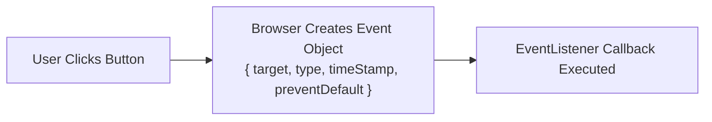

# File 06: Event Fundamentals

## Overview
Events are signals dispatched by the browser when user interactions (clicks, keyboard input, mouse movements) or system state changes (page load, resize) occur. Event listeners are registered using **`addEventListener()`**.

---

## 1. Event Registration & Event Object Flow



---

## 2. Event Handling Implementation

```javascript
const btn = document.querySelector("#action-btn");
const form = document.querySelector("#login-form");

// 1. Standard Event Listener Registration
function handleClick(event) {
    console.log("Event Type:", event.type);          // "click"
    console.log("Target Element:", event.target);    // <button>
    console.log("Mouse Coordinates:", event.clientX, event.clientY);
}

btn.addEventListener("click", handleClick);

// Removing Event Listener (Requires named function reference!)
// btn.removeEventListener("click", handleClick);

// 2. Preventing Default Browser Action
form.addEventListener("submit", event => {
    event.preventDefault(); // Prevents browser from reloading page on form submit!
    console.log("Form submission intercepted and handled via JavaScript AJAX");
});

// 3. One-Time Event Listener
btn.addEventListener("click", () => {
    console.log("This listener runs ONCE and unbinds automatically!");
}, { once: true });
```

---

## Key Takeaways
1. Always use **`addEventListener()`** instead of inline HTML event attributes (`onclick="..."`).
2. Use **`event.preventDefault()`** to stop default browser behaviors (form reloads, link navigation).
3. To remove an event listener via `removeEventListener()`, pass the exact named function reference.
4. Pass `{ once: true }` in options to auto-remove event listeners after initial execution.
