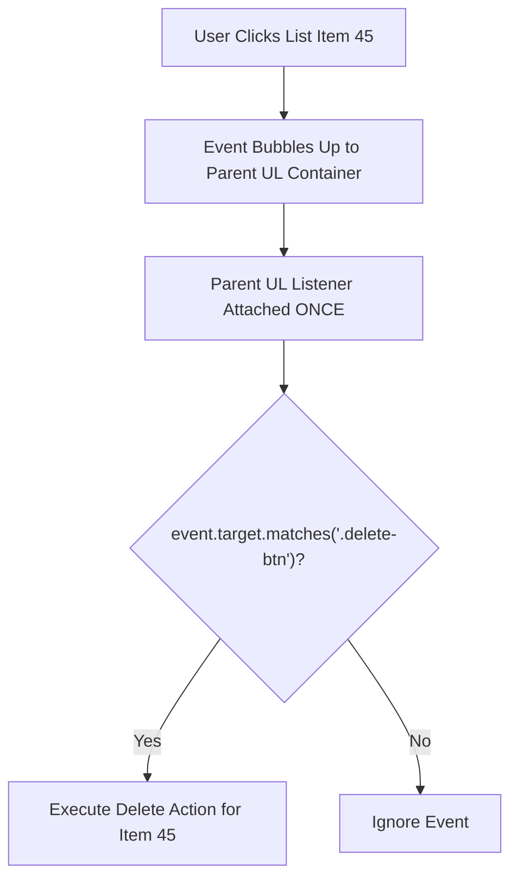

# File 08: Event Delegation

## Overview
**Event Delegation** is a high-performance pattern where a single event listener is attached to a parent container instead of binding individual listeners to dozens or hundreds of child elements. It leverages **Event Bubbling** and `event.target` / `element.matches()`.

---

## 1. Event Delegation Architecture



---

## 2. Dynamic Event Delegation Implementation

```javascript
const todoList = document.querySelector("#todo-list");

// Single Event Listener attached to Parent Container
todoList.addEventListener("click", event => {
    // Check if clicked element is a delete button
    if (event.target.matches(".delete-btn")) {
        const item = event.target.closest(".todo-item");
        console.log(`Deleting item: ${item.dataset.id}`);
        item.remove();
    }

    // Check if clicked element is a checkbox toggle
    if (event.target.matches(".toggle-checkbox")) {
        const item = event.target.closest(".todo-item");
        item.classList.toggle("completed");
    }
});

// Dynamically adding new items (No new event listeners needed!)
function addToList(text, id) {
    const li = document.createElement("li");
    li.className = "todo-item";
    li.dataset.id = id;
    li.innerHTML = `
        <input type="checkbox" class="toggle-checkbox" />
        <span>${text}</span>
        <button class="delete-btn">Delete</button>
    `;
    todoList.appendChild(li);
}
```

---

## Key Takeaways
1. Event Delegation attaches **one listener to a parent container** leveraging event bubbling.
2. Dramatically reduces **memory consumption** when rendering dynamic lists or tables.
3. Dynamically added child elements work automatically without rebinding event listeners.
4. Use **`event.target.matches(selector)`** or **`event.target.closest(selector)`** to identify targets.
