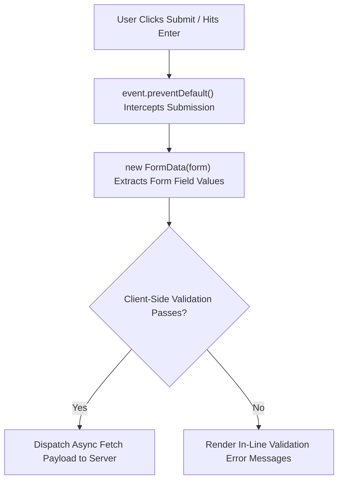

# File 09: Form Handling and Data Validation

## Overview
Form handling involves managing input controls, validating form entries, extracting form data via **`FormData`**, and preventing default browser page reloads upon submission.

---

## 1. Form Submission Processing Pipeline



---

## 2. FormData & Client Validation Implementation

```javascript
const form = document.querySelector("#registration-form");

form.addEventListener("submit", async event => {
    event.preventDefault(); // Stop page reload

    // 1. Extracting Form Data via FormData API
    const formData = new FormData(form);
    
    // Convert to plain JS Object
    const payload = Object.fromEntries(formData.entries());
    console.log("Extracted Form Data:", payload);

    // 2. Client-Side Validation
    if (!payload.email || !payload.email.includes("@")) {
        showError("Please enter a valid email address");
        return;
    }

    if (payload.password.length < 8) {
        showError("Password must be at least 8 characters long");
        return;
    }

    // 3. Send AJAX Request
    try {
        const response = await fetch("/api/register", {
            method: "POST",
            headers: { "Content-Type": "application/json" },
            body: JSON.stringify(payload)
        });
        if (response.ok) {
            form.reset(); // Clear form fields on success
            console.log("Registration successful!");
        }
    } catch (err) {
        console.error("Submission failed:", err.message);
    }
});

function showError(msg) {
    const errorBox = document.querySelector("#error-box");
    errorBox.textContent = msg;
    errorBox.hidden = false;
}
```

---

## Key Takeaways
1. Always call **`event.preventDefault()`** inside `submit` handlers.
2. Use **`new FormData(form)`** and **`Object.fromEntries()`** to extract form fields easily.
3. Validate inputs on client-side before sending network requests.
4. Call **`form.reset()`** to clear form fields after successful submissions.
