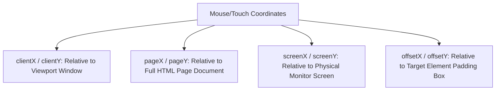

# File 10: Keyboard, Mouse, and Touch Events

## Overview
Browser user interactions trigger specific event types: Keyboard events (`keydown`, `keyup`), Mouse events (`click`, `mousemove`, `mouseenter`, `mouseleave`), and Touch events (`touchstart`, `touchmove`, `touchend`).

---

## 1. Event Coordinate Frame Systems



---

## 2. Keyboard & Pointer Event Implementation

```javascript
// 1. Keyboard Shortcuts Listener
document.addEventListener("keydown", event => {
    // Check key code identifier
    if (event.key === "Escape") {
        closeModal();
    }

    // Key Combination (Ctrl + S or Cmd + S)
    if ((event.ctrlKey || event.metaKey) && event.key === "s") {
        event.preventDefault(); // Prevent browser save popup
        saveDocument();
    }
});

// 2. Mouse Tracking Listener
const box = document.querySelector("#drag-box");

box.addEventListener("mousemove", event => {
    console.log(`Mouse inside Box: X=${event.offsetX}, Y=${event.offsetY}`);
});

// 3. Touch Event Handling (Mobile Devices)
box.addEventListener("touchstart", event => {
    const touch = event.touches[0];
    console.log(`Touch started at Page X=${touch.pageX}, Y=${touch.pageY}`);
});

box.addEventListener("touchmove", event => {
    const touch = event.touches[0];
    // Drag element with touch
    box.style.left = `${touch.pageX}px`;
    box.style.top = `${touch.pageY}px`;
});
```

---

## Key Takeaways
1. Use **`event.key`** (e.g. `"Enter"`, `"Escape"`) rather than legacy `event.keyCode`.
2. Check modifier keys via **`event.ctrlKey`**, **`event.metaKey`**, and **`event.shiftKey`**.
3. Use **`clientX/clientY`** for viewport coordinates and **`pageX/pageY`** for document-relative coordinates.
4. Mobile touch events expose multiple touches via **`event.touches[0]`**.
