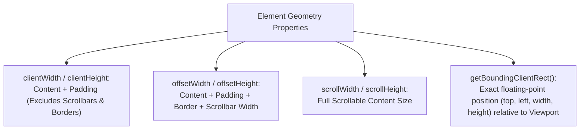

# File 11: Element Dimensions, Scroll, and Window Resize

## Overview
Understanding element geometry metrics (**`clientWidth`**, **`offsetWidth`**, **`scrollWidth`**, **`getBoundingClientRect()`**) allows JavaScript to accurately measure element sizes, calculate scroll positions, and handle viewport resize events.

---

## 1. Element Metric Geometry Breakdown



---

## 2. Geometry Inspection & Scroll Handling

```javascript
const box = document.querySelector("#content-box");

// 1. Measuring Geometry Metrics
console.log("Client Width (Content + Padding):", box.clientWidth);
console.log("Offset Width (Content + Padding + Border):", box.offsetWidth);
console.log("Scroll Height (Total Scrollable Content):", box.scrollHeight);

// 2. High-Precision Viewport Coordinates via getBoundingClientRect()
const rect = box.getBoundingClientRect();
console.log(`Position in Viewport: Top=${rect.top}px, Left=${rect.left}px, Width=${rect.width}px`);

// 3. Smooth Window Scrolling
function scrollToTop() {
    window.scrollTo({
        top: 0,
        behavior: "smooth"
    });
}

// 4. Scroll Percentage Tracker
window.addEventListener("scroll", () => {
    const scrollTop = window.scrollY;
    const docHeight = document.documentElement.scrollHeight - window.innerHeight;
    const scrollPercent = (scrollTop / docHeight) * 100;
    console.log(`Scroll Progress: ${scrollPercent.toFixed(1)}%`);
});
```

---

## Key Takeaways
1. **`clientWidth`**: Content + Padding.
2. **`offsetWidth`**: Content + Padding + Border + Scrollbar.
3. Use **`getBoundingClientRect()`** for exact floating-point position relative to the visible viewport.
4. Use **`window.scrollTo({ behavior: 'smooth' })`** for smooth programmatic scrolling.
