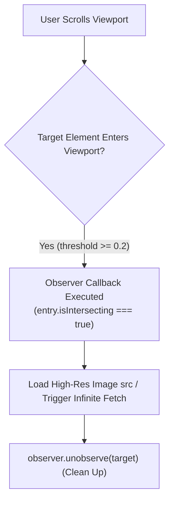

# File 12: Intersection Observer API

## Overview
The **Intersection Observer API** provides a high-performance way to asynchronously observe changes in the intersection of a target element with an ancestor element or top-level document viewport. It eliminates the need for expensive scroll event listeners when implementing **Lazy Loading Images** or **Infinite Scrolling**.

---

## 1. Intersection Observer Architecture



---

## 2. Lazy Loading Images & Infinite Scroll Implementation

```javascript
// 1. Image Lazy Loading Observer
const lazyImageObserver = new IntersectionObserver((entries, observer) => {
    entries.forEach(entry => {
        if (entry.isIntersecting) {
            const img = entry.target;
            img.src = img.dataset.src; // Swap data-src to real src!
            img.classList.add("fade-in");
            observer.unobserve(img); // Stop observing after loaded!
        }
    });
}, {
    root: null, // Default: Browser Viewport
    rootMargin: "50px", // Preload images 50px before entering viewport!
    threshold: 0.1 // Triggers when 10% of image is visible
});

// Attach Observer to all lazy images
document.querySelectorAll("img.lazy").forEach(img => {
    lazyImageObserver.observe(img);
});

// 2. Infinite Scroll Sentinel Observer
const sentinel = document.querySelector("#scroll-sentinel");
const infiniteScrollObserver = new IntersectionObserver(entries => {
    if (entries[0].isIntersecting) {
        console.log("Sentinel reached! Fetching next page batch...");
        loadNextPageData();
    }
});

infiniteScrollObserver.observe(sentinel);
```

---

## Key Takeaways
1. **IntersectionObserver** is infinitely more performant than listening to window `scroll` events.
2. Ideal for **Lazy Loading Images**, **Infinite Scroll**, and **Scroll Animations**.
3. Call **`observer.unobserve(element)`** once target element tasks finish to optimize memory.
