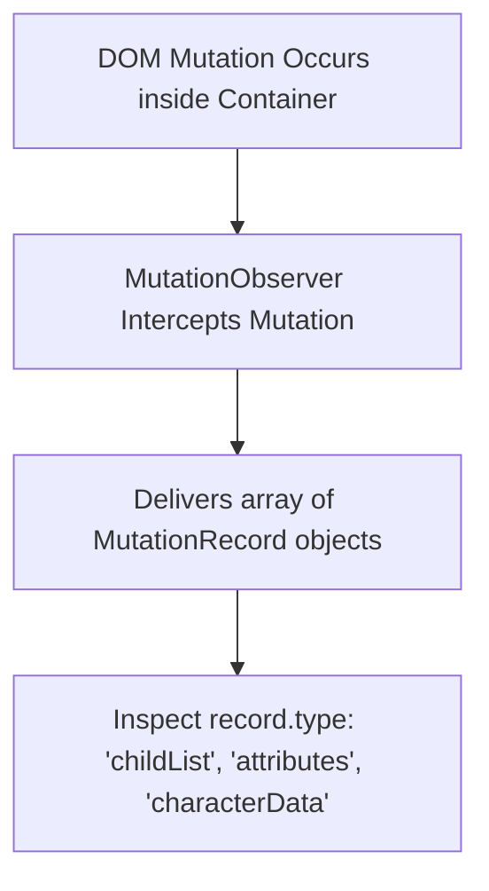

# File 13: Mutation Observer API

## Overview
The **Mutation Observer API** provides the ability to watch for changes made to the DOM tree (child addition/removal, attribute updates, text content modifications).

---

## 1. Mutation Observer Architecture



---

## 2. DOM Tree Monitoring Implementation

```javascript
const targetContainer = document.querySelector("#chat-messages");

// Observer Callback
const observerCallback = (mutationsList, observer) => {
    for (const mutation of mutationsList) {
        if (mutation.type === "childList") {
            console.log(`Added ${mutation.addedNodes.length} new node(s)`);
            mutation.addedNodes.forEach(node => {
                if (node.nodeType === Node.ELEMENT_NODE) {
                    console.log("New Element Attached:", node.tagName);
                }
            });
        } else if (mutation.type === "attributes") {
            console.log(`Attribute '${mutation.attributeName}' was updated to '${targetContainer.getAttribute(mutation.attributeName)}'`);
        }
    }
};

// Create Observer Instance
const observer = new MutationObserver(observerCallback);

// Configure & Start Observing
observer.observe(targetContainer, {
    childList: true,       // Monitor addition/removal of child nodes
    attributes: true,      // Monitor attribute changes
    subtree: true,         // Monitor all child descendant nodes
    attributeOldValue: true // Capture previous attribute value
});

// Stop Observing when no longer needed
// observer.disconnect();
```

---

## Key Takeaways
1. **MutationObserver** monitors DOM tree mutations asynchronously.
2. Monitor **`childList`** for element additions/removals and **`attributes`** for attribute updates.
3. Call **`observer.disconnect()`** to stop monitoring and prevent memory leaks.
