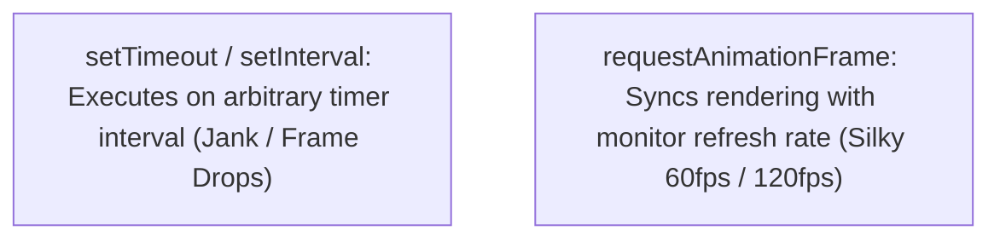

# File 14: Animations and requestAnimationFrame

## Overview
Smooth 60fps browser animations require using **`requestAnimationFrame()` (rAF)** instead of `setInterval` or `setTimeout`. `requestAnimationFrame` syncs animation updates with the browser's refresh rate and automatically pauses when tab focus is lost.

---

## 1. rAF vs setTimeout Execution Model



---

## 2. Smooth Animation Loop Implementation

```javascript
const box = document.querySelector("#animated-box");

let startTime = null;
const duration = 2000; // 2 Seconds
const distance = 400;  // 400 Pixels

function animate(timestamp) {
    if (!startTime) startTime = timestamp;
    const elapsed = timestamp - startTime;
    const progress = Math.min(elapsed / duration, 1); // Clamp between 0 and 1

    // Easing function (Ease-Out Quad)
    const easedProgress = progress * (2 - progress);

    // Apply Style Update
    box.style.transform = `translateX(${easedProgress * distance}px)`;

    if (progress < 1) {
        requestAnimationFrame(animate); // Schedule next frame!
    } else {
        console.log("Animation completed smoothly!");
    }
}

// Start Animation Loop
const animationId = requestAnimationFrame(animate);

// Cancel Animation Loop if needed
// cancelAnimationFrame(animationId);
```

---

## Key Takeaways
1. Always use **`requestAnimationFrame()`** for high-performance JavaScript animations.
2. Synchronizes updates with the monitor refresh rate (typically 60Hz or 120Hz).
3. Automatically **pauses when background tabs** are inactive to save CPU and battery power.
4. Calculate progress based on **timestamp elapsed time** rather than frame counts.
